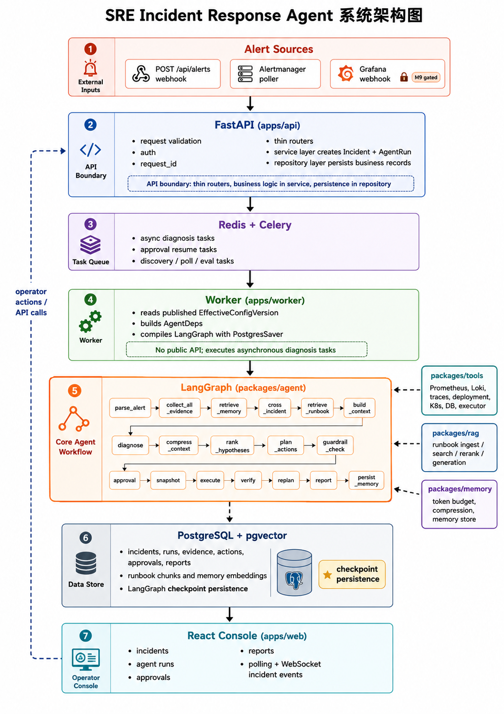

# 系统架构

**最后更新：** 2026-06-14

## 架构一览

下图展示系统主链路和关键依赖。图中的 `LangGraph (packages/agent)` 为简化版节点链路，详细工作流见 [Agent 工作流流程图（Image #1）](../02-agent/assets/agent-workflow.png)。



```text
Alert Sources
  - POST /api/alerts webhook
  - Alertmanager poller
  - Grafana webhook (M9, gated)
        |
        v
FastAPI (apps/api)
  - request validation, auth, request_id, thin routers
  - service layer creates Incident + AgentRun
  - repository layer persists business records
        |
        v
Redis + Celery
  - async diagnosis tasks
  - approval resume tasks
  - discovery/poll/eval tasks
        |
        v
Worker (apps/worker)
  - reads published EffectiveConfigVersion
  - builds AgentDeps
  - compiles LangGraph with PostgresSaver
        |
        v
LangGraph (packages/agent)
  parse_alert -> collect_all_evidence -> retrieve_memory -> cross_incident
  -> retrieve_runbook -> build_context -> diagnose -> compress_context
  -> rank_hypotheses -> plan_actions -> guardrail_check
  -> approval/snapshot/execute/verify/replan/report/persist_memory
        |
        +--> packages/tools: Prometheus, Loki, traces, deployment, K8s, DB, executor
        +--> packages/rag: runbook ingest/search/rerank/generation
        +--> packages/memory: token budget, compression, memory store
        |
        v
PostgreSQL + pgvector
  - incidents, runs, evidence, actions, approvals, reports
  - runbook chunks and memory embeddings
  - LangGraph checkpoint persistence
        |
        v
React Console (apps/web)
  - incidents, agent runs, approvals, reports
  - polling + WebSocket incident events
```

## 分层架构

| 层 | 代码位置 | 职责 |
|----|----------|------|
| API | `apps/api/` | FastAPI app、middleware、14 个 router、Pydantic schema、service 编排 |
| Worker | `apps/worker/` | Celery app、diagnosis/discovery/poll/eval 任务入口 |
| Frontend | `apps/web/` | React + TypeScript + Vite 控制台，TanStack Query 管理 API 状态 |
| Agent | `packages/agent/` | 18 节点 LangGraph、节点函数、FakeLLM/LLM adapter、guardrail、runner |
| Common | `packages/common/` | Settings、错误结构、ID、时间、redaction、metrics、feature flags、URL 安全 |
| DB | `packages/db/` | 32 个 SQLAlchemy 模型、repository、session 工厂 |
| Discovery | `packages/discovery/` | Prometheus/Loki/Jaeger/K8s/Grafana/Tempo 发现、配置合并和发布 |
| Tools | `packages/tools/` | Metrics/logs/traces/deployment/K8s/DB/runbook/executor 工具接口与后端 |
| RAG | `packages/rag/` | Runbook split、metadata、embedding、BM25/vector/hybrid retrieval、rerank、draft/diff |
| Memory | `packages/memory/` | Context budget、token count、compression plan、memory store |
| Evals | `packages/evals/` | Smoke/full/shadow eval 数据集、runner、harness 和 replay |

API 层遵循 `router -> service -> repository -> model`。Router 只处理 HTTP 形状和依赖注入；service 持有业务规则和事务边界；repository 是数据库读写入口。Agent 节点通过 `AgentDeps` 接收依赖，不直接创建数据库 session 或真实外部客户端。

## 运行时数据流

1. 告警通过 webhook、Alertmanager poller 或 gated Grafana webhook 到达。
2. API 标准化 payload，计算 fingerprint；若已有未关闭 incident，则复用/去重。
3. API 创建 `Incident` 和 `AgentRun`，写入 PostgreSQL，并把诊断任务放入 Celery。
4. Worker 取任务，读取 settings 和已发布有效配置，构建工具、memory、RAG、LLM 和 executor 依赖。
5. Worker 使用 LangGraph `PostgresSaver` 编译图；`thread_id` 固定为 `agent_run_id`。
6. Agent 并行收集 metrics/logs/traces/deployment/K8s/DB 证据，检索 runbook、memory 和 cross-incident context。
7. `build_context` 根据 token budget 组装上下文；超预算证据触发压缩，避免大日志直接进入 prompt。
8. `diagnose` 生成根因和假设，随后进行证据交叉验证和级联故障分析。
9. `plan_actions` 生成候选动作，`guardrail_check` 用确定性规则给出 L0-L4 风险和审批要求。
10. L0/L1 进入 snapshot/execute；L2/L3 通过 LangGraph interrupt 等待审批；L4 直接生成报告。
11. 审批通过后使用同一 checkpoint config 恢复；执行后 `verify` 重新查询证据，必要时回到 `plan_actions`。
12. `generate_report` 写入版本化报告，`persist_memory` 写入 run/incident/service/procedural memory。
13. API 和 worker 通过 Redis Pub/Sub 发布事件，前端轮询和 WebSocket 展示最新状态。

## 存储与状态

| 存储 | 用途 |
|------|------|
| PostgreSQL | 业务记录：incident、agent_run、node trace、tool call、evidence、action、approval、report、audit、config、eval |
| pgvector | Runbook chunk embedding 和 memory embedding；当前向量维度为 512 |
| LangGraph PostgresSaver | Agent checkpoint；不能用 `agent_runs.state` 替代 |
| Redis | Celery broker/result backend、工具/应用缓存、WebSocket Pub/Sub |
| File fixtures | `demo/alerts`、`demo/faults`、`demo/runbooks` 提供确定性本地数据 |

`agent_runs.state` 是展示和调试快照。恢复审批、避免重复危险动作和继续图执行都依赖 LangGraph checkpoint。

## 本地服务拓扑

默认 `docker compose config --services` 包含 13 个服务：

```text
postgres redis prometheus loki promtail otel-collector bge-zh grafana
api worker beat web demo-service
```

`mailpit` 是 `dev` profile 的第 14 个可选服务，用于本地邮件测试：

```bash
docker compose --profile dev up mailpit
```

Jaeger、Tempo、GitHub、Argo CD、live Kubernetes 和 live PostgreSQL 诊断是可配置后端或外部系统，不是默认 compose 必需服务。默认 trace 后端是 fixture。

## 配置与安全控制面

配置优先级按运行时合并逻辑理解为：

```text
env > active override > profile > published EffectiveConfigVersion > safe default
```

关键运行时规则：

- `APP_ENV=production` 在未显式设置时把 `LLM_PROVIDER` 改为 `disabled`，并关闭 discovery 自动启用。
- `EXECUTOR_BACKEND` 默认是 `fixture`；只有显式设置为 `live` 才会创建 live K8s executor。
- Worker 仅读取已发布的 `EffectiveConfigVersion`，不会使用未审核 proposal 或 detected-only 后端。
- 后端 URL 必须通过安全验证，生产环境拒绝 localhost、link-local 和 metadata 端点等危险目标。
- 原始密钥使用 `env:VAR_NAME` 或 SecretStr 引用，不能进入 DB、审计、日志、Agent state 或 prompt。
- M9 全局门 `M9_EXTENSIONS_ENABLED=false` 会强制关闭 M9 子能力；M8 已验证的 Jaeger trace 行为不因此禁用。

## M9 增强位置

M9 是增强层，不替代 M0-M8 确定性路径：

| 能力 | 位置 | 默认行为 |
|------|------|----------|
| LLM runbook draft | `packages/rag/llm_runbook_generator.py`、runbook API | 仅生成 `pending_review` 草稿 |
| Incident diff | `packages/rag/incident_diff.py` | 仅生成 `pending_review` amendment draft |
| Web search | `packages/rag/web_search_provider.py`、`runbook_web_context.py` | gated、HTTPS/domain 控制、脱敏、缓存、降级 |
| Tempo trace | `packages/tools/trace_backends.py` | `TRACE_BACKEND=tempo` 需要 M9 gate；否则 degraded |
| Grafana webhook | API/router + discovery/config | HMAC/size limit/gate 后摄取 |
| Semantic search | `packages/rag/retriever.py`、embedding provider | gated；embedding 失败不阻塞 runbook 入库 |

## 设计约束

- 不在 FastAPI 请求线程内运行 LangGraph。
- 不让 LLM 决定最终执行权限。
- 不把大日志直接放入 Agent state 或 prompt。
- 不让 discovery 失败阻塞 agent 启动；失败转为 degraded/unavailable 工具结果。
- 不新增未记录的真实写路径；真实云写入和 destructive DB/cache 操作不在范围内。
