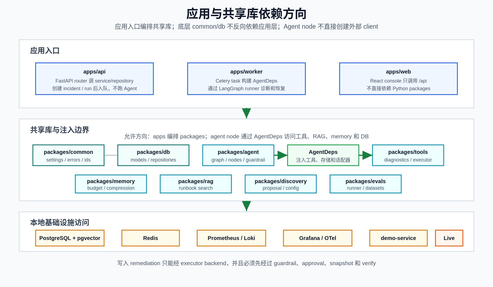

# 全项目技术地图

**最后更新：** 2026-06-15

本文从全项目视角说明各目录、进程、共享库、数据对象和测试资产如何协作。它补充 [仓库地图](repository-map.md) 和 [系统架构](architecture.md)：仓库地图回答“文件在哪里”，系统架构回答“主链路是什么”，本文回答“模块之间的技术契约是什么”。

## 一句话模型

项目由三个应用入口和八组共享库组成：

```text
apps/api      FastAPI 控制面和读 API
apps/worker   Celery + LangGraph 执行面
apps/web      React 运维控制台

packages/common      配置、错误、ID、时间、指标、脱敏和 URL 安全
packages/db          ORM 模型、session、repository
packages/agent       LangGraph 图、节点、LLM adapter、guardrail
packages/tools       诊断工具和 executor backend
packages/rag         runbook ingest/search/draft/diff
packages/memory      context budget、压缩、memory store
packages/discovery   后端发现、配置 proposal/publish/merge
packages/evals       deterministic eval runner 和 datasets
```

核心依赖方向是：

```text
apps/* -> packages/*
packages/agent -> tools + rag + memory + db + common
packages/tools -> common
packages/rag -> db + common
packages/memory -> db + rag embedding factory + common
packages/discovery -> db + common
packages/db -> common time/base only
```

`packages/common` 和 `packages/db` 是底层支撑；`apps/api` 和 `apps/worker` 是编排层；`packages/agent` 是诊断工作流核心。不要让底层包反向依赖应用层，也不要让 Agent node 直接创建外部 client 或 DB session。

下图概括应用入口、共享库和本地基础设施之间的依赖方向。详细目录职责见后续各节。

<p>
  
</p>

## 运行面划分

| 运行面 | 代码入口 | 运行职责 | 不应承担 |
|--------|----------|----------|----------|
| API 控制面 | `apps/api/main.py` | HTTP/WebSocket、认证、schema、service 编排、DB 事务、Celery 入队 | 不运行 LangGraph，不执行真实 remediation |
| Worker 执行面 | `apps/worker/tasks.py` | Celery task、依赖构造、LangGraph run/resume、node/tool audit、报告和状态同步 | 不读取未发布 discovery proposal，不绕过 checkpoint |
| 前端展示面 | `apps/web/src/App.tsx` | 事件、run、审批、报告、评论、审计展示和交互 | 不决定风险等级，不恢复 graph |
| 共享业务库 | `packages/*` | 可测试的业务能力、工具、RAG、memory、发现、评测 | 不耦合 HTTP request 或 React state |
| 本地基础设施 | `docker-compose.yml`、`deploy/` | PostgreSQL/pgvector、Redis、Prometheus、Loki、Grafana、demo service | 不默认启用真实写路径 |

## 项目级数据对象

| 对象 | 主模型/表 | 主要写入者 | 主要读取者 | 技术要点 |
|------|-----------|------------|------------|----------|
| Incident | `Incident` / `incidents` | `AlertService`、`IncidentService`、worker 状态同步 | incident API、frontend、report service | `fingerprint` 去重 open incident；root cause summary 是展示字段 |
| AgentRun | `AgentRun` / `agent_runs` | alert/manual diagnose、worker | Agent run API、frontend、eval/report | `state` 是展示快照；checkpoint 依赖 LangGraph saver |
| Node trace | `AgentRunNode` / `agent_run_nodes` | worker `node_tracer` | Agent run API、WebSocket/front-end | 每个节点记录 status、duration、input/output summary、error |
| Tool call | `ToolCall` / `tool_calls` | worker `tool_call_recorder` | Agent run API、tool audit tests | 记录 query/result/cache hit/cache key，供排障和缓存指标使用 |
| Evidence | `EvidenceItem` / `evidence_items` | Agent evidence 节点 | diagnosis/report/API/frontend | state evidence 回填 `evidence_id` 后才能被安全引用 |
| Action | `Action` / `actions` | `human_approval`、`execute_action`、service | approval/action API、frontend、report | 风险等级来自 guardrail，不来自前端 |
| Approval | `Approval` / `approvals` | `human_approval`、approval service | approval API、resume node | L3 保存 `risk_ack`、`confirm_action_type`、`confirm_target` |
| Report | `IncidentReport` / `incident_reports` | `generate_report`、report regenerate API | report API、frontend | `(incident_id, version)` 唯一；重新生成创建新版本 |
| Runbook chunk | `RunbookChunk` / `runbook_chunks` | runbook ingest/review | retriever、RunbookSearchTool | primary embedding 当前是 512 维 |
| Memory item | `MemoryItem` / `memory_items` | `compress_context`、`persist_memory` | `retrieve_memory` | L0-L3 scope；embedding nullable 512 维 |
| Effective config | `EffectiveConfigVersion` | config/discovery publish | worker `_build_deps()` | worker 只读 published config |
| Eval run | `EvalRun` | eval API/task/shadow | eval API | CI smoke 使用 FakeLLM，真实 provider 不做稳定门禁 |

## 模块契约

### API contract

API 层固定使用 `router -> service -> repository -> model`：

- Router 处理 path/query/body、依赖注入和 response model。
- Service 处理业务规则、事务、冲突校验、审计和 task enqueue。
- Repository 封装 SQLAlchemy 查询、状态转换和 `SELECT ... FOR UPDATE`。
- Schema 与 ORM model 分离。

跨 API 的统一约束：

- 所有写 API 应支持 `X-Request-Id`。
- 标准业务错误使用 `{ "error": { "code", "message", "request_id", "details" } }`。
- API key auth 和 scope enforcement 位于 middleware/dependency，不写在业务 service 内。
- `POST /api/alerts` 和 `POST /api/incidents/{incident_id}/diagnose` 只入队诊断任务。

### Worker contract

Worker 是所有诊断执行的统一入口。`run_incident_diagnosis_logic()` 的固定步骤是：

```text
lock AgentRun
-> idempotency/orphan check
-> mark running and commit
-> build AgentDeps
-> build PostgresSaver checkpointer
-> AgentRunner.run()
-> waiting_approval / failed / succeeded status sync
```

至少一次投递由 `AgentRunRepository.get_for_update()` 和 run status 判断处理。真实 PostgreSQL 下 checkpointer 初始化失败必须 fail closed，不能退回到无 checkpoint 的自动审批路径。

### Agent contract

`packages/agent` 的节点都是普通 Python 函数，形状是：

```python
def node(state: IncidentState, deps: AgentDeps) -> IncidentState:
    ...
```

节点边界：

- 依赖通过 `AgentDeps` 注入。
- 节点不直接创建 DB session、HTTP client、Kubernetes client 或 LLM provider。
- 节点要写 node trace，工具调用要通过 recorder 记录。
- 大日志不直接进 state/prompt，必须经过 context builder/compressor。
- 执行类动作必须经过 `guardrail_check`，不能从 planner 或 runbook 直接执行。

LangGraph checkpoint config 固定为：

```python
{"configurable": {"thread_id": agent_run_id, "checkpoint_ns": ""}}
```

### Tool contract

普通诊断工具遵守同步 `BaseTool.run(query) -> ToolResult` 协议：

- query 是 Pydantic schema。
- result 是 `ToolResult`，包含 status、data、summary、evidence、cache metadata 和 error。
- 外部调用必须有 timeout。
- 失败返回 degraded/timeout/failed，不让 worker 因后端缺失崩溃。
- cache key 必须稳定，包含必要的 backend/datasource 维度。

写入能力不属于普通 diagnostics tool。真实 remediation 只能通过 executor backend，并且必须经过 guardrail、approval、snapshot、execute、verify。

### RAG contract

Runbook RAG 提供知识检索，不提供执行许可：

- ingest 将 Markdown 拆成 chunk，写 `runbook_chunks`。
- retriever 返回 `chunk_id`、`source_path`、`title`、`excerpt`、`score`、`metadata`。
- diagnosis/report 引用 runbook 时必须保留 chunk ID 或 evidence ID。
- LLM draft 和 amendment draft 只能是 `pending_review`，不会自动发布。
- external embedding/web search/semantic search 均属于 M9 gated path，生产默认关闭。

### Memory and context contract

`packages/memory` 负责预算和确定性压缩，不直接调用 LLM：

- `ContextBuilder` 组装 prompt messages 和 token usage estimate。
- `Compressor` 压缩超预算 evidence，并保留 retained/omitted evidence ID。
- `MemoryStore` 读写 L0 run、L1 incident、L2 service、L3 global procedural memory。
- provider prompt cache、tool request-local cache、app prompt segment cache 是三种不同指标，不能混用。

### Frontend contract

前端只通过 `apps/web/src/api.ts` 调 API：

- 每个请求带 `X-Request-Id` 和可选 bearer API key。
- 标准错误信封转成 `ApiError`。
- 页面用 TanStack Query 管理 server state，mutation 成功后 invalidate 相关 query。
- Agent Run 页面使用 5 秒轮询和 WebSocket 事件共同刷新。
- L3 二次确认字段由 UI 采集，但最终校验仍在后端。

### Discovery and config contract

Discovery 负责发现和提议，不负责擅自修改 worker 运行配置：

- detection/proposal 可以失败降级，不阻塞 agent 启动。
- production discovery 不能自动发布配置。
- worker 只读取 latest published `EffectiveConfigVersion`。
- 配置合并优先级是 `env > active override > profile > published > safe default`。
- 后端 URL 必须通过 URL safety 校验，生产环境拒绝 localhost、metadata endpoint、link-local 和私网危险目标，除非显式 allowlist。

## 安全边界如何贯穿全项目

| 边界 | API | Worker/Agent | Tools/Executor | Frontend/Docs |
|------|-----|--------------|----------------|---------------|
| 默认 fixture executor | API 不直接执行真实动作 | `_build_deps()` 默认 fixture | live executor 需要 `EXECUTOR_BACKEND=live` | UI 不提供绕过路径 |
| L2/L3 审批 | approval service 写决策并入队 resume | `human_approval` interrupt/resume | executor 只执行已允许动作 | UI 采集 L3 字段 |
| L4 拒绝 | 不创建可执行审批路径 | `guardrail_check` 标记直接报告 | executor 不支持 destructive 动作 | 文档不得写成可配置开启 |
| 只读诊断 | API 暴露诊断结果 | collect/verify 只读查询 | K8s/DB diagnostics 限定 read-only | 页面只展示 evidence |
| Secret 不外泄 | middleware/service 不落原始 key | prompt/state 元数据脱敏 | external call 前 redaction | 文档使用 secret ref，不写 raw secret |
| M9 default-off | feature gates 控制 API path | worker 保持 M0-M8 确定性路径 | external LLM/web/embedding gated | docs 标明生产默认关闭 |

## 配置影响范围

| 配置类别 | 主要字段 | 影响模块 | 常见误区 |
|----------|----------|----------|----------|
| Core service | `DATABASE_URL`、`REDIS_URL`、Celery URLs | API、worker、DB、Redis | Compose 宿主机端口和容器内服务名不同 |
| Observability | `PROMETHEUS_URL`、`LOKI_URL`、`TRACE_BACKEND` | tools、worker deps、discovery | 单实例当前只有一套 active backend，不是多后端 fan-out |
| Executor | `EXECUTOR_BACKEND`、`EXECUTOR_K8S_NAMESPACE` | worker、executor backend、guardrail path | production 不会自动把 live 改回 fixture，发布前必须确认 |
| RAG/embedding | `EMBEDDING_PROVIDER`、`RUNBOOK_HYBRID_SEARCH_ENABLED` | runbook ingest/search、memory search | primary vector store 是 512 维 |
| LLM | `LLM_PROVIDER`、`LLM_REASONING_ENABLED` | diagnose/report/runbook draft/diff | 真实 LLM 不能做 CI 稳定门禁 |
| M9 | `M9_EXTENSIONS_ENABLED` 和子开关 | RAG、trace、Grafana、semantic search | global gate false 会强制关闭 M9 子能力 |
| Auth | `API_KEY_AUTH_ENABLED`、bootstrap/admin scope | API middleware、frontend API key panel | auth disabled 时 scope dependency 会跳过 |
| Poll/discovery | `ALERT_SOURCE`、`DISCOVERY_ENABLED` | beat、worker tasks、discovery | production discovery 默认关闭，proposal 不等于 published |

## 变更落点

| 要改什么 | 应先看 | 代码落点 | 文档落点 | 测试落点 |
|----------|--------|----------|----------|----------|
| 新 API endpoint | API 参考、后端架构 | router、schema、service、repository | `docs/01-backend/*` | integration + schema/API client tests |
| 新 Agent 节点 | Agent 工作流 | `graph.py`、`nodes/`、`state.py` | `docs/02-agent/workflow.md` | node unit + graph/integration |
| 新工具后端 | 工具层、配置参考 | `packages/tools/`、worker `_build_deps()` | `tool-layer.md`、`configuration.md` | mocked backend + degraded tests |
| 新执行动作 | guardrail/approval、executor docs | guardrail policy、capabilities、executor backend、verify | `guardrails-and-approval.md`、scope docs | L2/L3/L4 negative tests |
| 新 runbook/RAG 能力 | Runbook RAG | `packages/rag/`、runbook service/repo | `runbook-rag.md` | ingest/search/contract |
| 新 memory/compression 行为 | Memory 文档 | `packages/memory/`、agent build/compress nodes | `memory-cache-compression.md` | compression/evidence ID tests |
| 新配置或 feature flag | 配置参考 | `settings.py`、`feature_flags.py`、deps builder | `configuration.md` 和相关专题 | settings + production safety |
| 新前端页面 | React 控制台 | `App.tsx`、`api.ts`、styles | `react-console.md` | Vitest + Playwright when needed |
| 新部署资源 | 本地演示/K8s docs | `docker-compose.yml`、`deploy/` | `local-demo.md`、deploy docs | smoke/manual verification |
| 新 eval case | 评测体系 | `packages/evals/datasets/` | `evaluation.md` | eval runner integration |

## 横向调试入口

| 问题类型 | 首看数据 | 首看代码 | 判断方向 |
|----------|----------|----------|----------|
| 告警未生成 incident | API response/request ID、API logs | `alerts.py`、`alert_service.py` | auth、rate limit、payload validation、dedup |
| run 不执行 | `agent_runs.status`、`celery_task_id` | `tasks.py`、Celery config | worker 是否在线、Redis broker、idempotency 状态 |
| 节点卡住或失败 | `agent_run_nodes`、worker logs | `packages/agent/nodes/*` | node trace error、tool degraded、checkpoint |
| 工具无数据 | `tool_calls`、tool output summary | `packages/tools/*`、`_build_deps()` | backend URL、effective config、cache key、fixture path |
| 审批后未继续 | `approvals.status`、`actions.status` | `approval_service.py`、`human_approval.py` | 是否仍有 waiting approval、resume 是否入队 |
| 报告缺失 | `incident_reports`、run state | `generate_report.py`、`report_service.py` | run 是否终态、report node 是否失败 |
| 前端展示旧数据 | query key、network request ID | `api.ts`、`App.tsx` | polling、WebSocket ticket、mutation invalidation |
| 配置没生效 | env、published config、override | `settings.py`、`config_merge.py`、`_build_deps()` | env 优先级、production safety default、published 状态 |

## 代码审查时的项目级检查

- 这个变更有没有越过 `router -> service -> repository` 或 `AgentDeps` 注入边界。
- 是否引入了新的真实外部调用；如果有，是否具备 feature flag、timeout、redaction、audit/metric 和 degraded path。
- 是否新增或扩大真实写路径；如果有，是否仍在 executor backend、guardrail、approval 和 verify 链路内。
- 是否把 `agent_runs.state` 当成 checkpoint 或 source of truth。
- 是否把大日志、secret、token、auth header 写入 DB、audit、state 或 prompt。
- 是否保持 FakeLLM、fake embedding、fixture executor 的 CI 默认路径。
- 是否更新了对应专题文档，而不只是 README。
- 是否选择了最小但足够的测试层级。

## 展示项目技术细节的推荐讲解顺序

1. 从 [告警到报告技术深挖](alert-to-report-deep-dive.md) 讲主链路。
2. 用本文讲各模块契约和数据对象所有权。
3. 展示 `agent_run_nodes`、`tool_calls`、`evidence_items`、`incident_reports` 如何把一次 run 可审计化。
4. 展示 `guardrail_check -> human_approval -> execute_action -> verify` 如何隔离 LLM 建议和真实执行权限。
5. 展示 `configuration.md` 中的 feature gates、production defaults 和 M9 rollback。
6. 最后用 `testing-strategy.md` 和 `evaluation.md` 说明这些边界如何通过测试和 smoke eval 固化。
