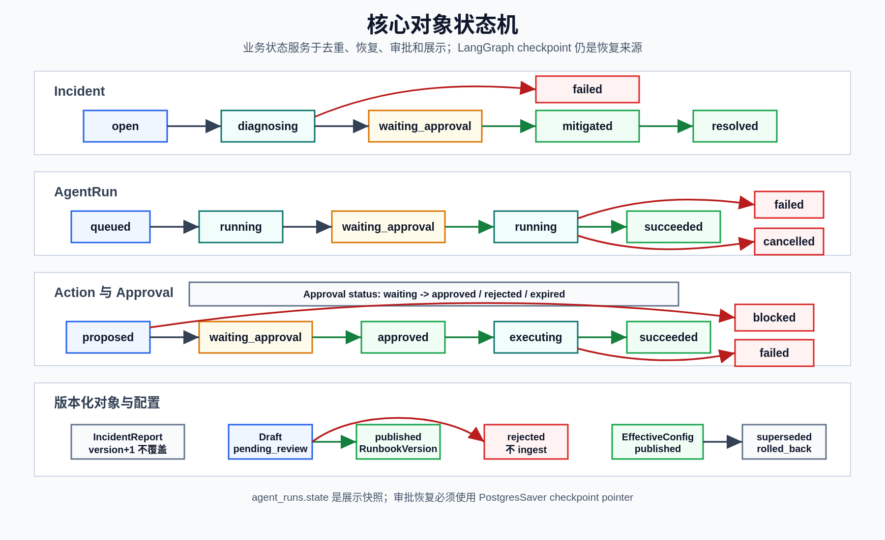

# 数据模型

**最后更新：** 2026-06-14

## 设计原则

- Pydantic schema 与 SQLAlchemy ORM model 分离。
- Public ID 使用稳定前缀，例如 `inc_`、`run_`、`nd_`、`tool_`、`evi_`、`act_`、`apv_`、`exec_`、`rpt_`、`chk_`、`drf_`、`ver_`、`amd_`、`mem_`、`eval_`、`nfp_`、`fbk_`、`cor_`、`cmt_`、`ean_`、`adt_`、`agp_`、`apik_`、`eml_`、`dr_`、`dp_`、`ecv_`、`dov_`。完整表见 [状态与 ID](../11-reference/status-and-ids.md)。
- 时间字段使用 timezone-aware UTC datetime。
- PostgreSQL 使用 JSONB；SQLite/test fallback 使用 JSON。
- 向量字段使用 512 维 pgvector；当本地未安装 pgvector SQLAlchemy 类型时使用 JSON fallback。
- `agent_runs.state` 只保存展示/调试快照，不能替代 LangGraph PostgresSaver checkpoint。
- 业务表只保存 checkpoint pointer：`checkpoint_thread_id`、`checkpoint_ns`、`latest_checkpoint_id`。

## 模型总览

当前 `packages/db/models.py` 有 32 个 SQLAlchemy ORM 模型。

下图先给出核心业务对象的状态机。表字段和约束仍以后续模型表和迁移说明为准。

<p>
  
</p>

### Incident 与 Agent Run

| 模型 | 表 | 关键字段 | 说明 |
|------|----|----------|------|
| `Incident` | `incidents` | `incident_id`、`fingerprint`、`source`、`service`、`severity`、`alert_name`、`status`、`starts_at`、`ends_at`、`labels`、`annotations`、`raw_payload`、`root_cause_summary` | 告警实例和诊断主对象；fingerprint 用于开放 incident 去重 |
| `AgentRun` | `agent_runs` | `agent_run_id`、`incident_id`、`status`、`celery_task_id`、`model_name`、`prompt_version`、`state`、`checkpoint_thread_id`、`checkpoint_ns`、`latest_checkpoint_id`、token/cache counters | 一次 LangGraph 诊断运行；checkpoint pointer 在此保存 |
| `AgentRunNode` | `agent_run_nodes` | `node_id`、`agent_run_id`、`name`、`status`、`started_at`、`finished_at`、`duration_ms`、`input_summary`、`output_summary`、`error_message` | 每个 LangGraph node 的轨迹 |
| `ToolCall` | `tool_calls` | `tool_call_id`、`agent_run_id`、`node_name`、`tool_name`、`input_json`、`output_json`、`status`、`duration_ms`、`cache_key`、`cache_hit` | 工具调用审计和性能数据 |
| `EvidenceItem` | `evidence_items` | `evidence_id`、`incident_id`、`agent_run_id`、`type`、`source`、`source_id`、`title`、`excerpt`、`payload`、`confidence`、`timestamp` | 诊断证据；root cause 和报告应引用 evidence id |

### Action、Approval、Report、Email

| 模型 | 表 | 关键字段 | 说明 |
|------|----|----------|------|
| `Action` | `actions` | `action_id`、`incident_id`、`agent_run_id`、`type`、`risk_level`、`status`、`executor`、`target`、`params`、`reason`、`rollback_plan`、`execution_result` | Agent proposed/approved/executed action |
| `Approval` | `approvals` | `approval_id`、`action_id`、`incident_id`、`agent_run_id`、`status`、`approver`、`comment`、`risk_ack`、`confirm_action_type`、`confirm_target`、`email_token` | L2/L3 人工审批；L3 二次确认字段持久化在这里 |
| `IncidentReport` | `incident_reports` | `report_id`、`incident_id`、`agent_run_id`、`version`、`root_cause`、`impact`、`timeline`、`actions`、`follow_ups`、`body_markdown` | 版本化报告；唯一约束 `(incident_id, version)` |
| `EmailLog` | `email_log` | `email_log_id`、`notification_type`、`status`、`recipients`、`subject`、related ids、`attempts`、`last_error`、`provider_message_id`、`sent_at` | 邮件通知队列和发送结果记录 |

### Runbook / RAG

| 模型 | 表 | 关键字段 | 说明 |
|------|----|----------|------|
| `RunbookChunk` | `runbook_chunks` | `chunk_id`、`document_id`、`source_path`、`title`、`content`、`content_hash`、`embedding`、`embedding_model`、`tsv_content`、`language`、`metadata_json` | 主 runbook chunk；`embedding` 为 512 维向量或 JSON fallback |
| `RunbookChunkEmbedding` | `runbook_chunk_embeddings` | `runbook_chunk_id`、`provider`、`model`、`dimension`、`embedding_vector`、`vector_backend`、`text_hash`、`redaction_version`、`status`、`error_code` | M9 per-provider embedding side table；唯一约束 provider/model/dimension/text_hash |
| `RunbookDraft` | `runbook_drafts` | `draft_id`、`fingerprint`、`incident_ids`、`service`、`incident_type`、`title`、`content`、`front_matter`、`status`、`draft_type`、`source`、`reviewer`、`source_chunk_ids`、`llm_model` | 待审 runbook 草稿；LLM 草稿不能自动发布 |
| `RunbookVersion` | `runbook_versions` | `version_id`、`document_id`、`version_number`、`source_path`、`content_hash`、`change_reason`、`related_incident_id`、`related_draft_id`、`diff_from_previous`、`created_by` | 已发布 runbook 版本；唯一约束 `(document_id, version_number)` |
| `RunbookFeedbackSummary` | `runbook_feedback_summaries` | `summary_id`、`service`、`fault_type`、incident/action 统计、top action 数据 | 确定性反馈聚合 |
| `AmendmentDraft` | `amendment_drafts` | `amendment_id`、nullable `summary_id`、`service`、`fault_type`、`source`、related incident/version ids、`amendment_type`、`proposed_content`、`rationale`、evidence ids、`confidence`、`proposal_kind`、`status`、approve/apply metadata | runbook 修订草稿；M9 diff 输出也落到这里 |

### Memory 与 Eval

| 模型 | 表 | 关键字段 | 说明 |
|------|----|----------|------|
| `MemoryItem` | `memory_items` | `memory_id`、`scope`、`scope_key`、`memory_type`、`content`、`content_json`、`embedding`、`importance`、`expires_at`、`source_ref` | L0-L3 memory；`embedding` 为 nullable 512 维向量或 JSON fallback |
| `MemoryEvent` | `memory_events` | `event_id`、`agent_run_id`、`node_name`、`event_type`、`before_tokens`、`after_tokens`、`compression_ratio`、`metadata_json` | context compression/token 事件 |
| `EvalRun` | `eval_runs` | `eval_run_id`、`status`、`suite`、`model_name`、`prompt_version`、`metrics`、`started_at`、`finished_at`、`git_commit` | eval run 元数据和指标 |
| `EvalCase` | `eval_cases` | `eval_case_id`、`eval_run_id`、`incident_type`、`fixture_path`、`expected_root_cause`、`status`、`actual_root_cause`、`duration_ms`、`error`、`metadata_json` | eval case 结果 |

### Feedback、Collaboration、Audit、Auth

| 模型 | 表 | 关键字段 | 说明 |
|------|----|----------|------|
| `FalsePositivePattern` | `false_positive_patterns` | `pattern_id`、`fingerprint`、`service`、`alert_name`、`nfa_count`、`status`、`suppressed_at`、`expires_at` | NFA 自动降级和抑制模式 |
| `IncidentCorrelation` | `incident_correlations` | `correlation_id`、`incident_id_a`、`incident_id_b`、`correlation_type`、`similarity_score` | 跨 incident 关联 |
| `FeedbackItem` | `feedback_items` | `feedback_id`、`incident_id`、`agent_run_id`、`feedback_type`、`original_value`、`corrected_value`、`delta`、`submitted_by` | 操作员反馈 |
| `IncidentComment` | `incident_comments` | `comment_id`、`incident_id`、`author`、`content`、`parent_comment_id`、`mentioned_users` | 评论 |
| `EvidenceAnnotation` | `evidence_annotations` | `annotation_id`、`evidence_id`、`incident_id`、`author`、`content` | 证据标注 |
| `AuditLog` | `audit_logs` | `audit_id`、`incident_id`、`actor`、`action`、`resource_type`、`resource_id`、`source`、`request_id`、`details` | 追加式审计日志 |
| `ApprovalGroup` | `approval_groups` | `group_id`、`name`、`service_pattern`、`members`、`is_default` | 服务到审批人组的匹配配置 |
| `ApiKey` | `api_keys` | `key_id`、`description`、`key_hash`、`created_by`、`roles`、`scopes`、`is_bootstrap`、`expires_at`、`last_used_at`、`revoked` | API key 元数据；raw key 只创建时返回 |

### Discovery 与配置

| 模型 | 表 | 关键字段 | 说明 |
|------|----|----------|------|
| `DiscoveryRun` | `discovery_runs` | `discovery_run_id`、`source`、`status`、`trigger_type`、`triggered_by`、`started_at`、`finished_at`、`summary` | 一次发现运行 |
| `DiscoveryProposal` | `discovery_proposals` | `proposal_id`、`discovery_run_id`、`status`、`config_diff`、`confidence`、`applied_at`、`reviewed_by` | 待审配置变更提案 |
| `EffectiveConfigVersion` | `effective_config_versions` | `version_id`、`proposal_id`、`version_number`、`status`、`config_snapshot`、`published_at`、`published_by`、rollback/revoke/stale 字段 | worker 读取的已发布配置版本 |
| `DiscoveryOverride` | `discovery_overrides` | `override_id`、`backend_type`、`override_json`、`reason`、`expires_at`、`revoked_at`、`created_by_key_id`、`created_by_scopes` | 带 TTL 的手动覆盖项 |
| `AlertPollCursor` | `alert_poll_cursors` | `filter_hash`、`fingerprint`、`incident_id`、`last_seen_at`、`first_seen_at`、`missing_rounds` | Alertmanager poll cursor 和 resolved inference 状态 |

## 迁移

当前有 15 个 Alembic 迁移版本：

```text
c26ca1452607_0001_initial_schema.py
0002_phase3_alerts_email.py
0003_runbook_tsvector.py
0004_runbook_drafts_versions.py
0005_runbook_language.py
0006_phase5_feedback.py
0007_phase6_collaboration.py
0008_phase7_api_keys.py
0009_phase7_evals.py
2e6d6dbb06eb_runbook_draft_type_and_source.py
3f7e8d9c0a1b_runbook_feedback_models.py
4dbe6ecad2b1_switch_embedding_384_to_512.py
a1b2c3d4e5f6_discovery_config_models.py
b2c3d4e5f6a7_api_key_scopes.py
c3d4e5f6a7b8_alert_poll_cursor.py
```

新增/修改模型时必须添加迁移；不要只改 ORM。

## 关键约束

- Fingerprint 去重：业务查询只 deduplicate 未终态 incident；终态包括 `resolved`、`failed`、`mitigated`。
- Agent run 幂等：worker 使用 `SELECT ... FOR UPDATE` 锁 run 行，终态和 waiting approval 不重复执行。
- Checkpoint：`agent_runs.state` 不是 checkpoint；审批恢复必须使用 LangGraph PostgresSaver。
- Report：唯一约束 `(incident_id, version)`；重新生成创建新版本。
- Runbook version：唯一约束 `(document_id, version_number)`。
- API key：raw key 只返回一次；DB 只保存 SHA-256 hash。
- Audit log：无业务更新/删除路径，按 append-only 使用。
- Embedding：当前主 chunk 和 memory embedding 均为 512 维；旧 384 维计划已由迁移切换，不是当前实现口径。

## 状态机

| 对象 | 正常路径 | 其他路径 |
|------|----------|----------|
| Incident | `open -> diagnosing -> waiting_approval -> mitigated/resolved` | `failed` |
| AgentRun | `queued -> running -> waiting_approval -> running -> succeeded` | `failed`、`cancelled` |
| Action | `proposed -> waiting_approval -> approved -> executing -> succeeded` | `blocked`、`rejected`、`failed` |
| Approval | `waiting -> approved/rejected` | `expired` |
| DiscoveryRun | `running -> succeeded/degraded/failed` |  |
| DiscoveryProposal | `pending_review -> auto_applied/rejected/superseded` |  |
| EffectiveConfigVersion | `published -> superseded/rolled_back/revoked` |  |
| DiscoveryOverride | active until `expires_at` or `revoked_at` |  |
| RunbookDraft | `draft -> pending_review -> approved/rejected` |  |
| AmendmentDraft | `pending_review -> approved/rejected`，`approved -> applied/superseded` |  |

## Repository 边界

- 新表通常需要 `packages/db/models.py`、migration、repository、schema/service 使用点和测试。
- Repository 不应返回 ad hoc dict，除非该方法明确是 display/read model 查询。
- Service 负责事务提交；repository 只做查询/变更对象。
- 测试中不要用随机 embedding；FakeEmbedding 必须 deterministic。
