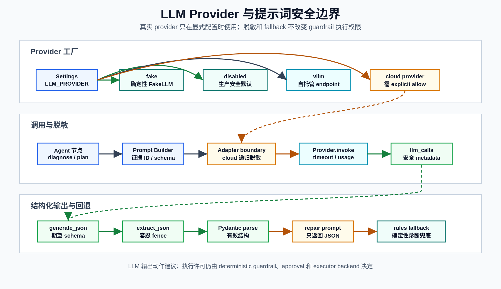

# LLM 与提示词

**最后更新：** 2026-06-14

## 概述

Agent 的 LLM 调用通过同步 `LLMProvider` 协议抽象，入口在 `packages/agent/llm/`。CI、单元测试和默认本地 demo 使用 deterministic `FakeLLMAdapter`；真实 provider 只在显式配置时使用。

LLM 不是安全决策者。它可以输出诊断、排序、动作建议和报告草稿，但动作权限由确定性 guardrail、approval 和 executor backend 决定。

下图概括 provider 工厂、真实 provider 脱敏边界、JSON 解析修复和 deterministic fallback 的关系。

  

## Provider 工厂

`packages/agent/llm/factory.py` 根据 `Settings.llm_provider` 构造 provider：

| `LLM_PROVIDER` | Adapter | 外部调用 | 用途 |
|----------------|---------|----------|------|
| `fake` | `FakeLLMAdapter` | 否 | 本地 demo、测试、CI smoke eval |
| `disabled` | `DisabledLLMAdapter` | 否 | 生产安全默认或显式禁用 |
| `vllm` | `OpenAICompatibleAdapter` | 是，本地/自托管 OpenAI-compatible endpoint | 手动 demo 或 eval |
| `openai` | `RedactingLLMAdapter(OpenAICompatibleAdapter)` | 是 | 手动 full eval 或受控 M9 功能 |
| `deepseek` | `RedactingLLMAdapter(OpenAICompatibleAdapter)` | 是 | 手动 full eval 或受控 M9 功能 |
| `anthropic` | `RedactingLLMAdapter(AnthropicAdapter)` | 是 | 手动 full eval 或受控 M9 功能 |

本地默认值是 `LLM_PROVIDER=fake`。当 `APP_ENV=production` 且用户没有显式设置 `llm_provider` 时，settings validator 会把 provider 改为 `disabled`。

外部云 provider（`openai`、`deepseek`、`anthropic`）还必须显式设置 `LLM_EXTERNAL_PROVIDER_ALLOWED=true`，否则 provider factory 会拒绝构造 adapter。自托管 `vllm` 不受该云 provider 开关限制，但仍必须由 operator 显式配置 endpoint、模型和超时。

外部云 provider 会由 `RedactingLLMAdapter` 包装。该包装层是所有云端 LLM 请求出进程前的最后一道边界，会对 `invoke()` messages 和 `generate_json()` prompt 中的字符串递归执行 `redact_text()`，并在 `last_metadata` / `llm_calls` 中记录 `redaction_applied`、`redaction_count`、`redaction_types`。包装层不保存 raw prompt；provider API key 仍只作为请求 header 使用，不进入 prompt。

## 当前默认配置

| 配置 | 默认值 | 说明 |
|------|--------|------|
| `LLM_PROVIDER` | `fake` | 本地/CI deterministic path |
| `LLM_MODEL` | `fake-diagnosis-model` | run 记录中的模型名 |
| `LLM_BASE_URL` | `http://localhost:8001/v1` | OpenAI-compatible provider 的 base URL |
| `LLM_API_KEY` | 空 | `SecretStr`，只在 adapter 调用点解包 |
| `LLM_TIMEOUT_SECONDS` | `30.0` | provider 请求超时 |
| `LLM_MAX_TOKENS` | `512` | 最大输出 token |
| `LLM_TEMPERATURE` | `0.1` | 真实 provider 温度 |
| `LLM_REASONING_ENABLED` | `false` | 深度推理总开关 |
| `LLM_REASONING_EFFORT` | `medium` | 传给支持 reasoning 的 provider |
| `LLM_REASONING_NODES` | `diagnose,diagnose_synthesize` | 启用 reasoning 时使用深度推理的节点 |
| `LLM_MULTI_PERSPECTIVE_ENABLED` | `false` | 是否启用 metrics/logs/traces specialist + synthesizer |

M9 的 LLM runbook 生成和 incident diff 还有独立 feature gate，见下文。

## FakeLLM 覆盖范围

`FakeLLMAdapter` 包装 `packages/agent/fake_llm.py`，读取 `packages/agent/rules_fallback.py` 中的确定性映射。当前覆盖 15 类告警：

- `DatabaseConnectionExhaustion`
- `High5xxAfterDeploy`
- `RedisCacheAvalanche`
- `PodRestartLoop`
- `CPUThrottling`
- `MemoryLeak`
- `DiskFull`
- `CertificateExpiry`
- `DNSFailure`
- `MessageQueueLag`
- `RateLimitTriggered`
- `SlowAPI`
- `ErrorBudgetBurn`
- `P0SiteOutage`
- `DownstreamTimeout`

未知告警按 `High5xxAfterDeploy` 路径回退。FakeLLM 无随机性、无网络调用，并会尽量把 prompt 中出现的 evidence ID 写回诊断结果。

## 调用点

| 节点/组件 | 调用方式 | 输出 |
|-----------|----------|------|
| `diagnose` | `generate_json(prompt, DiagnosisOutput)` | hypotheses、root_cause、missing_evidence |
| `rank_hypotheses` | LLM 或确定性排序路径 | ranked hypotheses |
| `plan_actions` | `generate_json(prompt, list[PlannedAction])` | recommended actions |
| `generate_report` | `invoke()`/JSON parse | incident report |
| `LLMRunbookGenerator` (M9) | `invoke()` | `RunbookDraft(status=pending_review)` 的内容 |
| `IncidentDiffAnalyzer` (M9) | `invoke()` | `AmendmentDraft(status=pending_review)` 的提案 |

`diagnose` 失败时会尝试 JSON repair；repair 仍失败时使用 deterministic rules fallback。

## 提示词文件

`packages/agent/prompts.py` 保存 Agent 运行时提示词：

| 模板 | 用途 |
|------|------|
| `SYSTEM_PROMPT` | SRE Agent 总规则，要求引用 evidence ID、输出 JSON、禁止 L4 |
| `DIAGNOSIS_PROMPT_TEMPLATE` | 单次诊断路径 |
| `METRICS_SPECIALIST_SYSTEM_PROMPT` | metrics specialist |
| `LOGS_SPECIALIST_SYSTEM_PROMPT` | logs specialist |
| `TRACES_SPECIALIST_SYSTEM_PROMPT` | traces specialist |
| `SYNTHESIZER_SYSTEM_PROMPT` | multi-perspective synthesizer |
| `RANK_PROMPT_TEMPLATE` | 假设排序 |
| `PLAN_ACTIONS_PROMPT_TEMPLATE` | 动作规划，内嵌 allowed action table |
| `REPORT_PROMPT_TEMPLATE` | 事故报告 |
| `SUMMARIZATION_PROMPT` | 摘要提示词，当前 memory 包本身不直接调用 LLM |

`allowed_actions_table()` 的动作列表必须与 `guardrails/policy.py` 保持一致。新增动作类型时两处都要更新，并补 guardrail 测试。

## Multi-perspective 诊断

当 `LLM_MULTI_PERSPECTIVE_ENABLED=true` 时，`diagnose` 会运行：

1. metrics specialist
2. logs specialist
3. traces specialist，附带 service topology
4. synthesizer，整合 specialist 输出、deployment、K8s、DB、runbook 和 memory

specialist 调用失败不会中止主流程；失败的 perspective 返回空 `DiagnosisOutput`，synthesizer 仍会尝试继续。synthesizer 失败时回退到单次诊断，并携带已成功的 specialist 输出。

## 深度推理与审计

`packages/agent/llm/reasoning.py` 负责节点级 reasoning 开关：

- `LLM_REASONING_ENABLED=false` 时所有调用都是普通推理。
- 开启后，只有 `LLM_REASONING_NODES` 中的节点会把 `thinking=true` 传给 adapter。
- 默认深度节点是 `diagnose` 和 `diagnose_synthesize`。
- `record_llm_call()` 只记录 provider、model、usage、finish_reason 等安全元数据。
- `reasoning_summary` 会被剥离，不写入 state、DB 或审计轨迹，避免保存原始推理内容。

OpenAI-compatible adapter 会把 provider 返回的 token usage 写入 Prometheus 指标和 `llm_calls` 元数据。provider cache hit 目前只从 provider 返回的 `finish_reason == "cache_hit"` 推断；没有 provider 明确信号时不要把应用层 cache 命中率解释成 provider prompt cache 命中率。

外部云 provider 的 `llm_calls` 还会包含脱敏元数据，例如 `redaction_count`。该数字只表示 wrapper 在最终 prompt/message 中替换的敏感片段数量，不代表上游证据采集允许保存 raw secret。

## JSON 解析与回退

`packages/agent/llm/base.py` 提供：

| 函数 | 作用 |
|------|------|
| `extract_json()` | 容忍 Markdown fence 和 JSON 前后的文本，提取对象或数组 |
| `parse_into_schema()` | 把解析后的 JSON 转成 Pydantic model 或 model list |

节点层回退策略：

1. 首次 `generate_json()`。
2. 失败后构造 repair prompt，要求只返回匹配 schema 的 JSON。
3. repair 失败时，诊断使用 deterministic rules fallback；其它节点按各自实现降级。

## M9 LLM 边界

M9 LLM 能力默认关闭，并受全局开关控制：

| 功能 | 必要开关 | 输出边界 |
|------|----------|----------|
| LLM runbook draft | `M9_EXTENSIONS_ENABLED=true` + `RUNBOOK_LLM_GENERATION_ENABLED=true` | 只生成 `RunbookDraft(status=pending_review, draft_type=llm_generated)` |
| LLM incident diff | `M9_EXTENSIONS_ENABLED=true` + `LLM_INCIDENT_DIFF_ENABLED=true` | 只生成 `AmendmentDraft(status=pending_review)` |
| 外部/cloud LLM provider | 还需要 `LLM_EXTERNAL_PROVIDER_ALLOWED=true` | 未开启时返回 blocked |

LLM 不会自动批准、发布、应用 amendment，也不会触发 remediation 执行。runbook prompt builder 会脱敏输入，并只允许 approved runbook context、evidence summary、template draft、capability gaps 和 redacted EffectiveConfig 进入 prompt。

## 新增或修改提示词 checklist

1. 保持输出 schema 明确，优先要求 JSON。
2. 保留 evidence ID、chunk ID、action type 和 target 等可追溯字段。
3. 不要求模型输出执行许可；权限仍归 deterministic guardrail。
4. 不把 raw logs、secret、token、private key、auth header 放入 prompt。
5. 更新 FakeLLM 或 rules fallback，保证 CI/smoke eval deterministic。
6. 添加解析失败、无效 JSON、未知动作、L3/L4 边界测试。
7. 如果启用真实 provider，只用于手动 full eval 或手动 demo，不作为稳定 CI gate。

## 相关测试

- `tests/unit/test_llm_provider_factory.py`
- `tests/unit/test_fake_llm.py`
- `tests/unit/test_agent_nodes.py`
- `tests/unit/test_reasoning.py`
- `tests/unit/test_m9_llm_runbook_generator.py`
- `tests/unit/test_incident_diff_analyzer.py`
- `tests/evals/` 和 `packages/evals/` 中的 FakeLLM smoke eval
