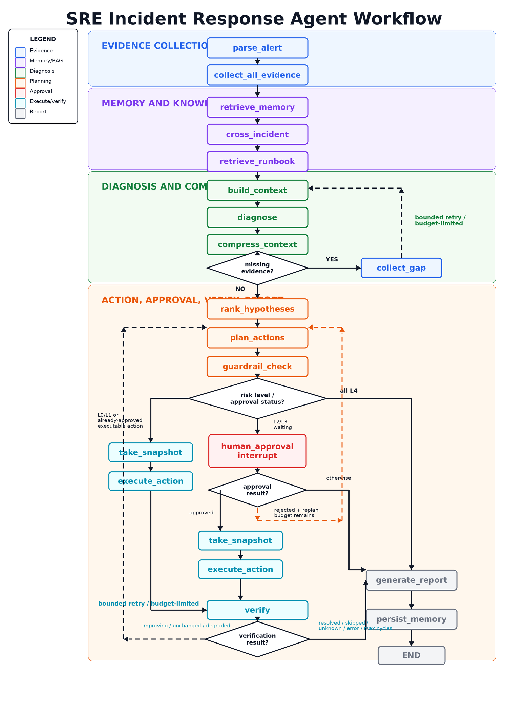

# Agent 工作流

**最后更新：** 2026-06-15

## 概述

Agent 工作流由 `packages/agent/graph.py` 构建，是一个 18 节点 LangGraph `StateGraph`。API 不内联运行诊断；`POST /api/alerts` 创建 incident 和 agent run 后入队 Celery，worker 再构造 `AgentDeps`、编译图并执行。

当前图把六类证据采集收敛到一个并行节点 `collect_all_evidence`。单项采集函数仍保留在 `packages/agent/nodes/collect_*.py`，但图上的节点是并行编排器。

## 代码入口

| 入口 | 职责 |
|------|------|
| `packages/agent/graph.py` | LangGraph 节点、边和条件路由 |
| `packages/agent/runner.py` | 初始 state、checkpoint config、interrupt/resume |
| `packages/agent/state.py` | `IncidentState` 字段定义 |
| `packages/agent/schemas.py` | 诊断、动作、护栏和依赖注入 schema |
| `packages/agent/nodes/` | 普通 Python 节点函数 |
| `apps/worker/tasks.py` | Celery 任务、依赖构造、run 状态同步 |

## 图结构

下图展示 Agent 的主执行路径，以及三个受预算限制的循环：缺失证据补采、审批拒绝后的重规划、验证未恢复后的重规划。



```text
parse_alert
  -> collect_all_evidence
  -> retrieve_memory
  -> cross_incident
  -> retrieve_runbook
  -> build_context
  -> diagnose
  -> compress_context
  -> conditional:
       missing_evidence and collect_gap cycle budget remains -> collect_gap -> build_context
       otherwise -> rank_hypotheses
  -> rank_hypotheses
  -> plan_actions
  -> guardrail_check
  -> conditional:
       L0/L1 or already-approved executable action -> take_snapshot -> execute_action
       L2/L3 waiting for decision -> human_approval interrupt
       all L4 -> generate_report
  -> conditional after approval:
       approved -> take_snapshot -> execute_action
       rejected and replan budget remains -> plan_actions
       otherwise -> generate_report
  -> verify
  -> conditional:
       resolved / skipped / unknown / error / max cycles -> generate_report
       improving / unchanged / degraded -> plan_actions
  -> generate_report
  -> persist_memory
  -> END
```

## 节点职责

| 节点 | 主要输入 | 主要输出 | 说明 |
|------|----------|----------|------|
| `parse_alert` | `alert_payload` | `service_name`、`alert_name`、`severity`、`time_window` | 标准化告警字段 |
| `collect_all_evidence` | service、time window、tool deps | 六类 evidence | 使用 `ThreadPoolExecutor` 并行调用 metrics/logs/traces/deployment/k8s/db，主线程统一记录 trace 和持久化 evidence |
| `retrieve_memory` | incident/run/service/alert | `memory_context` | 读取 L0 run、L1 incident、L2 service、L3 global procedural memory |
| `cross_incident` | service/fingerprint | `cross_incident_context` | 查找相似历史 incident |
| `retrieve_runbook` | alert/service/root query | `runbook_context` | 通过 `RunbookSearchTool` 返回带 chunk ID/source path 的上下文 |
| `build_context` | evidence、runbook、memory、cross incident | `_built_messages`、`token_budget`、`compression_events` | 调用 `ContextBuilder`，不直接调用 LLM |
| `diagnose` | `_built_messages` 和 state evidence | `hypotheses`、`root_cause`、`diagnosis_rationale`、`llm_calls` | 支持单次诊断或 multi-perspective 诊断，失败时可规则回退 |
| `compress_context` | `compression_events` | L2 compressed memory | 将超预算上下文摘要写入 service scope memory |
| `collect_gap` | `diagnosis_rationale.missing_evidence` | 追加 gap evidence | 按关键词选择工具，扩大窗口 5 分钟，最多 1 轮 |
| `rank_hypotheses` | hypotheses、evidence | ranked hypotheses | 按证据数量、来源多样性、部署相关性、runbook/memory 匹配排序 |
| `plan_actions` | root cause、反馈、snapshot | `recommended_actions` | 只建议动作，不决定最终执行权限 |
| `guardrail_check` | recommended actions | `risk_level`、`allowed`、`requires_approval` | 确定性风险分类，绝不信任模型决定权限 |
| `human_approval` | L2/L3 actions | action/approval records、GraphInterrupt | 为需要审批的动作创建 Action/Approval 记录并暂停图；resume 时读取 DB 中每个 approval 的真实状态 |
| `take_snapshot` | pending executable actions | `pre_action_snapshot` | 执行前抓取 evidence count 和 K8s deployment 状态，供回滚/降级处理使用 |
| `execute_action` | allowed 且无需审批的 actions | action records、`execution_results` | 对无 `action_id` 的自动动作先创建 Action 记录，再通过注入的 executor backend 执行；默认 fixture |
| `verify` | execution results | `verify_result`、`verify_evidence`、`verify_gates` | 按 action capability metadata 执行只读 verify gates；默认重新查 metrics/logs，K8s live 能力追加 `k8s_rollout`，rollback 类能力可追加 `db_readonly`；最多 2 轮验证/重规划 |
| `generate_report` | run trajectory | `incident_report` | 生成结构化 incident report |
| `persist_memory` | diagnosis/report/actions | L0-L3 memory writes | best-effort 写入，失败不终止主流程 |

## 条件路由和循环上限

| 路由 | 条件 | 上限 |
|------|------|------|
| `compress_context -> collect_gap` | `diagnosis_rationale.missing_evidence` 非空 | `MAX_DIAGNOSE_CYCLES = 1` |
| `human_approval -> plan_actions` | 本批审批全拒绝 | `MAX_REPLAN_CYCLES = 3` |
| `verify -> plan_actions` | `verify_result` 为 `improving`、`unchanged`、`degraded` | `MAX_VERIFY_CYCLES = 2` |
| `verify -> generate_report` | `resolved`、`skipped`、`unknown`、`error` 或达到上限 | 终止循环 |

## Verify Gates

`execute_action` 会把 action capability metadata 写入每个 execution result。`verify` 从这些 metadata 中读取 `verify_gates` 并执行只读验证：

| Gate | 数据源 | 说明 |
|------|--------|------|
| `metrics_logs` | `MetricsTool`、`LogsTool` | 默认 gate；和旧行为一致，按原 alert 类型重新查询最近 5 分钟 metrics/logs |
| `k8s_rollout` | `K8sDiagnosticsTool` | 只读 `rollout_status`；成功可贡献 `resolved`，失败/ReplicaFailure 会阻止 `resolved` 并返回 `degraded` |
| `db_readonly` | `DbDiagnosticsTool` | 只读 `connection_pool`；连接数下降可贡献 `improving`/`resolved`；默认 optional，不可用时返回 `unknown` |

Gate verdicts 写入 state 的 `verify_gates`，每项包含 `gate`、`required`、`verdict`、`status`、`summary` 和 `evidence_ids`。Required gate 的 `degraded`/`unchanged`/`unknown` 会影响整体 `verify_result`；optional gate 的 `unknown` 不阻止 resolved，但如果实际返回 `degraded` 或 `unchanged`，会参与整体判定。所有 gate 只能读数据，不能触发新的写 remediation。

## Checkpoint 与恢复

运行配置固定为：

```python
config = {
    "configurable": {
        "thread_id": agent_run_id,
        "checkpoint_ns": "",
    }
}
```

规则：

- `thread_id` 始终是 `agent_run_id`。
- MVP 的 `checkpoint_ns` 为空字符串。
- worker 路径应使用 PostgreSQL checkpointer，业务表只保存 checkpoint 指针和展示快照。
- `human_approval` 通过 `interrupt()` 暂停；API 先写入 approval/action 决策，再入队 resume 任务。
- resume 使用同一个 config，并用 `Command(resume={"decision": ...}, update={...})` 继续执行。
- resume 后不会把一个批次决策盲目应用到所有动作；节点逐个读取 DB 中 approval 的状态，仍为 `waiting` 的动作不会执行。

无 checkpointer 的 dev/test 便捷路径会自动批准 L2 批次以便单元测试推进；L3 永远不会通过该路径自动批准。

## `IncidentState` 关键字段

| 字段 | 含义 |
|------|------|
| `incident_id` / `agent_run_id` | 业务 ID 和 graph checkpoint thread ID |
| `alert_payload`、`service_name`、`severity`、`alert_name`、`time_window` | 标准化告警上下文 |
| `metrics_evidence`、`logs_evidence`、`traces_evidence`、`deployment_evidence`、`k8s_evidence`、`db_evidence` | 六类证据，持久化后带 evidence ID |
| `runbook_context`、`memory_context`、`cross_incident_context` | RAG、记忆和相似 incident 上下文 |
| `hypotheses`、`root_cause`、`diagnosis_rationale` | 诊断输出和可审计依据 |
| `cross_validation`、`needs_human_review`、`cascade_analysis` | 证据交叉验证和级联故障分析 |
| `recommended_actions` | planner 输出，经 guardrail 后补充风险字段 |
| `approval_status`、`approval_decision`、`rejection_feedback`、`_replan_count` | 审批与拒绝重规划状态 |
| `pre_action_snapshot`、`execution_results`、`verify_result`、`verify_evidence`、`verify_gates`、`_verify_cycles` | 执行、验证、gate verdict 和回滚参考 |
| `token_budget`、`compression_events`、`llm_calls` | token 使用、压缩事件和 LLM 元数据 |
| `_built_messages`、`_needs_approval`、`_all_l4`、`_collect_gap_cycles`、`_interrupts_enabled` | 图内部字段，不应作为外部 API 契约 |

## 证据与审计

- 每个节点应通过 `deps.node_tracer` 写入 node trace，包含状态、耗时、输入摘要、输出摘要和错误。
- 工具调用通过 `deps.tool_call_recorder` 记录 query、result、cache key、cache hit 和摘要。
- `collect_all_evidence` 在线程中只捕获 trace 参数，不共享 DB session；主线程统一 replay 和批量写 evidence。
- 大日志不直接塞入 prompt。`ContextBuilder` 与 `Compressor` 会根据预算压缩，并保留 retained/omitted evidence ID。
- 诊断结论和 root cause 必须引用 evidence ID 或 runbook chunk ID；缺失证据时写入 `missing_evidence`，由 `collect_gap` 受限补采。

## 新增节点的规则

1. 节点是普通函数：`def node(state: IncidentState, deps: AgentDeps) -> IncidentState`。
2. 依赖通过 `AgentDeps` 注入，不在节点内创建 DB session 或外部 client。
3. 节点必须记录 node trace；失败时追加 `errors` 并返回 state，不吞异常原因。
4. 不把大块原始日志、secret、token、auth header 写入 state、prompt、DB 或 audit。
5. 新节点如改变图路由，必须更新 `graph.py`、本文件、相关单元测试和必要的集成测试。
6. 新执行类动作仍必须经过 `guardrail_check`，不得绕过审批和 executor backend。

## 常用测试入口

- `tests/unit/test_agent_nodes.py`
- `tests/unit/test_agent_graph.py`
- `tests/unit/test_agent_runner.py`
- `tests/unit/test_checkpoint_resume.py`
- `tests/unit/test_react_loops.py`
- `tests/integration/test_worker_tasks.py`
- `tests/e2e/` 中的端到端诊断和审批用例
