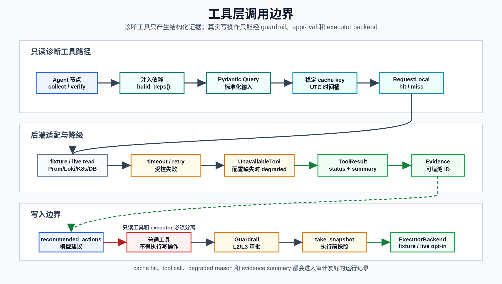

# 工具层

**最后更新：** 2026-06-18

## 概述

工具层位于 `packages/tools/`，负责把 Prometheus、Loki、Trace、Deployment、Kubernetes、Database、Runbook RAG 和 executor backend 封装成可测试、可降级的接口。Agent 节点只依赖 `BaseTool.run(query)` 或 `ExecutorBackend` 协议，不直接操作外部系统。

默认本地/CI 路径使用 fixture 或 unavailable backend，避免真实外部写入。只有显式配置的 live/read backend 才会访问真实系统。

如果需要按运行时路径理解 `ToolResult`、request-local cache、`tool_calls`、`evidence_items`、`evidence_id` 回填和 verify gates，见 [工具与证据技术深挖](../00-overview/tool-evidence-deep-dive.md)。如果需要理解 Prometheus、Loki、Trace、Deployment、K8s 和 DB backend 如何由 worker deps、`EffectiveConfig`、URL safety 和 read-only live backend 接入，见 [Observability 与后端适配器技术深挖](../00-overview/observability-backend-adapters-deep-dive.md)。如果需要聚焦 deployment change、GitHub deployments/commits fallback、Argo CD sync history 和 rollback action 边界，见 [Deployment Change、GitHub、Argo CD 与发布变更证据技术深挖](../00-overview/deployment-change-github-argocd-deep-dive.md)。如果需要聚焦 executor backend、action capability metadata、snapshot contract、execute preflight、verify gates 和 degraded rollback，见 [执行器、动作能力与验证闭环技术深挖](../00-overview/executor-action-verification-loop-deep-dive.md)。

下图展示普通诊断工具、缓存、降级和 executor 写入边界之间的关系。新增工具时应保持这些边界不变。

<p>
  
</p>

## 模块地图（15 个模块）

| 模块 | 职责 |
|------|------|
| `base.py` | `BaseTool` 协议、`ToolResult`、计时和摘要 helper |
| `cache.py` | request-local 工具缓存、稳定 cache key、UTC 时间桶 |
| `metrics.py` | Prometheus range query、PromQL 模板、统计聚合 |
| `logs.py` | Loki query_range、LogQL selector fallback、日志聚合 |
| `traces.py` | TraceTool 通用分析路径，提取慢 span、错误 span、下游服务 |
| `trace_backends.py` | fixture、disabled、Jaeger、Tempo trace backend |
| `git_changes.py` | deployment change 工具，统一 GitHub/Argo/fixture 输出 |
| `deployment_backends.py` | fixture、GitHub、Argo CD 只读 deployment backend |
| `k8s.py` | Kubernetes read-only diagnostics tool 和 backend |
| `db_diagnostics.py` | PostgreSQL read-only diagnostics tool 和 backend |
| `runbook_search.py` | Runbook RAG 的 tool wrapper |
| `executor_backends.py` | fixture executor 和 opt-in live K8s executor |
| `mock_executor.py` | legacy mock result map，供兼容路径使用 |
| `unavailable.py` | backend 未配置时返回 degraded 的占位工具 |
| `__init__.py` | 工厂函数导出 |

## Tool 协议

所有普通工具实现同步协议：

```python
class BaseTool(Protocol):
    name: str
    timeout_seconds: float

    def run(self, query: BaseModel) -> ToolResult:
        ...
```

`ToolResult` 字段：

| 字段 | 含义 |
|------|------|
| `status` | `succeeded`、`failed`、`degraded`、`timeout` |
| `data` | 工具结构化数据，用于节点逻辑 |
| `summary` | 审计友好的简短摘要 |
| `evidence` | 可持久化证据列表，后续会获得 evidence ID |
| `cache_key` | 命中的稳定 key |
| `cache_hit` | 是否来自 request-local cache |
| `duration_ms` | 调用耗时 |
| `error_message` | 降级、失败或超时原因 |

新增工具必须有 Pydantic query schema、结构化 result、timeout、降级行为、cache key 策略、审计摘要和 mocked tests。

## 缓存规则

`RequestLocalToolCache` 是单次 agent run 内的内存缓存，最多 200 条，线程安全，供 `collect_all_evidence` 并行调用共享。

| 工具 | 时间桶 | datasource 是否入 key | 说明 |
|------|--------|-----------------------|------|
| metrics | 60 秒 | 否 | query schema 标准化后 hash |
| logs | 60 秒 | 否 | 空 keywords 不参与 hash |
| traces | 300 秒 | 是 | `fixture`、`jaeger`、`tempo` 不共享缓存 |
| deployment/git changes | 600 秒 | 是 | `fixture`、`github`、`argocd` 不共享缓存 |
| runbook_search | 无时间桶 | 不适用 | query/service/incident_type/top_k hash |

cache key 统一使用 UTC bucket。工具缓存命中率是应用层/tool cache 指标，不是 provider prompt cache 指标。

## 工具清单

### MetricsTool

- 文件：`metrics.py`
- Query：`MetricsQuery(service, metric_type, start, end)`
- Backend：Prometheus HTTP API
- 失败行为：timeout 返回 `timeout`；HTTP/解析错误返回 `degraded`
- 安全策略：按窗口 shard，限制 `max_window_seconds`、`max_shards` 和 step；`service_label` 必须是合法 Prometheus label name
- metric types：`latency`、`error_rate`、`qps`、`cpu`、`memory`、`db_connections`、`cache_hit_rate`、`cpu_throttle`、`disk_avail`、`cert_expiry_days`、`dns_error_rate`、`queue_lag`、`rate_limit_hits`、`slo_burn_rate`

MetricsTool 会在拼接 PromQL 前对 service 值执行通用文本脱敏：正常服务名保持不变；如果 alert/service 字段异常携带 password、token、secret、内部 URL 或私网 IP 等片段，Prometheus query、`ToolResult.data`、evidence、summary 和 cache key 都只使用脱敏后的值。Prometheus timeout/HTTP/解析异常的 `error_message` 也会先脱敏。

### LogsTool

- 文件：`logs.py`
- Query：`LogsQuery(service, start, end, keywords, limit)`
- Backend：Loki HTTP API
- 失败行为：timeout 返回 `timeout`；HTTP/解析错误返回 `degraded`
- 安全策略：limit 限制为 1 到 1000；keywords 最多取前 10 个；`service_label` 必须是合法 Loki label name；LogQL selector 尝试 service/app/job/container/deployment/pod 等 label fallback
- 输出：error type counts、top stack signature、最多 5 条 samples

LogsTool 会在拼接 LogQL 前对 service 和 keywords 执行通用文本脱敏：正常服务名和关键字保持不变；如果 alert/service/keyword 字段异常携带 password、token、secret、内部 URL 或私网 IP 等片段，Loki query、summary、evidence title 和 cache key 都只使用脱敏后的值。Loki 返回的 log line 和 stream labels 会在聚合前执行通用文本脱敏，脱敏后的 samples 才会进入 `ToolResult.data`、evidence 和 request-local cache；Loki timeout/HTTP/解析异常的 `error_message` 也会先脱敏。

### TraceTool

- 文件：`traces.py`、`trace_backends.py`
- Query：`TraceQuery(service, start, end, min_duration_ms=500)`
- Backend：`disabled`、`fixture`、`jaeger`、`tempo`
- 失败行为：backend 空结果为 `degraded`；timeout 为 `timeout`；HTTP/解析错误为 `degraded`
- 输出：span count、slow spans、error spans、downstream services、duration p95

TraceTool 会在调用 backend 前对 service 值执行通用文本脱敏：正常服务名保持不变；如果 alert/service 字段异常携带 password、token、secret、内部 URL 或私网 IP 等片段，Jaeger/Tempo query、summary、evidence title 和 cache key 都只使用脱敏后的值。TraceTool 也会在公共输出层对 span name、downstream service 和 backend 异常消息执行通用文本脱敏，脱敏后的数据才会进入 `ToolResult.data`、evidence 和 request-local cache。Trace/span ID 保留用于关联排障；如果 ID 字段包含显式 keyed secret 或内部 endpoint，也会脱敏。

Trace backend 选择：

| 配置 | 行为 |
|------|------|
| `TRACE_ENABLED=false` | `DegradedTraceBackend`，TraceTool 降级 |
| `TRACE_BACKEND=disabled` | 同上 |
| `TRACE_BACKEND=fixture` | 读取 `demo/faults/traces.json` |
| `TRACE_BACKEND=jaeger` | Jaeger-compatible `/api/traces` |
| `TRACE_BACKEND=tempo` | Native Tempo API，带 capability flags；需要 `M9_EXTENSIONS_ENABLED=true`，否则返回 degraded backend |

### GitChangeTool

- 文件：`git_changes.py`、`deployment_backends.py`
- Query：`GitChangeQuery(service, start, end)`
- Backend：`fixture`、`github`、`argocd`
- 失败行为：空结果为 `degraded`；timeout 为 `timeout`；HTTP/解析错误为 `degraded`
- 输出：最多 10 条部署变更，字段统一为 service、deployed_at、commit_sha、author、summary、files

GitChangeTool 会在调用 backend 前对 service 值执行通用文本脱敏：正常服务名保持不变；如果 alert/service 字段异常携带 password、token、secret、内部 URL 或私网 IP 等片段，GitHub/Argo query、summary、evidence title 和 cache key 都只使用脱敏后的值。GitChangeTool 也会在公共输出层把 backend 返回值收敛到上述字段，并对 author、summary、files 和 backend 异常消息执行通用文本脱敏，脱敏后的变更才会进入 `ToolResult.data`、evidence 和 request-local cache。Commit SHA 作为排障关联 ID 保留；如果该字段包含显式 keyed secret 或内部 endpoint，也会脱敏。

GitHub backend 先读 deployments API；如果没有 deployment records，再按时间窗口查 commits 并过滤与 service 相关的文件。Argo CD backend 只读 application sync history。

更完整的只读变更证据链路、GitHub/Argo CD 字段映射、deployment evidence 如何影响诊断相关性，以及为什么最近部署不等于自动 rollback，见 [Deployment Change、GitHub、Argo CD 与发布变更证据技术深挖](../00-overview/deployment-change-github-argocd-deep-dive.md)。

### K8sDiagnosticsTool

- 文件：`k8s.py`
- Query：`K8sQuery(service, operation, namespace, pod)`
- Backend：`fixture`、`live`
- 允许操作：`describe_pod`、`logs`、`events`、`rollout_status`、`get_deployment`、`get_statefulset`
- 禁止行为：任何非 read-only operation 直接返回 `failed`

K8sDiagnosticsTool 会在调用 backend 前对 service、namespace 和 operation 执行通用文本脱敏：正常 Kubernetes 名称保持不变；如果 alert/service/namespace 字段异常携带 password、token、secret、内部 URL 或私网 IP 等片段，live Kubernetes read 参数、summary 和 evidence title 都只使用脱敏后的值。非 read-only operation 的拒绝摘要也只使用脱敏后的 operation 文本。

live backend 只调用 Kubernetes read API。它不执行 restart、scale、rollback、cordon、drain 等写操作。live 读诊断 namespace 会先使用 query 显式 namespace，再回退 backend namespace；两者为空或仅包含空白时使用 `default`，不会把空 namespace 传给 Kubernetes API。live backend 会在初始化 Kubernetes client 前校验 namespace、显式 pod 名以及 Deployment/StatefulSet 查询目标名；非法输入返回结构化 error payload，`K8sDiagnosticsTool` 将其视为 `degraded` 且不生成 evidence。Kubernetes config 加载失败时，in-cluster 和 kubeconfig 的异常摘要会先脱敏再写入错误消息。live Kubernetes read 调用会把 API error 归类为 `not_found`、`forbidden`、`unauthorized`、`rate_limited`、`timeout`、`api_error` 或 `read_failed`，不会把原始异常文本写入 payload；这些 error payload 同样按 degraded 处理。`events` 会用 `field_selector=involvedObject.name=...` 读取目标 workload 和解析出的 Pod 事件，避免 namespace-wide 事件噪声。`logs` / `describe_pod` 如果未传 `pod`，会用只读 `list_namespaced_pod` 按 `app.kubernetes.io/name`、`app`、`service`、`deployment` 等常见 label 在目标 namespace 内解析一个非终态 Pod，再读取日志或 Pod 描述；不会跨 namespace 扫描。live `logs` 和 `events` 在进入 evidence payload 前会调用通用 redaction 规则，脱敏 password、token、secret、API key、auth header、内部 URL 和私网 IP 等文本片段。live `describe_pod` 只返回 phase、node、container image/ready/restart count/state/reason 和 conditions 等安全摘要，不返回 raw Pod spec、env、args 或 annotations。`build_remediation_suggestions()` 只生成 dry-run command suggestion，不执行。

`verify` 节点的 `k8s_rollout` gate 默认使用 `operation="rollout_status"` 重新读取 Deployment rollout 状态；`restart_statefulset` 使用 `operation="get_statefulset"` 读取 StatefulSet status。该 gate 仍只读，失败会阻止整体验证结果变成 `resolved`。

live `rollout_status` 通过 `read_namespaced_deployment` 读取 Deployment spec/status，并把 `replicas`、`ready_replicas`、`available_replicas`、`updated_replicas`、`observed_generation` 和 conditions 映射为 `complete`、`progressing`、`paused`、`pending` 或 `failed`；不会调用任何 rollout 写 API。

`k8s_rollout` verify 会按 action type 解释状态：`paused` 只对 `pause_rollout` 表示成功；对 `resume_rollout` 表示尚未恢复；对 restart/scale/rollback 类动作不视为 resolved。

同一 target 上不同 action type 的 `k8s_rollout` gate 会分别保留，避免 `pause_rollout` / `resume_rollout` 这类相反语义在 gate 去重时互相覆盖。

live `get_statefulset` 通过 `read_namespaced_stateful_set` 读取 StatefulSet spec/status，并返回安全摘要字段：`replicas`、`desired_replicas`、`ready_replicas`、`current_replicas`、`updated_replicas`、`current_revision`、`update_revision`、`observed_generation`、conditions 和归一化 `status`。当 `current_revision` 尚未追上 `update_revision` 时，即使 ready/updated 副本数已经满足期望，也会标记为 `progressing`，verify gate 不会把该状态误判为 `resolved`。

### DbDiagnosticsTool

- 文件：`db_diagnostics.py`
- Query：`DbDiagnosticsQuery(operation, limit)`
- Backend：`fixture`、`live`
- 允许操作：`connection_pool`、`locks`、`slow_queries`
- SQL：固定 SELECT 模板，用户输入只选择 operation 和 limit
- live 安全策略：专用连接、`conn.read_only = True`、`statement_timeout`、`_assert_read_only()` 二次校验

live DB diagnostics 只能读取 PostgreSQL 诊断视图，不允许任何 DDL/DML。

Live DB backend 会在本地校验运行时 timeout：`statement_timeout_ms` 必须是正整数，`connect_timeout_seconds` 必须是正数并归一成至少 1 秒的 psycopg connect timeout；非法值在连接数据库前失败。

Live DB backend 和 `DbDiagnosticsTool` 捕获查询/连接异常时只暴露脱敏后的错误摘要，避免 DSN、password、token 或 URL credential 进入 `ToolResult.error_message`。返回 rows 中的字符串值也会脱敏，尤其是 `pg_stat_statements.query` 这类可能包含 SQL literal 的字段；脱敏后的 rows 才会进入 `ToolResult.data` 和 evidence。

`verify` 节点的 `db_readonly` gate 使用 `operation="connection_pool"` 重新读取连接池状态；该 gate 默认 optional，不可用时记录 `unknown`，不会触发任何 DB 写 remediation。

### RunbookSearchTool

- 文件：`runbook_search.py`
- Query：`RunbookSearchQuery(query, service, incident_type, top_k)`
- Backend：`RunbookRetriever`
- 输出：tool evidence type 为 `runbook`，包含 `chunk_id`、`source_path`、metadata 和 score
- 失败行为：任何 retriever 异常返回 `degraded`，不阻塞诊断

### Executor Backends

Executor 不是普通 `BaseTool`，而是 `ExecutorBackend` 协议：

```python
class ExecutorBackend(Protocol):
    name: str
    def execute(self, action: dict, context: ExecutionContext) -> ExecutionResult: ...
    def rollback(self, action: dict, snapshot: dict, context: ExecutionContext) -> ExecutionResult: ...
```

| Backend | 默认 | 行为 |
|---------|------|------|
| `FixtureExecutorBackend` | 是 | 返回确定性 mock result，供测试、本地 demo、CI 使用 |
| `LiveK8sExecutorBackend` | 否 | `EXECUTOR_BACKEND=live` 显式 opt-in，只支持 restart/pause/resume/scale/rollback 类 Kubernetes mutation |

live executor 当前支持：`restart_pod`、`restart_deployment`、`restart_service`、`restart_statefulset`、`pause_rollout`、`resume_rollout`、`scale_deployment`、`scale_back`、`rollback_release`。`restart_deployment` 使用与 `restart_pod` 相同的 Deployment pod template annotation patch；`rollback_deployment` 是兼容别名，会规范化为 `rollback_release` 并调用同一个 Deployment rollback subresource。其它动作失败关闭。

Live K8s action capability metadata 会声明执行后必须运行的 verify gates。Restart/pause/resume/scale 类能力至少包含 `k8s_rollout` 和 `metrics_logs`；rollback 类能力还包含 `db_readonly`。Gate 执行由 Agent `verify` 节点完成，不由 executor backend 直接执行。Restart/pause/resume 类动作是 bounded irreversible Deployment/StatefulSet patch，不提供 restore/undo 保证；executor 只负责执行受控 patch，后续恢复判断由只读 verify gates 和 replan 循环完成。

Agent snapshot、live executor context 和 post-action K8s verify 使用同一个有效 namespace：`EXECUTOR_K8S_NAMESPACE` 优先；为空时回退 `K8S_NAMESPACE`；仍为空时使用 `default`。Snapshot namespace 与 executor namespace 不一致时，live preflight 会阻断执行。

`scale_deployment` / `scale_back` 的 `k8s_rollout` verify 会携带期望 replicas：优先使用 action params；降级回退的 `scale_back` 可使用 executor `execution_result.details.replicas`。如果只读 rollout payload 中的 `desired_replicas` / `replicas` 与期望值不一致，即使 rollout status 显示 complete，也不会判定为 resolved。

live executor backend 自身也会失败关闭：所有 live K8s mutation 都会 trim target 和 namespace，要求非空 DNS-1123 target；namespace 按 context namespace、backend namespace、`default` 的顺序兜底，空白字符串不会传给 Kubernetes API；`params` 必须是 object，并按 action type 执行参数白名单；restart/pause/resume 类动作不接受任何 params。

Live executor 的具体 `_live_*` handler 也会重复执行同一套最小 preflight（target/namespace 规范化、DNS-1123 校验、action alias 归一化、params object 和参数白名单），避免测试或内部直接调用 handler 时绕过 backend 入口边界。

`scale_deployment` / `scale_back` 只允许 patch Deployment scale subresource。live preflight 和 executor backend 都会在调用 Kubernetes API 前校验 target、namespace、Deployment snapshot、参数只包含 `replicas`，且 replicas 是 0 到 50 的整数；`scale_back` 的降级回退路径可以从 pre-action snapshot 读取原始 replicas。

`rollback_release` / `rollback_deployment` 只允许调用 Deployment rollback subresource。live preflight 和 executor backend 都会校验 Deployment snapshot、参数只包含可选 `to_revision`，且显式或 snapshot 填充的 revision 必须是正整数；普通 rollback 可以不传 `to_revision`，使用 Kubernetes rollback subresource 的默认上一版语义。Rollback snapshot 填参按 action type 分离：scale-back 只填 `replicas`，rollback-release 只填 `to_revision`。

Live executor 成功结果会在 `execution_result.details` 中记录审计字段，包括 `resource`、`target`、`namespace`、`patch` 或 `subresource`，以及受控字段值（如 `replicas`、`paused`、`to_revision` 或 restart annotation 名称）。这些字段用于确认真实写入边界，不包含 kubeconfig、token 或 raw Kubernetes 对象。

Live executor 捕获 Kubernetes client 异常时只在日志中记录 action、target、namespace、exception type 和脱敏后的异常摘要；不会记录 raw exception stack，也不会把原始异常文本写入 `ExecutionResult.details`。

Live executor 初始化 Kubernetes client 时也会先尝试 in-cluster config，再尝试 kubeconfig；两者都失败时，错误消息只包含脱敏后的失败摘要。

Executor backend 只负责执行或返回执行结果，不负责风险分类、人工审批或 post-action verify。完整闭环由 `guardrail_check -> human_approval -> take_snapshot -> execute_action -> verify -> replan/report` 组成，详见 [执行器、动作能力与验证闭环技术深挖](../00-overview/executor-action-verification-loop-deep-dive.md)。

## Worker 中的依赖构造

`apps/worker/tasks.py` 的 `_build_deps()` 会：

1. 读取已发布 EffectiveConfig 和 settings。
2. 构造 `RequestLocalToolCache`。
3. 使用 EffectiveConfig URL 构造 metrics、logs、trace 和 Alertmanager poll 依赖；production active override 会参与 merge，未发布 proposal 不会进入 worker。
4. 根据 settings 构造 deployment、k8s、db diagnostics、executor backend。GitHub/Argo/K8s/DB/executor 的 secret-bearing settings 不写入 EffectiveConfig。
5. 如果 metrics/logs/trace URL 不可用，使用 `UnavailableTool` 返回 degraded，而不是传入 `None`。
6. 构造 `RunbookRetriever(use_hybrid=settings.runbook_hybrid_search_enabled)` 和 `RunbookSearchTool`。
7. 把所有依赖注入 `AgentDeps`。

节点不得绕过 `_build_deps()` 直接创建 live client。

## 新增工具 checklist

1. 新建 Pydantic query schema，并验证必填字段、时间窗口、limit。
2. 返回 `ToolResult`，不要返回裸 dict。
3. 给每个外部调用设置 timeout。
4. 明确 degraded/timeout/failure 的返回行为。
5. 设计稳定 cache key，包含 datasource 或 backend 名称，避免跨 backend 污染。
6. evidence 中只放摘要和可追溯 ID，不放 raw secret 或大块 raw logs。
7. 所有 live/read backend 都要有 fixture 或 mock 测试。
8. 如果工具可能产生写入能力，不应放在普通 diagnostics tool 中；必须走 executor backend、guardrail 和 approval。
9. 更新本文件、相关配置参考和测试策略。

## 常用测试入口

- `tests/unit/test_tools.py`
- `tests/unit/test_tools_phase2.py`
- `tests/unit/test_collect_all_evidence.py`
- `tests/unit/test_tool_call_repository.py`
- `tests/unit/test_evidence_validation.py`
- `tests/unit/test_tempo_trace_backend.py`
- `tests/unit/test_trace_backend_settings.py`
- `tests/unit/test_k8s_diagnostics_resilience.py`
- `tests/unit/test_executor_backends.py`
- `tests/unit/test_rag.py`
- `tests/unit/test_semantic_runbook_search.py`
- `tests/unit/test_build_deps_integration.py`
- `tests/integration/test_worker_tool_audit.py`
