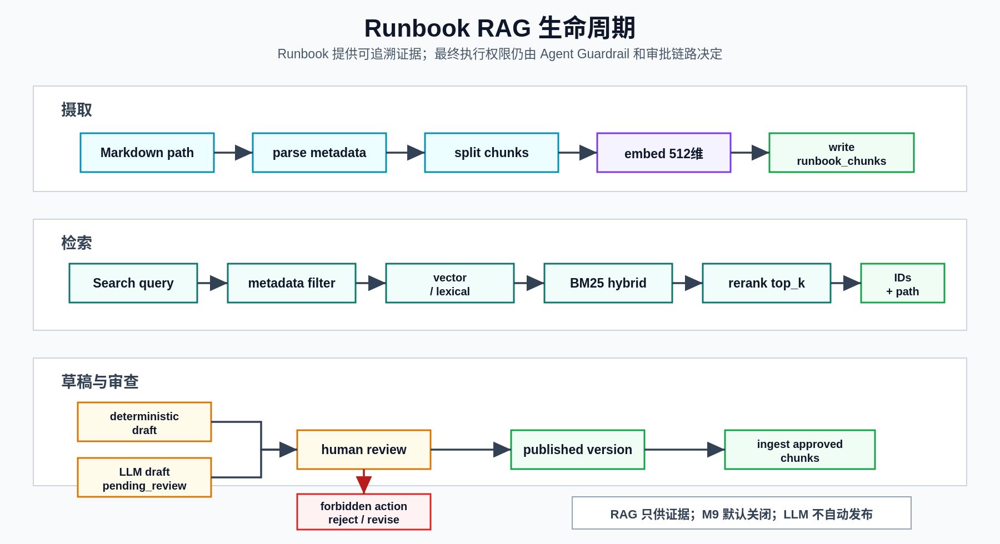

# Runbook RAG

**最后更新：** 2026-06-18

## 概述

Runbook RAG 把 Markdown runbook、已发布草稿和历史知识引入诊断上下文。Agent 使用 `RunbookSearchTool` 调用 `RunbookRetriever`，返回的结果必须包含 `chunk_id`、`source_path`、`title`、`excerpt`、`score` 和 `metadata`，以便诊断结论可追溯。

RAG 不是执行层。runbook 中的动作描述会被分类和审查，但最终执行权限仍由 Agent guardrail、approval 和 executor backend 决定。

如果需要沿当前代码路径理解 runbook ingest/search 如何进入 Agent context、如何和 memory/context compression/cache 指标组合，见 [RAG、记忆与上下文技术深挖](../00-overview/rag-memory-context-deep-dive.md)。
如果需要聚焦 deterministic runbook feedback analyzer、`RunbookFeedbackSummary`、`AmendmentDraft` review/apply 元数据和未自动接线边界，见 [反馈、NFA、关联事件与持续学习技术深挖](../00-overview/feedback-nfa-correlation-continuous-learning-deep-dive.md)。

## 模块地图（20 个模块）

| 模块 | 用途 |
|------|------|
| `__init__.py` | 导出 RAG provider、retriever、ingestor 等公开入口 |
| `metadata.py` | 解析 Markdown front matter 和 runbook 元数据 |
| `splitter.py` | Markdown-aware 分块，按 H2 section 和 token 预算切分 |
| `ingest.py` | 本地 Markdown runbook 摄取管道和 CLI |
| `embeddings.py` | 旧 FakeEmbedding 兼容 shim，推荐使用 `embedding_factory.py` |
| `embedding_factory.py` | `fake`、`bge_zh` embedding provider 分发；拒绝与主存储不兼容的维度 |
| `embedding_jobs.py` | M9 embedding job 去重和 search mode helper |
| `external_embedding_provider.py` | M9 外部 embedding provider 组件，默认关闭 |
| `bm25.py` | PostgreSQL tsvector 查询构造、BM25/词法 fallback 归一化、自适应 alpha |
| `retriever.py` | 主检索编排：vector/lexical recall、BM25 hybrid、rerank、format context |
| `reranker.py` | 旧 rerank 兼容 shim |
| `reranker_backends.py` | `fake`、`cohere`、`jina`、`bge` reranker backend |
| `runbook_generator.py` | incident-cluster runbook draft 生成，使用注入的 LLM adapter |
| `llm_runbook_generator.py` | M9 LLM runbook 草稿生成，输出 pending_review |
| `runbook_prompt_builder.py` | M9 runbook LLM prompt 构造和脱敏 metadata |
| `runbook_web_context.py` | M9 Web 搜索上下文构建，证据只用于草稿审查 |
| `web_search_provider.py` | `disabled`、`fake` Web search provider |
| `incident_diff.py` | M9 incident vs approved runbook 差异分析，输出 amendment draft |
| `runbook_action_classifier.py` | runbook 动作步骤安全分类 |
| `template_extractor.py` | 从 incident cluster 提取模板变量 |

## 数据模型

Runbook 搜索主要读写：

| 表/模型 | 用途 |
|---------|------|
| `runbook_chunks` | 已入库的 chunk，当前 embedding 字段是 `vector(512)` |
| `runbook_chunk_embeddings` | embedding side table，按 provider/model/dimension 存储附加向量 |
| `runbook_drafts` | 草稿，包括 deterministic、template、LLM generated |
| `runbook_versions` | 发布版本记录，保留 version number 和来源 |
| `amendment_drafts` | incident diff 或反馈生成的 amendment 草稿 |

FakeEmbeddingProvider 和 BGE-ZH 都输出 512 维向量，匹配当前 `runbook_chunks.embedding`。`Text2VecEmbeddingProvider` 输出 1024 维，使用前需要确认目标存储路径和迁移是否匹配。

下图概括 runbook 从摄取、检索到草稿审查的生命周期。RAG 只提供证据上下文，不改变 remediation 的最终执行权限。

<p>
  
</p>

## 摄取流程

```text
Markdown path
  -> parse_runbook_markdown
  -> split_markdown_document
  -> embed title + content
  -> create runbook_chunks
```

入口：

- API：`POST /api/runbooks/ingest`
- CLI：`python -m packages.rag.ingest --path demo/runbooks`
- Service：`RunbookService.ingest()`

`split_markdown_document()` 当前默认：

| 参数 | 默认值 | 说明 |
|------|--------|------|
| `target_tokens` | `450` | 目标 chunk 大小 |
| `max_tokens` | `900` | 单个 chunk 最大大小 |
| `overlap_tokens` | `80` | 长 section 分块重叠 |

chunk metadata 会保留 document title、parent title、chunk index、token count、content hash、service、incident type、language 等字段。

## Embedding Provider

`build_embedding_provider(settings)` 当前支持：

| Provider | 维度 | 默认/用途 |
|----------|------|-----------|
| `disabled` | 512 placeholder | 关闭语义 embedding，使用零向量占位以保持 `vector(512)` 写入兼容，检索依赖 lexical/BM25 |
| `fake` | 512 | 默认，本地/测试 deterministic，无网络 |
| `bge_zh` | 512 | 本地 BAAI/bge-small-zh HTTP 服务，默认 URL `http://localhost:8083` |
| `text2vec` | 1024 | 当前主表是 `vector(512)`，因此 `build_embedding_provider()` 会拒绝该 provider，直到有匹配迁移/side-table 写入路径 |
| `external` | 512 fallback in primary path | 只有 `M9_EXTENSIONS_ENABLED=true`、`SEMANTIC_RUNBOOK_SEARCH_ENABLED=true`、`EXTERNAL_EMBEDDING_PROVIDER_ENABLED=true` 且 `EXTERNAL_EMBEDDING_URL` 通过 URL safety 校验时才构造外部 provider；否则降级为 `disabled` |

`FakeEmbeddingProvider` 通过 SHA256 生成稳定归一化向量。测试不得使用随机向量。

`external_embedding_provider.py` 是 M9 受控组件，具有 URL safety 校验、脱敏、timeout、retry、circuit breaker 和 secret ref 设计；它默认关闭，并受 `M9_EXTENSIONS_ENABLED`、`SEMANTIC_RUNBOOK_SEARCH_ENABLED`、`EXTERNAL_EMBEDDING_PROVIDER_ENABLED`、外部 provider 权限等条件约束。当前 primary `runbook_chunks.embedding` 仍是 512 维；外部 provider 在 primary 检索路径中只接受 512 维结果，失败或维度不匹配时降级为零向量。

## 检索流程

`RunbookRetriever.search()` 的当前流程：

1. 标准化 `RunbookSearchQuery(query, service, incident_type, top_k)`。
2. 计算 query embedding。
3. 遍历 repository 中的 chunks，按 metadata 过滤。
4. 对每个候选计算 vector cosine score 与 lexical overlap score，取较大值。
5. 当 `use_hybrid=true` 时，PostgreSQL 环境执行 tsvector/BM25 recall；SQLite 测试和 eval 环境使用确定性词法 fallback，避免执行 PostgreSQL 专用的 `@@ to_tsquery` 语法。
6. 截取前 20 个候选交给 reranker。
7. 返回 top_k 个 `RunbookSearchResult`。

`use_hybrid` 由 worker 中的 `settings.runbook_hybrid_search_enabled` 传入，默认 `true`。`SEMANTIC_RUNBOOK_SEARCH_ENABLED` 是 M9 feature gate/control-plane 标志，默认关闭；当前检索构造仍以 `runbook_hybrid_search_enabled` 和 embedding provider 为实际运行参数。

## 搜索结果契约

API 和 tool 层应返回同一类字段：

| 字段 | 含义 |
|------|------|
| `chunk_id` | `chk_` 前缀 chunk ID |
| `source_path` | Markdown 文件或 `drafts/{draft_id}.md` |
| `title` | chunk 标题 |
| `excerpt` | 最多约 360 字符的相关片段 |
| `score` | rerank 后得分 |
| `metadata` | service、incident_type、token_count、content_hash 等 |

`format_runbook_context()` 会把结果格式化为包含 chunk ID 和 source path 的 prompt block。Agent 的 `retrieve_runbook` 节点会把 runbook 命中持久化为 `evidence_items(type=runbook)`，`source_id` 指向 `chunk_id`，`payload.source_path` 保留原始 Markdown 路径，并把生成的 `evidence_id` 回写到 `runbook_context`。诊断输出引用 runbook 时应同时保留 `evidence_id` 和 `runbook_chunk_ids`。

## Reranker

`build_reranker_backend(settings)` 支持：

| Provider | 默认 | 说明 |
|----------|------|------|
| `fake` | 是 | 启发式得分：vector score、service match、incident type match、title keyword、freshness |
| `cohere` | 否 | Cohere Rerank API，需要 API key |
| `jina` | 否 | Jina reranker compatible HTTP API |
| `bge` | 否 | BGE reranker HTTP API |

未知 reranker provider 会抛 `ValidationAppError`。

## Draft、Version 与 Amendment

更完整的 draft 来源、publish 创建 `RunbookVersion`、draft chunk ingest 降级、M9 incident diff amendment 状态机和 `applied` 不自动合并的边界见 [Runbook 草稿、版本与 Amendment 生命周期技术深挖](../00-overview/runbook-draft-version-amendment-lifecycle-deep-dive.md)。

### 确定性 draft

`RunbookGenerator` 和 `TemplateExtractor` 可基于 incident cluster 生成 draft，并通过注入的 LLM adapter 生成 Markdown；本地、测试和 CI 应使用 FakeLLM 保持确定性。template engine 是纯模板路径。draft 需要 review 后才能发布。

### Draft review

`RunbookService.review_draft(status="published")` 会：

1. 更新 draft 状态。
2. 创建 `RunbookVersion`。
3. 将 draft content 解析、分块并写入 `runbook_chunks`。

发布 draft 的 chunk ingest 对 embedding provider/embedding 失败做降级：如果 provider 不可用或单个 chunk embedding 失败，会以 512 维零向量和 `embedding_model="none"` 继续保存，避免 pgvector 维度错误，同时关键词检索仍可用。

本地 Markdown ingest 当前同步调用配置的 embedding provider。默认 fake provider 不会失败；切换到外部 HTTP provider 前应确保服务可用，并补充失败降级测试。

### LLM runbook draft (M9)

`LLMRunbookGenerator` 只返回草稿内容，service 层持久化为：

```text
RunbookDraft(status=pending_review, draft_type=llm_generated)
```

它不会自动发布，不会修改 approved runbook，不会执行 remediation。

Provider 工厂、外部 LLM allow、prompt redaction、draft-only 与 incident diff pending-review 边界的完整横向说明见 [LLM、Prompt、FakeLLM 与 Provider 边界技术深挖](../00-overview/llm-prompt-fakellm-provider-boundaries-deep-dive.md)。

### Incident diff (M9)

`IncidentDiffAnalyzer` 只生成 amendment proposals，service 层持久化为：

```text
AmendmentDraft(status=pending_review)
```

证据不足时返回 `skipped_insufficient_evidence`，不会调用 LLM。
Review 可以把 amendment 从 `pending_review` 置为 `approved` 或 `rejected`；
`applied` 是独立状态，只有已批准、带 evidence refs 的 `proposed_patch` 才能应用到目标 draft/version。
当前 `applied` 只记录 amendment lifecycle metadata，不会自动合并内容、发布 runbook 或重新 ingest chunks；完整边界见 [反馈、NFA、关联事件与持续学习技术深挖](../00-overview/feedback-nfa-correlation-continuous-learning-deep-dive.md)。

## Web 搜索 (M9)

`RunbookWebContextBuilder` 默认关闭。启用需要：

- `M9_EXTENSIONS_ENABLED=true`
- `RUNBOOK_WEB_SEARCH_ENABLED=true`
- `RUNBOOK_WEB_SEARCH_PROVIDER` 不是 `disabled`
- 生产环境必须配置 allowed domains

安全措施：

- 搜索 query 脱敏。
- 使用 `BackendUrlSafetyValidator` 的 web-search 严格模式校验 original URL、redirect chain 和 final URL。
- 默认要求 HTTPS，阻止 localhost、metadata endpoint、cluster 内域名、私网 IP，并对 DNS 解析结果再次校验。
- `RUNBOOK_WEB_SEARCH_BLOCKED_DOMAINS` 优先于 allowed domains；生产环境 allowed domains 为空时返回 blocked/config error，不发起 provider 调用。
- 结果带 original URL、final URL、content hash、provider、redaction version、retrieved_at。
- 结果只作为 draft enrichment evidence，不自动发布。

当前 provider：`disabled` 和 deterministic `fake`。`exa` 仍是未来 provider；未知 provider 会返回 `config_error`，不会回退到默认搜索 provider。

## 动作分类

`RunbookActionClassifier` 只用于审查 runbook 内容：

| 分类 | 关键词示例 | 含义 |
|------|------------|------|
| `forbidden` | delete、drop、truncate、flush、modify_database、destroy、purge | 禁止草稿直接进入安全发布 |
| `approval_required` | restart、scale、rollback、revert、drain、evict、enable_rate_limit、cancel_deployment | 需要人工确认的操作措辞 |
| `diagnostic_only` | profile、dump、trace、debug、inspect | 诊断类动作 |
| `read_only` | check、query、list、get、describe、show、fetch | 只读动作 |
| `unknown` | 无匹配 | 需要人工审查 |

该分类器不替代 Agent guardrail；实际 remediation 的最终权限仍由 `classify_risk_level()` 决定。

## 新增检索能力 checklist

1. 明确是否影响 ingest、retriever、reranker、tool wrapper 或 API。
2. 保持 `RunbookSearchResult` 的 chunk ID 和 source path。
3. 不使用随机 embedding；测试使用 fake provider。
4. 新外部调用必须有 feature gate、timeout、脱敏、审计/指标和降级。
5. 不让 LLM 自动发布 runbook 或 amendment。
6. 若变更 embedding 维度，先同步数据库迁移、provider、测试和文档。
7. 更新 `docs/03-tools/tool-layer.md`、本文件、测试策略和配置参考。

## 常用测试入口

- `tests/unit/test_rag.py`
- `tests/unit/test_runbook_draft_ingest.py`
- `tests/unit/test_runbook_action_classifier.py`
- `tests/unit/test_runbook_template_engine.py`
- `tests/unit/test_runbook_tsvector_schema.py`
- `tests/unit/test_semantic_runbook_search.py`
- `tests/unit/test_external_embedding_provider.py`
- `tests/unit/test_llm_runbook_generation.py`
- `tests/unit/test_incident_diff_analysis.py`
- `tests/e2e/test_m9_semantic_search.py`
- `tests/e2e/test_m9_ai_extensions.py`
