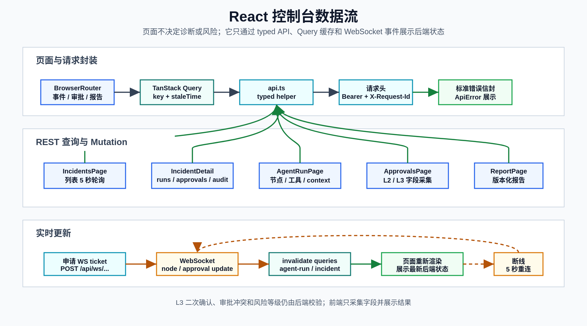

# React 控制台

**最后更新：** 2026-06-14

本文描述 `apps/web/` 当前实现。前端是运维控制台，不是营销页；第一屏默认进入事件列表，所有关键交互都围绕事件、诊断运行、审批和报告。

## 技术栈

| 能力 | 当前实现 |
|------|----------|
| UI 框架 | React 19 + TypeScript 5.7 |
| 构建工具 | Vite 6 |
| 路由 | React Router DOM 7，`BrowserRouter` |
| 服务端状态 | TanStack Query 5 |
| 图标 | `lucide-react` |
| 样式 | 单文件 `apps/web/src/styles.css`，约 1,269 行，无 UI 框架 |
| 单元测试 | Vitest + React Testing Library + jsdom |
| E2E | Playwright |

`main.tsx` 负责创建 `QueryClient`、挂载 `BrowserRouter`，并且只在生产构建中自动注册 `/sw.js`。审批通知按钮也会在用户授权后注册同一个 service worker。

下图概括控制台页面、API client、TanStack Query、REST API 和 WebSocket 事件之间的数据流。

<p>
  
</p>

## 文件职责

| 文件 | 职责 |
|------|------|
| `apps/web/src/App.tsx` | 页面路由、页面组件、审批弹窗、可视化、loading/empty/error 组件、WebSocket hook |
| `apps/web/src/api.ts` | API 类型、认证存储、请求封装、错误封装、分页归一化和所有 API helper |
| `apps/web/src/main.tsx` | React 根节点、QueryClient、Router、生产 service worker 注册 |
| `apps/web/src/styles.css` | 全局布局、页面、表格、状态徽章、可视化、弹窗、响应式样式 |
| `apps/web/public/sw.js` | 浏览器通知使用的 service worker |
| `apps/web/src/App.test.tsx` | 页面级行为测试，目前 19 个测试 |
| `apps/web/src/api.test.ts` | API client 测试，目前 11 个测试 |
| `apps/web/src/e2e/smoke.spec.ts` | Playwright smoke 流程，目前 1 个测试 |

## 路由

| 路由 | 页面 | 主要数据源 |
|------|------|------------|
| `/` | 重定向到 `/incidents` | - |
| `/incidents` | 事件列表 | `GET /api/incidents` |
| `/incidents/:incidentId` | 事件详情 | incident、runs、approvals、correlation、comments、audit |
| `/agent-runs/:agentRunId` | Agent 运行详情 | `GET /api/agent-runs/{agent_run_id}` + WebSocket |
| `/approvals` | 审批列表 | `GET /api/approvals?status=...` |
| `/approvals/:approvalId` | 审批列表并打开指定审批 | `GET /api/approvals/{approval_id}` |
| `/incidents/:incidentId/report` | 事件报告 | `GET /api/incidents/{incident_id}/report` |
| `*` | Not found | - |

侧边栏只暴露两个主入口：事件和审批。事件报告和 Agent Run 页面从事件详情进入，审批详情可以通过深链接直接打开。

## API Client

`api.ts` 的请求封装有几个固定行为：

- `VITE_API_BASE_URL` 存在时作为 API 前缀；未设置时使用相对路径，开发环境由 Vite proxy 处理 `/api`。
- 每个请求自动带 `X-Request-Id`，格式为 `web_<timestamp>_<random>`。
- API key 存在 `localStorage` 的 `sre_api_key` 中，请求时写入 `Authorization: Bearer <key>`。
- `createApiKey(payload, authToken)` 使用输入的 bootstrap token，而不是本地已保存 key。
- 侧边栏“生成密钥”默认创建 `scopes=["api_key:admin"]`、`roles=["operator"]` 的本地 Web key，避免 bootstrap seed 移除后无法继续管理 key。
- 标准错误信封会转换为 `ApiError(status, code, requestId, details)`，页面错误态会显示 `request_id`。
- 列表接口通过 `normalizePaginatedResponse` 同时兼容分页响应和旧的数组响应。

Vite 配置中的容器开发代理是：`/api` -> `http://api:8000`。如果在宿主机直接运行前端并且不走 Docker 网络，优先设置：

```bash
cd apps/web
VITE_API_BASE_URL=http://localhost:8000 npm run dev
```

## Query 与实时更新

| 页面/组件 | Query key | 刷新策略 |
|-----------|-----------|----------|
| 事件列表 | `['incidents', filters]` | 存在 live incident 时 5 秒轮询 |
| 事件详情 | `['incident', incidentId]` | incident live 时 5 秒轮询 |
| 事件运行列表 | `['incident-runs', incidentId]` | mutation 后失效刷新 |
| 事件审批列表 | `['incident-approvals', incidentId]` | 在 pending approvals 区块 5 秒轮询 |
| 相关事件 | `['correlated-incidents', incidentId]` | `staleTime=30s` |
| Agent Run | `['agent-run', agentRunId]` | run live 时 5 秒轮询 + WebSocket 事件失效刷新 |
| 审批列表 | `['approvals', status]` | `status=waiting` 时 5 秒轮询 |
| 单个审批 | `['approval', approvalId]` | 打开深链接时查询 |
| Action 详情 | `['action', actionId]` | 审批弹窗打开时查询 |
| 事件报告 | `['incident-report', incidentId]` | 重新生成后失效刷新 |
| 评论 | `['incident-comments', incidentId]` | 15 秒轮询 |
| 审计 | `['incident-audit', incidentId]` | `staleTime=30s` |

`LIVE_STATUSES` 包括 `open`、`diagnosing`、`waiting_approval`、`queued`、`running`、`executing`。这些状态决定是否启用页面轮询。

Agent Run 页面会先用当前保存的 bearer API key 申请短期 WebSocket ticket：

```text
POST /api/ws/incidents/{incident_id}/ticket
/api/ws/incidents/{incident_id}?ticket=<short_lived_ticket>
```

WebSocket 收到 `node_update`、`approval_update`、`incident_update` 后，会失效对应 `agent-run` 和 `incident` query。连接断开后 5 秒重连。无 API key 时仍会尝试连接不带 ticket 的 URL，是否放行由后端认证配置决定。

## 页面行为

### 事件列表

`IncidentsPage` 支持 `status`、`service`、`severity` URL 查询参数，并固定请求 `page_size=50`。列表展示事件状态、严重级别、服务、告警名、创建时间和最近诊断入口。空结果使用 `EmptyState`，错误使用 `ErrorState`。

### 事件详情

`IncidentDetailPage` 聚合事件主记录、agent runs、审批、相关事件、评论和审计日志。主要交互包括：

- 手动重新诊断：`POST /api/incidents/{incident_id}/diagnose`，payload 为 `{force: true, reason: 'manual rerun from UI'}`。
- NFA 标记、根因纠正、动作纠正，全部通过 feedback/correction API 写入后端。
- 展示证据、动作、审批摘要、相关事件、评论和审计。
- 从 run 列表进入 `/agent-runs/:agentRunId`，从报告按钮进入 `/incidents/:incidentId/report`。

### Agent Run

`AgentRunPage` 展示一次 LangGraph 运行的运行态：

- 顶部指标：状态、节点数、工具调用数、压缩事件数、WebSocket 连接状态。
- `RunProgress` 和 `RunTimeline` 展示节点进度、状态和持续时间。
- `LiveNodeLog` 合并 WebSocket 事件和后端返回的 node traces。
- `DiagnosisVisualizations` 包括 signal swimlanes、dependency graph、evidence network。
- `ToolCallList` 展示工具名称、状态、cache hit/miss、耗时和错误。
- `ContextSummary` 展示 API state 暴露的 token/context 字段以及 compression events。
- 如果运行等待审批，`PendingApprovalsSection` 直接展示当前 incident 的 waiting approvals。

注意：前端只展示后端返回的状态快照，不负责恢复 LangGraph，也不决定动作风险等级。

### 审批

`ApprovalsPage` 支持列表、状态筛选、深链接弹窗、批量批准和批量驳回。默认筛选 `status=waiting`。

审批安全边界由后端决定，前端只负责采集必要字段：

- L2 审批：审批人必填；批准或驳回后刷新审批、incident、agent-run。
- L3 审批：单个审批弹窗要求 `risk_ack=true`、`confirm_action_type`、`confirm_target`，并把字段原样发送到后端。
- 批量审批：只发送 `approval_ids`、`decision`、`approver` 和 comment；不会自动补 L3 二次确认字段。L3 批量批准应由后端按规则拒绝或要求单独审批。
- 驳回：comment 必填。

`ApprovalNotificationControl` 在浏览器允许通知后，会对新出现的 waiting approval 发送浏览器通知，并用内存 set 避免同一个 approval 重复通知。

### 报告

`ReportPage` 查询当前事件报告。后端返回 404 时显示“尚无报告”的空态，其他错误走标准错误态。重新生成报告调用 `POST /api/incidents/{incident_id}/report/regenerate`，成功后刷新 `['incident-report', incidentId]`。

报告展示版本、关联 run、根因、影响、时间线、执行动作、后续项和 evidence references。报告版本管理由后端保证，前端不覆盖历史版本。

## 状态与错误体验

通用组件位于 `App.tsx` 尾部：

- `LoadingPage`、`LoadingRows` 用于页面和列表加载。
- `EmptyState` 用于无事件、无报告、无 tool call、无 comments 等空态。
- `ErrorState` 负责显示错误标题、消息、request id 和重试按钮。
- 401 会额外提示在左侧认证面板设置或生成 API key。
- `StatusBadge`、`SeverityBadge`、`RiskBadge` 统一显示状态、严重级别和风险等级。

审批冲突、认证失败、服务端校验失败等都应通过标准 API 错误信封透传到 `ApiError`，不要在页面里解析非标准错误字符串。

## 本地运行

```bash
cd apps/web
npm ci
npm run dev
```

常用命令：

```bash
npm run build          # tsc + vite build
npm run test           # Vitest
npm run test:coverage  # 覆盖率阈值 80%
npm run test:e2e       # Playwright，自动启动 Vite :5173
```

`vitest.config.ts` 要求 statements、branches、functions、lines 都达到 80%。`playwright.config.ts` 的 baseURL 是 `http://127.0.0.1:5173`，webServer 命令是 `npm run dev -- --port 5173`。

## 新增或修改页面 Checklist

- 在 `App.tsx` 增加 route，并确认侧边栏是否需要新增入口。
- 在 `api.ts` 增加类型和 API helper，不在组件里拼 ad hoc fetch。
- 使用 TanStack Query key，mutation 成功后失效相关 query。
- 覆盖 loading、empty、error、401 和必要的 conflict/validation 状态。
- 如果涉及审批，L2/L3/L4 规则仍以后端 guardrail 为准，L3 字段必须显式采集。
- 如果展示 run state 或 evidence，保留后端提供的 evidence id、tool call id、request id。
- 更新 `App.test.tsx` 或 `api.test.ts`；跨页面主路径变化时更新 Playwright smoke。
