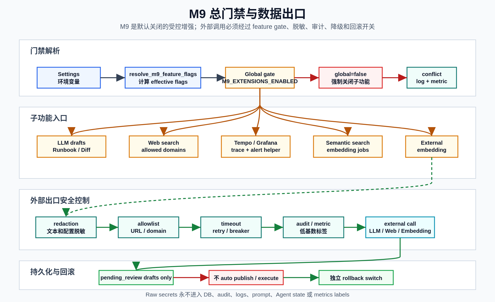

# M9 Threat Model

**Last updated:** 2026-06-14

M9 introduces optional AI and external-context paths. This threat model defines the assets, trust boundaries, threats, and required controls for those paths. It does not relax the existing M0-M8 safety model: fixture execution remains default, live Kubernetes writes remain narrow and opt-in, and L2/L3/L4 guardrails remain deterministic.

## Assets

| Asset | Why it matters |
|-------|----------------|
| Incident evidence | May contain service names, logs, stack traces, endpoints, user identifiers, or operational details. |
| Runbooks and drafts | Can influence operator decisions; unsafe instructions can cause operational harm. |
| Effective config | Contains backend URLs and operational topology; must not expose secrets or enable unsafe backends. |
| API keys and scopes | Control access to config, discovery, and M9 review endpoints. |
| LLM prompts/responses | May cross process or network boundaries depending on provider. |
| Web search queries/results | Can disclose incident context or introduce untrusted content. |
| Embedding inputs/vectors | May leak text content or encode sensitive information. |
| Audit logs and metrics | Must remain useful without storing raw secrets. |

## Trust Boundaries

<p>
  
</p>

```text
Browser / operator
        |
        v
FastAPI API boundary
        |
        +--> PostgreSQL / pgvector
        +--> Redis / Celery
        +--> LangGraph worker
        |
        +--> local observability backends
        +--> optional external LLM
        +--> optional Web search provider
        +--> optional external embedding endpoint
```

The highest-risk crossings are:

- Process to external LLM provider.
- Process to external Web search provider.
- Process to external embedding provider.
- Operator-supplied config or discovered backend URL to worker runtime.
- LLM/Web-derived text to runbook review surfaces.

## Security Controls Already Present

| Control | Implementation |
|---------|----------------|
| Feature gates | `packages.common.feature_flags` resolves the global M9 gate and sub-feature flags. |
| API scopes | `require_scope()` protects M9 runbook endpoints when API key auth is enabled. |
| Redaction | `packages.common.redaction` removes bearer/basic auth, API keys, passwords, private keys, URL credentials, internal URLs, private IPs, raw token patterns, and namespace references. |
| URL safety | `BackendUrlSafetyValidator` rejects metadata endpoints, unsafe schemes, and production localhost/private IPs unless allowlisted. |
| LLM draft boundary | `LLMRunbookGenerator` and `IncidentDiffAnalyzer` return drafts/amendments only. Review APIs are separate. |
| External LLM allow | Cloud providers require `LLM_EXTERNAL_PROVIDER_ALLOWED=true`. |
| Web production allowlist | Production Web search requires `RUNBOOK_WEB_SEARCH_ALLOWED_DOMAINS`. |
| Tempo production review | Tempo discovery status is `requires_review` in production. |
| External embedding degradation | External embedding returns `None` on failures and supports timeout/retry/circuit breaker behavior. |
| Config override restrictions | Config override API forbids secret/auth/executor/live fields. |
| Immutable audit | Config, discovery, approval, feedback, and related write paths record audit logs. |

## Threats and Required Mitigations

### T1: Secret Leakage to LLM, Web, Embedding, Logs, or DB

Risk:

- Prompts, Web queries, embedding text, audit details, or metrics could include raw tokens, passwords, private keys, auth headers, internal URLs, or private IPs.

Mitigations:

- Run `redact_text()` before LLM prompts, Web search queries, and external embedding input.
- Run `redact_dict_values()` before including effective config in prompts.
- Never put raw secret values in DB fields, audit details, logs, metrics labels, or Agent state.
- Use secret references such as `env:VAR_NAME`; resolve at call time.
- Add regression tests with realistic bearer tokens, API keys, passwords, private keys, metadata URLs, and private IPs.

Signals:

- `agentp_m9_secret_redaction_failures_total`
- Unit tests under M9 safety suites

### T2: Prompt Injection Through Runbook, Web, or Incident Text

Risk:

- Untrusted text could instruct the LLM to ignore safety rules, include destructive actions, or exfiltrate context.

Mitigations:

- Treat LLM output as draft-only.
- Classify generated action steps with deterministic `RunbookActionClassifier`.
- Keep publication behind reviewer API.
- Preserve source/evidence IDs for reviewer traceability.
- Reject or flag destructive terms such as delete, drop, truncate, flush, or database modification wording.

Residual risk:

- A reviewer could still approve a poor draft. The control is review workflow and traceable evidence, not automatic trust.

### T3: Uncontrolled External Calls or Data Exfiltration

Risk:

- A disabled or partially configured M9 feature could call external providers.

Mitigations:

- Check both global M9 gate and sub-feature gate before external or AI work.
- Keep providers disabled by default.
- Require `LLM_EXTERNAL_PROVIDER_ALLOWED=true` for external LLM providers.
- Require production Web allowed domains.
- Use timeout and degraded results for each external call.

Implementation note:

- `RunbookWebContextBuilder`, `LLMRunbookGenerator`, and `IncidentDiffAnalyzer` perform explicit gate checks.
- `resolve_m9_feature_flags()` records conflicts where sub-feature flags are true while global M9 is false.

### T4: SSRF or Unsafe Backend URL Publication

Risk:

- Discovered or operator-provided URLs could target metadata services, localhost, private networks, or unsupported schemes.

Mitigations:

- Validate URLs with `BackendUrlSafetyValidator`.
- Production rejects localhost and private IPs unless allowlisted.
- Metadata hosts are always blocked.
- General config overrides cannot set secret/auth/executor/live fields.
- Production discovery marks endpoints `requires_review` instead of auto-publishing.

Residual risk:

- DNS names can still resolve to private IPs after validation if DNS changes later. Production should pair allowlists with network egress policy.

### T5: Unsafe Runbook Publication or Amendment Application

Risk:

- LLM diff or draft generation could silently change runbook knowledge.

Mitigations:

- LLM generation creates `RunbookDraft(status=pending_review)`.
- LLM incident diff creates `AmendmentDraft(status=pending_review)`.
- Draft/amendment review APIs require explicit reviewer action.
- Publishing a draft creates a `RunbookVersion`; regeneration creates a new draft and does not overwrite the original.

### T6: Tempo or Discovery Changes Break Existing Jaeger Behavior

Risk:

- Enabling M9 Tempo might disrupt the M8 Jaeger trace path or publish a wrong trace backend.

Mitigations:

- Jaeger remains independent of M9.
- Record `PRE_M9_TRACE_BACKEND` and `PRE_M9_TRACE_ENABLED` before Tempo rollout.
- Use `TRACE_BACKEND=tempo` only in controlled rollout.
- Disable `TEMPO_DISCOVERY_ENABLED` for immediate discovery rollback.
- Restore previous trace settings on full rollback.

### T7: Grafana Payload Abuse

Risk:

- Webhook payloads can be large, malformed, or contain volatile fields that defeat deduplication.

Mitigations:

- Generic `/api/alerts` uses the normal API key, rate limit, request validation, and incident dedup path.
- Parser validates expected `alerts` shape in the helper path when `AlertService.ingest_grafana_alert()` is invoked.
- Stable Grafana fingerprints exclude dashboard URL, panel URL, rule UID, generator URL, and similar volatile fields.
- Deduplication still uses open incident fingerprint constraints.
- Malformed helper payloads are rejected cleanly.

Implementation nuance:

- Generic `/api/alerts` can still normalize `source=grafana` payloads. Treat this as provider normalization, not the gated webhook helper.
- The current FastAPI app does not register a dedicated Grafana webhook route. `GRAFANA_WEBHOOK_SECRET_REF` and `GRAFANA_WEBHOOK_MAX_BYTES` are settings fields but are not enforced by a public Grafana route yet. Any future dedicated route must wire HMAC and payload size checks before production use.

### T8: External Embedding Provider Leakage or Availability Failure

Risk:

- Embedding input may reveal sensitive text; provider failures may degrade RAG.

Mitigations:

- Redact embedding input.
- Resolve auth through secret refs.
- Use timeout, retry, and circuit breaker behavior.
- Return `None` on failure.
- Keep keyword search available.
- Do not block runbook ingest on embedding failure.

### T9: API Scope Misconfiguration

Risk:

- Local development may run with `API_KEY_AUTH_ENABLED=false`, skipping scope checks.
- Production keys may be created without required scopes if seeded or edited manually.

Mitigations:

- Production must set `API_KEY_AUTH_ENABLED=true`.
- M9 write/review endpoints use `require_scope()` where implemented.
- Open paths must remain minimal and boundary-aware.
- Bootstrap seed should be rotated after creating real keys.

### T10: Metrics or Audit Cardinality / Sensitive Labels

Risk:

- Metrics labels could include incident IDs, service-specific secrets, URLs, or user input.

Mitigations:

- Use low-cardinality status, feature, provider, and component labels.
- Do not use raw URL, query, prompt, secret name, incident payload, or evidence content as metric labels.
- Store detailed operational context in audit details only after redaction.

## Production Security Checklist

Before enabling any M9 sub-feature in production:

1. Confirm `API_KEY_AUTH_ENABLED=true`.
2. Confirm only expected open paths are in `API_KEY_OPEN_PATHS`.
3. Confirm `EXECUTOR_BACKEND=fixture` unless a separate live-executor change is explicitly approved.
4. Confirm `M9_EXTENSIONS_ENABLED=true` only for the rollout window or permanent approved scope.
5. Confirm only the intended sub-feature flag is true.
6. Confirm any external provider has timeout, redaction, and rollback tested.
7. Confirm `LLM_EXTERNAL_PROVIDER_ALLOWED=false` unless external LLM has been approved.
8. Confirm Web search has production allowed domains before enabling.
9. Confirm backend URL allowlists are explicit and minimal.
10. Confirm no raw secret appears in audit logs, app logs, DB rows, prompt preview, or metrics.

## Test Expectations

Every M9 change should cover:

- disabled feature path,
- global-off/sub-feature-on conflict path,
- blocked production or external-provider path,
- provider exception / degraded path,
- success path with traceable IDs or content hashes,
- secret redaction regression,
- rollback behavior where settings are changed back to default.

Relevant focused tests:

```bash
pytest tests/unit/test_m9_feature_flags.py -q
pytest tests/unit/test_web_search_safety.py -q
pytest tests/unit/test_tempo_endpoint_detection.py -q
pytest tests/unit/test_grafana_alert_parser.py -q
pytest tests/unit/test_external_embedding_provider.py -q
pytest tests/e2e/test_m9_ai_extensions.py -q
pytest tests/e2e/test_m9_tempo_grafana.py -q
pytest tests/e2e/test_m9_semantic_search.py -q
```
