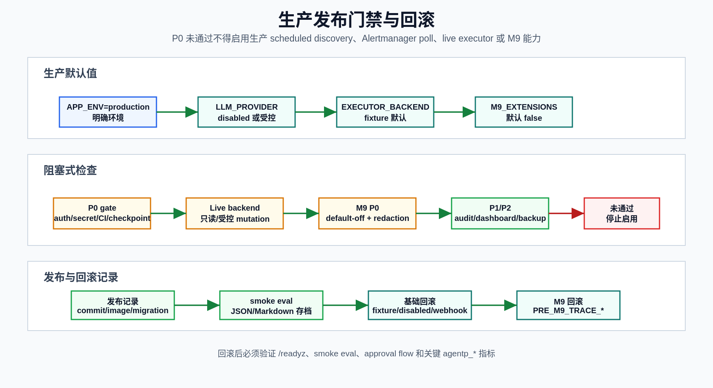

# 生产环境就绪检查清单

**最后更新：** 2026-06-14

本清单用于启用生产环境、计划发现、Alertmanager 轮询、live read adapters、live executor 或任何 M9 功能之前的检查。它不放宽安全边界：默认执行器仍应为 fixture，L2/L3 必须人工审批，L4 必须直接拒绝。

## 生产默认值口径

当前 `Settings` 在 `APP_ENV=production` 且未显式设置字段时，会自动应用：

| 字段 | 生产未显式设置时 |
|------|------------------|
| `LLM_PROVIDER` | `disabled` |
| `DISCOVERY_ENABLED` | `false` |

以下字段虽然默认安全，但生产上线仍必须显式确认：

| 字段 | 期望值/约束 |
|------|-------------|
| `EXECUTOR_BACKEND` | 默认和生产期望均为 `fixture`；只有受控演练才允许显式 `live` |
| `API_KEY_AUTH_ENABLED` | 生产必须为 `true` |
| `API_KEY_INITIAL_SEED` | 仅 bootstrap 使用，用完后移除/轮换 |
| `M9_EXTENSIONS_ENABLED` | 默认 `false`，生产默认关闭 |
| `LLM_EXTERNAL_PROVIDER_ALLOWED` | 默认 `false` |
| `TRACE_BACKEND` | `fixture`、`jaeger`、`tempo`、`disabled` 之一；M9 全局关闭不能禁用 M8 Jaeger |

下图把生产默认值、P0/P1/M9 检查、发布记录和回滚验证放在同一条发布门禁链路中。

<p>
  
</p>

## P0 阻塞项

| # | 检查项 | 验证方法 | 通过标准 |
|---|--------|----------|----------|
| P0-1 | `APP_ENV=production` | 启动环境和 settings dump | 环境明确为 production |
| P0-2 | LLM 默认禁用或显式受控 | `LLM_PROVIDER=disabled` 或人工演练批准 | 生产稳定路径不依赖真实 LLM |
| P0-3 | Executor 保持 fixture | `EXECUTOR_BACKEND=fixture` | 不存在默认真实写入外部系统路径 |
| P0-4 | API key auth 已启用 | `API_KEY_AUTH_ENABLED=true` | 非开放路径无 token 返回 401 |
| P0-5 | Bootstrap key 已移除或轮换 | 检查 `API_KEY_INITIAL_SEED` | 不保留长期 bootstrap secret |
| P0-6 | 后端 URL 安全验证生效 | 尝试 localhost、metadata IP、file scheme、私网 IP | 生产环境拒绝，allowlist 例外有审计 |
| P0-7 | 原始 secret 不落库/日志/审计/prompt/state | 扫描 DB、日志、audit、eval report 样本 | 无 raw token/password/private key/auth header |
| P0-8 | L2/L3/L4 行为验证 | 运行 guardrail/approval 测试和一次手动审批演练 | L2/L3 阻断执行，L3 二次确认，L4 直接拒绝 |
| P0-9 | DB migration 已验证 | `alembic upgrade head`，高风险 migration 验证 downgrade 或记录不可逆 | upgrade 成功，数据约束可解释 |
| P0-10 | Worker checkpoint 不 fail open | Postgres checkpointer 可用；不可达时失败关闭 | 不因 checkpoint 失败自动批准 L2/L3 |
| P0-11 | Redis/Celery broker 可用 | `/readyz`，worker logs，Redis ping | `postgres/redis/celery_broker=ok` |
| P0-12 | CI 等价检查通过 | 后端 lint/type/test/smoke eval，前端 coverage/build/e2e | 无失败，覆盖率达到硬门禁 |
| P0-13 | Alertmanager poll scope 有效 | 验证 receiver/matcher/namespace/service allowlist | 不允许无边界大范围生产轮询 |
| P0-14 | M9 全局默认关闭 | `M9_EXTENSIONS_ENABLED=false` | 所有 M9 子功能实际 disabled |

## P1 强烈推荐

| # | 检查项 | 验证方法 |
|---|--------|----------|
| P1-1 | `BACKEND_URL_ALLOWLIST` 最小化 | 只允许必要内部 DNS/IP pattern |
| P1-2 | Beat 单例 | 部署只有一个 Celery Beat；Redis lock 作为安全网 |
| P1-3 | Worker 只读 published EffectiveConfig | 验证 proposal/detected_only 不进入 AgentDeps |
| P1-4 | Override TTL 和 forbidden fields | 创建过期 override、secret/auth/executor/live override 负向测试 |
| P1-5 | `api_key:admin` 不隐含业务写 scope | API key admin 调 config/discovery write 预期 403 |
| P1-6 | Audit write path 覆盖 | config、approval、comments、discovery、M9 写操作都有 audit |
| P1-7 | Runbook ingest 可降级 | embedding provider 不可用时 runbook 入库和关键词检索仍可用 |
| P1-8 | Report regeneration 保留版本 | Regenerate 创建新版本，不覆盖旧报告 |
| P1-9 | Email token 安全 | L3 不可通过 email token 审批；token 过期和一次性使用有效 |
| P1-10 | Worker orphan run 处理 | `TASK_ORPHAN_TIMEOUT_SECONDS` 设置合理，重复执行有幂等保护 |

## P2 运维卓越

| # | 检查项 | 验证方法 |
|---|--------|----------|
| P2-1 | API `/metrics` 正常 | Prometheus scrape `agentp_*` 指标 |
| P2-2 | Worker metrics 采集路径明确 | `PROMETHEUS_METRICS_ENABLED=true`，`CELERY_METRICS_PORT` 已暴露或由 Service 抓取 |
| P2-3 | Dashboard 和告警规则就绪 | Grafana datasource/dashboard provisioning 可用 |
| P2-4 | 备份恢复演练 | 用最近备份在隔离库恢复成功 |
| P2-5 | Eval baseline 存档 | smoke eval JSON/Markdown 附到发布记录 |
| P2-6 | Runbook 操作手册已演练 | 值班人员能完成告警、审批、报告、回滚开关演练 |

## 验证命令

CI 等价：

```bash
ruff check apps packages tests
mypy apps packages
pytest tests/unit tests/integration --cov=apps --cov=packages --cov-report=term-missing --cov-fail-under=80
python -m packages.evals.runner --suite smoke --output reports/eval-smoke.json
```

前端：

```bash
cd apps/web
npm run test:coverage
npm run build
npm run test:e2e
```

生产默认值抽查：

```bash
APP_ENV=production python -c "from packages.common.settings import Settings; s=Settings(_env_file=None); assert s.llm_provider == 'disabled'; assert s.discovery_enabled is False; assert s.executor_backend == 'fixture'"
```

M9 默认关闭抽查：

```bash
python -c "from packages.common.settings import Settings; s=Settings(_env_file=None); assert s.m9_extensions_enabled is False; assert s.llm_external_provider_allowed is False"
```

Backend URL safety 抽查建议运行：

```bash
pytest tests/unit/test_backend_url_safety.py tests/unit/test_production_safety.py -v
```

## Live Backend 特别检查

### Live K8s diagnostics

- 只允许 describe/logs/events/rollout status/get deployment/get statefulset 等只读诊断。
- kubeconfig/service account 权限必须只读。
- 工具失败返回 degraded，不阻塞 Agent 启动。

### Live DB diagnostics

- 必须使用只读账号。
- 只允许预定义 SELECT。
- 强制 statement timeout 和 read-only transaction。
- 禁止任何 DML/DDL、truncate、flush、modify database。

### Live executor

只有显式 `EXECUTOR_BACKEND=live` 才能启用，并且只允许：

- `restart_pod` / `restart_service`：Deployment patch 触发 rolling restart。
- `restart_statefulset`：StatefulSet patch 触发 rolling restart。
- `pause_rollout`：Deployment patch 设置 `spec.paused=true`，暂停 rollout。
- `resume_rollout`：Deployment patch 设置 `spec.paused=false`，恢复 rollout。
- `scale_deployment` / `scale_back`：Deployment scale patch。
- `rollback_release`：Deployment rollback subresource。

所有 live executor 操作仍必须经过 guardrail、approval、L3 second confirmation（如适用）和 pre-action snapshot。

## M9 P0

M9 全部能力生产默认关闭。任何单项启用前必须通过：

| # | 检查项 | 通过标准 |
|---|--------|----------|
| M9-1 | `M9_EXTENSIONS_ENABLED=false` baseline | M8 smoke 通过，M9 指标均为 disabled |
| M9-2 | 子功能独立开关 | 每个子功能可单独关闭并降级 |
| M9-3 | 全局 gate forcing | 全局 false 时子功能 true 只记录 conflict，不生效 |
| M9-4 | `PRE_M9_TRACE_BACKEND` / `PRE_M9_TRACE_ENABLED` 已记录 | 可执行 total rollback |
| M9-5 | LLM 草稿限制 | 只生成 `pending_review` Draft/Amendment，不发布、不审批、不执行 |
| M9-6 | Web/external calls 安全 | feature flag、timeout、HTTPS/allowlist、redaction、audit、metric、degrade 全部存在 |
| M9-7 | Secret leakage 测试 | 相关 unit/E2E 无泄漏 |
| M9-8 | Tempo discovery 生产不 auto-publish | production 下最高 `requires_review` |
| M9-9 | 外部 embedding 双重门禁 | semantic search + external embedding + scope + safe URL |
| M9-10 | Jaeger 不受 M9 gate 影响 | M9 false 不禁用 M8 verified Jaeger |

## 回滚开关

基础安全回滚：

```bash
export EXECUTOR_BACKEND=fixture
export LLM_PROVIDER=disabled
export DISCOVERY_ENABLED=false
export ALERT_SOURCE=webhook
```

M9 子功能回滚示例：

```bash
export RUNBOOK_LLM_GENERATION_ENABLED=false
export LLM_INCIDENT_DIFF_ENABLED=false
export RUNBOOK_WEB_SEARCH_ENABLED=false
export TEMPO_DISCOVERY_ENABLED=false
export GRAFANA_ALERT_INGEST_ENABLED=false
export SEMANTIC_RUNBOOK_SEARCH_ENABLED=false
export EXTERNAL_EMBEDDING_PROVIDER_ENABLED=false
export LLM_EXTERNAL_PROVIDER_ALLOWED=false
```

M9 完全回滚：

```bash
export M9_EXTENSIONS_ENABLED=false
export TRACE_BACKEND=${PRE_M9_TRACE_BACKEND}
export TRACE_ENABLED=${PRE_M9_TRACE_ENABLED}
```

回滚后必须验证 `/readyz`、smoke eval、approval flow 和关键 `agentp_*` 指标。

## 发布记录必须包含

- Git commit / image tag。
- 迁移版本。
- CI run 链接或本地等价命令输出摘要。
- Smoke eval JSON/Markdown 路径。
- 当前 `APP_ENV`、`LLM_PROVIDER`、`EXECUTOR_BACKEND`、`M9_EXTENSIONS_ENABLED`。
- 如果启用任何 live/M9 能力，列出启用理由、审批人、回滚开关和验证结果。
