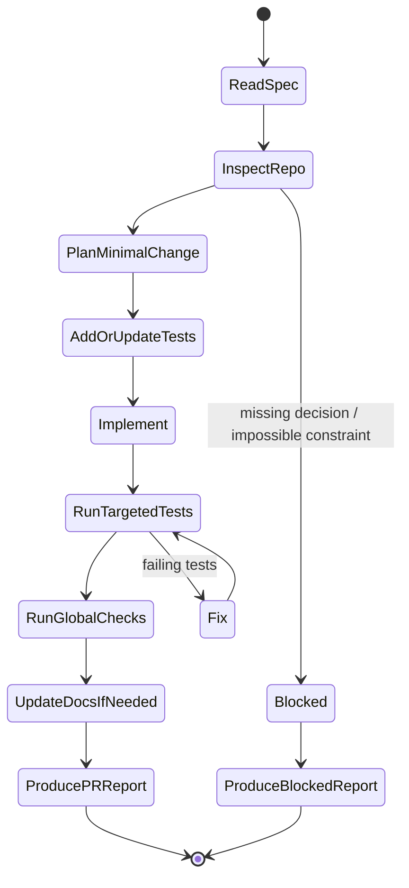
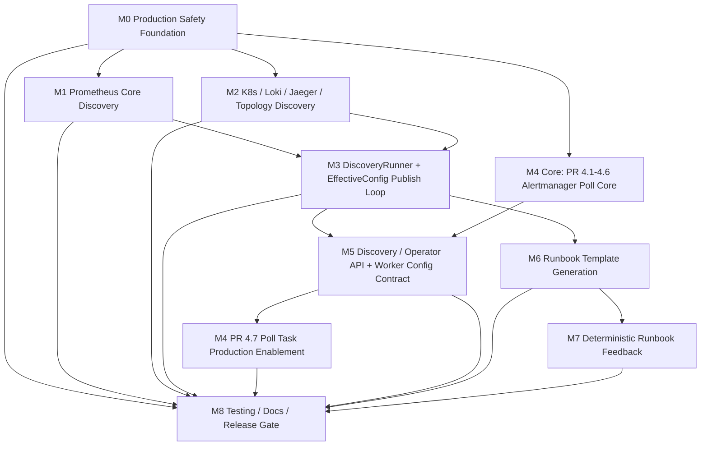

# sre-agent Real Backend Integration — Agent Execution Document

**Date:** 2026-06-12  
**Status:** M0–M8 complete — staging verification phase  
**Source:** `2026-06-12-sre-agent-real-backend-integration-implementation-plan-revised(2)(1).md`  
**Target:** 将 `sre-agent` 从本地 demo/fixture 模式扩展为可安全接入 Prometheus、Loki、Jaeger、Kubernetes、Alertmanager 的生产诊断系统。  
**Execution Unit:** 每个 `PR x.y` 是一个独立 agent 任务，必须可独立实现、独立测试、独立 review、独立回滚。  

> 本版本不改变原技术决策，只把原施工文档整理为更适合 coding agent 执行的格式：明确执行顺序、硬性边界、任务状态机、提交格式、停止条件、测试门禁和最终 release gate。

---

## A. 给 Coding Agent 的总提示词

将下面这段作为 agent 执行本计划时的系统/任务提示词使用：

```text
你是 sre-agent 项目的 coding agent。你必须严格按本文档执行，每次只实现一个明确指定的 PR x.y。

执行规则：
1. 先阅读“全局硬性约束”和当前 PR 的 Scope / 不做 / 建议文件 / 测试清单 / 验收标准 / 风险点 / 回滚方案。
2. 只实现当前 PR 范围，不提前实现后续 PR，不扩大设计。
3. 如果文档路径与仓库实际路径不一致，先搜索仓库，优先复用现有模块；找不到时再按建议路径新增。
4. 所有生产安全约束优先级高于功能实现。遇到冲突时选择 safe/degraded，不选择隐式启用。
5. Phase 0–8 不依赖真实 LLM 和 web_search。生产默认 LLM_PROVIDER=disabled，EXECUTOR_BACKEND=fixture。
6. raw secret 不得进入 DB、audit、debug log、AgentDeps、prompt/state。
7. worker 只读取 published EffectiveConfigVersion，不读取 proposal/detected_only。
8. Backend URL 在 publish/override/profile/effective config 合并和 worker 构造前必须通过安全校验。
9. Alertmanager poll 必须有非 severity/priority 的有效 scope；poll marker 不得覆盖 raw_labels，不得参与 fingerprint。
10. 每个 PR 必须补测试。完成后输出：变更摘要、文件列表、测试命令与结果、未解决风险、回滚方式、下一步建议。
```

---

## B. Agent 执行状态机

每个 PR 必须按以下状态流转：



### B.1 每个 PR 的固定执行步骤

1. **读取任务边界**：只读当前 PR 章节，不把后续 PR 范围混入当前实现。
2. **仓库勘察**：确认建议文件是否存在；如果不存在，搜索相邻模块并记录实际路径。
3. **最小实现计划**：列出要改的文件、要新增的测试、不会做的内容。
4. **测试优先**：至少为当前 PR 的验收标准新增/修改单元测试；涉及 DB/API/worker 时增加集成测试。
5. **代码实现**：优先复用现有模式，保持本地 demo/CI 兼容。
6. **运行检查**：执行当前 PR 测试；能运行全局检查时运行全局检查。
7. **审计与安全自检**：按本文档的 hard constraints 检查 secret、URL、LLM、proposal、scope、override、lock。
8. **输出 PR 报告**：按“B.4 输出格式”返回。

### B.2 Agent 停止条件

只有出现以下情况才允许停止并报告 blocked：

- 当前 PR 依赖的前置 PR 没有实现，且无法用最小兼容 stub 推进。
- 仓库中存在与文档冲突的安全边界，继续实现会破坏生产安全。
- 需要外部真实凭据、真实集群、真实生产后端才能验证，且无法通过 mock/fixture/staging placeholder 替代。
- migration 与现有 DB schema 存在不可自动解决的冲突。
- 测试环境缺少必要基础设施，且无法用 mock、sqlite、testcontainer 或现有 fixture 替代。

停止时必须输出：已完成勘察、阻塞原因、最小复现、建议决策、可继续执行的替代任务。

### B.3 每个 PR 的最小测试命令策略

优先按仓库实际工具执行；如果仓库没有对应工具，记录原因：

```bash
ruff check .
mypy .
pytest tests/unit/<current_area> -q
pytest tests/integration/<current_area> -q
alembic upgrade head
alembic downgrade -1
alembic upgrade head
```

涉及 worker / Celery / Redis / Postgres / HTTP mock 时，还需执行对应 integration 或 e2e smoke。

### B.4 Agent 完成 PR 后必须输出的报告格式

```md
## PR x.y 完成报告

### 1. 变更摘要
- ...

### 2. 修改文件
- `path/to/file.py`：...
- `tests/...`：...

### 3. 测试结果
- `command`：pass/fail/未运行原因

### 4. 安全自检
- raw secret 未进入 DB/audit/log/prompt/state：pass/fail
- production 默认 safe/degraded：pass/fail
- worker 不读取 proposal：pass/fail
- Backend URL safety：pass/fail/不适用
- Alertmanager poll bounded scope：pass/fail/不适用

### 5. 风险与遗留
- ...

### 6. 回滚方式
- ...

### 7. 下一步
- 建议执行 PR ...
```

---

## C. 全局硬性约束

这些规则优先级高于任何单个 PR 的实现便利性：

1. 默认环境保持 `APP_ENV=local`；本地 demo/CI 保持 FakeLLM、fixture、localhost 兼容。
2. `APP_ENV=production` 时默认 `LLM_PROVIDER=disabled`、`EXECUTOR_BACKEND=fixture`。
3. Phase 0–8 不依赖真实 LLM 与 web_search。
4. Discovery 失败不阻塞 agent 启动；必须 degraded，而不是 crash。
5. worker 只使用 `published` 的 `EffectiveConfigVersion`。
6. 人工 `.env` / profile / active override 优先于 published discovery。
7. Override 必须有 `expires_at`；active override = `revoked_at IS NULL AND expires_at > now`。
8. Published config 默认 stale warning，不硬过期。
9. 生产环境 backend URL discovery 默认 review-first，不 auto_publish。
10. Backend URL 必须通过 safety validator，生产默认禁止未授权 localhost、metadata endpoint、link-local、危险 scheme。
11. `BACKEND_URL_ALLOWLIST` 默认支持 host pattern；CIDR allowlist 是显式高级选项，默认关闭。
12. Phase 0–8 backend secret reference 仅支持 `env:VAR_NAME`；API/DB 不接收 raw secret。
13. raw secret 不得进入 DB、audit、debug log、AgentDeps、prompt/state。
14. API key `api_key:admin` 只管理 key，不隐式拥有 `config:write` / `discovery:write` / `runbook:review`。
15. legacy API key migration 默认不给 `config:write`。
16. Alertmanager poll 使用 `source=alertmanager`，内部 marker 存 `ingestion_metadata.ingest_mode=poll` 或 `internal_labels.ingest_mode=poll`。
17. `raw_labels` 必须原样保留；合成的 `labels.ingest_mode=poll` 不得覆盖 `raw_labels`，不得参与 fingerprint。
18. Alertmanager poll 有效 scope 必须至少包含 receiver、namespace_allowlist、service_allowlist 或非 severity matcher 之一；severity/priority only 无效。
19. Alertmanager `receiver` 使用独立 query parameter，不默认伪装成 label matcher。
20. resolved inference 必须保守；单个 filter hash missing 不得直接关闭 incident。
21. Discovery scheduled/manual rerun 必须使用 Redis lock；释放锁必须 compare-and-delete。
22. Redis lock 默认不续租；要求 task hard time limit < lock TTL。长任务才允许 owner-token renewal heartbeat。
23. Celery Beat 生产必须单独 singleton process；Redis lock 只是 task-level safety net。
24. Runbook regenerate 必须创建新 pending draft，不覆盖旧 draft。
25. Approved runbook ingest 在 embedding provider 不可用时降级为 keyword-only/chunk-only，不允许丢失已审核 runbook。
26. AuditLog 表示 operation origin：`api` / `worker` / `beat` / `system`，不是 alert.source。
27. 审计日志创建后不可修改或删除；优先使用 DB trigger，ORM guard 只是附加防线。
28. `EXECUTOR_BACKEND=live` 永不可自动发布。
29. M8 不是最后才补测试；每个 PR 都必须补测试，M8 作为 release gate 和覆盖收口。
30. 如任何实现与以上规则冲突，选择禁用、降级、requires_review 或 blocked report。

---

## D. Milestone 执行顺序



| Milestone | Goal | Dependencies | PRs | Execution Mode | Status |
|---|---|---|---|---|---|---|
| M0 | Production Safety Foundation | 无；必须优先完成 | PR 0.1, PR 0.2, PR 0.3, PR 0.4, PR 0.5, PR 0.6, PR 0.7, PR 0.8, PR 0.9 | 建议顺序执行 0.1 → 0.9 | ✅ 完成 |
| M1 | Prometheus Core Discovery | M0 | PR 1.1, PR 1.2, PR 1.3, PR 1.4, PR 1.5, PR 1.6 | 可与 M2、M4 core 并行 | ✅ 完成 |
| M2 | K8s / Loki / Jaeger / Topology Discovery | M0 | PR 2.1, PR 2.2, PR 2.3, PR 2.4, PR 2.5, PR 2.6, PR 2.7 | 可与 M1、M4 core 并行 | ✅ 完成 |
| M3 | DiscoveryRunner + EffectiveConfig 发布闭环 | M1 + M2 | PR 3.1, PR 3.2, PR 3.3, PR 3.4, PR 3.5, PR 3.6 | M1/M2 完成后执行 | ✅ 完成 |
| M4 | Alertmanager Poll Production Hardening | PR 4.1–4.6 依赖 M0；PR 4.7 依赖 M5 worker config contract | PR 4.1, PR 4.2, PR 4.3, PR 4.4, PR 4.5, PR 4.6, PR 4.7 | 4.1–4.6 可并行提前；4.7 延后 | ✅ 完成 |
| M5 | Discovery API / Operator API | M3 + M4 core + PR 0.7 | PR 5.1, PR 5.2, PR 5.3, PR 5.4, PR 5.5 | M3 完成后执行 | ✅ 完成 |
| M6 | Runbook Template Generation | M3 | PR 6.1, PR 6.2, PR 6.3 | M3 完成后执行 | ✅ 完成 |
| M7 | Deterministic Runbook Feedback | M6 | PR 7.1, PR 7.2, PR 7.3, PR 7.4 | M6 完成后执行 | ✅ 完成 |
| M8 | Testing & Docs | M0–M7 | PR 8.1, PR 8.2, PR 8.3, PR 8.4, PR 8.5, PR 8.6 | 贯穿每个 PR；最终作为 release gate | ✅ 完成 |

---

## E. PR 任务索引

| PR | Milestone | Agent Task | Scope Boundary | Done Gate | Status |
|---|---|---|---|---|---|
| PR 0.1 | M0 | Settings 环境默认值与生产 profile 安全默认值 | 执行该 PR 章节内 Scope；不得提前实现后续 PR | 该 PR 验收标准 + 全局 DoD | ✅ |
| PR 0.2 | M0 | Discovery / EffectiveConfig / AuditLog 数据模型与迁移 | 执行该 PR 章节内 Scope；不得提前实现后续 PR | 该 PR 验收标准 + 全局 DoD | ✅ |
| PR 0.3 | M0 | AutomationPolicy | 执行该 PR 章节内 Scope；不得提前实现后续 PR | 该 PR 验收标准 + 全局 DoD | ✅ |
| PR 0.4 | M0 | EffectiveConfig 读取优先级 | 执行该 PR 章节内 Scope；不得提前实现后续 PR | 该 PR 验收标准 + 全局 DoD | ✅ |
| PR 0.5 | M0 | AuditLog 服务扩展 | 执行该 PR 章节内 Scope；不得提前实现后续 PR | 该 PR 验收标准 + 全局 DoD | ✅ |
| PR 0.6 | M0 | DisabledLLM 与确定性 fallback 可运行路径 | 执行该 PR 章节内 Scope；不得提前实现后续 PR | 该 PR 验收标准 + 全局 DoD | ✅ |
| PR 0.7 | M0 | Operator API Key Role/Scope 授权 | 执行该 PR 章节内 Scope；不得提前实现后续 PR | 该 PR 验收标准 + 全局 DoD | ✅ |
| PR 0.8 | M0 | Backend URL Safety Validator | 执行该 PR 章节内 Scope；不得提前实现后续 PR | 该 PR 验收标准 + 全局 DoD | ✅ |
| PR 0.9 | M0 | BackendAuthConfig Schema 与脱敏策略 | 执行该 PR 章节内 Scope；不得提前实现后续 PR | 该 PR 验收标准 + 全局 DoD | ✅ |
| PR 1.1 | M1 | Discovery 基础 Pydantic 模型 | 执行该 PR 章节内 Scope；不得提前实现后续 PR | 该 PR 验收标准 + 全局 DoD | ✅ |
| PR 1.2 | M1 | PrometheusClient | 执行该 PR 章节内 Scope；不得提前实现后续 PR | 该 PR 验收标准 + 全局 DoD | ✅ |
| PR 1.3 | M1 | MetricMatcher 匹配引擎 | 执行该 PR 章节内 Scope；不得提前实现后续 PR | 该 PR 验收标准 + 全局 DoD | ✅ |
| PR 1.4 | M1 | Prometheus Service Label 检测 | 执行该 PR 章节内 Scope；不得提前实现后续 PR | 该 PR 验收标准 + 全局 DoD | ✅ |
| PR 1.5 | M1 | PromQL Builder | 执行该 PR 章节内 Scope；不得提前实现后续 PR | 该 PR 验收标准 + 全局 DoD | ✅ |
| PR 1.6 | M1 | PromQL Dry-Run 验证 | 执行该 PR 章节内 Scope；不得提前实现后续 PR | 该 PR 验收标准 + 全局 DoD | ✅ |
| PR 2.1 | M2 | K8sDiscovery | 执行该 PR 章节内 Scope；不得提前实现后续 PR | 该 PR 验收标准 + 全局 DoD | ✅ |
| PR 2.2 | M2 | Service Label Detector | 执行该 PR 章节内 Scope；不得提前实现后续 PR | 该 PR 验收标准 + 全局 DoD | ✅ |
| PR 2.3 | M2 | LokiDiscovery | 执行该 PR 章节内 Scope；不得提前实现后续 PR | 该 PR 验收标准 + 全局 DoD | ✅ |
| PR 2.4 | M2 | WorkloadBinding | 执行该 PR 章节内 Scope；不得提前实现后续 PR | 该 PR 验收标准 + 全局 DoD | ✅ |
| PR 2.5 | M2 | ServiceEdge Deriver | 执行该 PR 章节内 Scope；不得提前实现后续 PR | 该 PR 验收标准 + 全局 DoD | ✅ |
| PR 2.6 | M2 | Observability Backend Endpoint Discovery | 执行该 PR 章节内 Scope；不得提前实现后续 PR | 该 PR 验收标准 + 全局 DoD | ✅ |
| PR 2.7 | M2 | Jaeger Service Discovery | 执行该 PR 章节内 Scope；不得提前实现后续 PR | 该 PR 验收标准 + 全局 DoD | ✅ |
| PR 3.1 | M3 | DiscoveryRunner 编排 | 执行该 PR 章节内 Scope；不得提前实现后续 PR | 该 PR 验收标准 + 全局 DoD | ✅ |
| PR 3.2 | M3 | 降级输出标准化 | 执行该 PR 章节内 Scope；不得提前实现后续 PR | 该 PR 验收标准 + 全局 DoD | ✅ |
| PR 3.3 | M3 | 成本控制 | 执行该 PR 章节内 Scope；不得提前实现后续 PR | 该 PR 验收标准 + 全局 DoD | ✅ |
| PR 3.4 | M3 | DiscoveryStore | 执行该 PR 章节内 Scope；不得提前实现后续 PR | 该 PR 验收标准 + 全局 DoD | ✅ |
| PR 3.5 | M3 | Config Proposal 生成 | 执行该 PR 章节内 Scope；不得提前实现后续 PR | 该 PR 验收标准 + 全局 DoD | ✅ |
| PR 3.6 | M3 | EffectiveConfigVersion Publish / Rollback / Revoke | 执行该 PR 章节内 Scope；不得提前实现后续 PR | 该 PR 验收标准 + 全局 DoD | ✅ |
| PR 4.1 | M4 | AlertmanagerClient | 执行该 PR 章节内 Scope；不得提前实现后续 PR | 该 PR 验收标准 + 全局 DoD | ✅ |
| PR 4.2 | M4 | Matcher Parser | 执行该 PR 章节内 Scope；不得提前实现后续 PR | 该 PR 验收标准 + 全局 DoD | ✅ |
| PR 4.3 | M4 | Scope Validation | 执行该 PR 章节内 Scope；不得提前实现后续 PR | 该 PR 验收标准 + 全局 DoD | ✅ |
| PR 4.4 | M4 | Allowlist Server-side Filter | 执行该 PR 章节内 Scope；不得提前实现后续 PR | 该 PR 验收标准 + 全局 DoD | ✅ |
| PR 4.5 | M4 | Poll Cursor / Dedup | 执行该 PR 章节内 Scope；不得提前实现后续 PR | 该 PR 验收标准 + 全局 DoD | ✅ |
| PR 4.6 | M4 | Resolved Inference | 执行该 PR 章节内 Scope；不得提前实现后续 PR | 该 PR 验收标准 + 全局 DoD | ✅ |
| PR 4.7 | M4 | Poll Task + Redis Lock + Metrics + Audit | 执行该 PR 章节内 Scope；不得提前实现后续 PR | 该 PR 验收标准 + 全局 DoD | ✅ |
| PR 5.1 | M5 | Discovery Read API | 执行该 PR 章节内 Scope；不得提前实现后续 PR | 该 PR 验收标准 + 全局 DoD | ✅ |
| PR 5.2 | M5 | Discovery Rerun API | 执行该 PR 章节内 Scope；不得提前实现后续 PR | 该 PR 验收标准 + 全局 DoD | ✅ |
| PR 5.3 | M5 | Config Publish / Rollback / Revoke API | 执行该 PR 章节内 Scope；不得提前实现后续 PR | 该 PR 验收标准 + 全局 DoD | ✅ |
| PR 5.4 | M5 | Override API | 执行该 PR 章节内 Scope；不得提前实现后续 PR | 该 PR 验收标准 + 全局 DoD | ✅ |
| PR 5.5 | M5 | Worker `_build_deps` 集成 | 执行该 PR 章节内 Scope；不得提前实现后续 PR | 该 PR 验收标准 + 全局 DoD | ✅ |
| PR 6.1 | M6 | RunbookTemplateEngine | 执行该 PR 章节内 Scope；不得提前实现后续 PR | 该 PR 验收标准 + 全局 DoD | ✅ |
| PR 6.2 | M6 | RunbookDraft 扩展与 Ingest | 执行该 PR 章节内 Scope；不得提前实现后续 PR | 该 PR 验收标准 + 全局 DoD | ✅ |
| PR 6.3 | M6 | Runbook Review API | 执行该 PR 章节内 Scope；不得提前实现后续 PR | 该 PR 验收标准 + 全局 DoD | ✅ |
| PR 7.1 | M7 | Incident Aggregation | 执行该 PR 章节内 Scope；不得提前实现后续 PR | 该 PR 验收标准 + 全局 DoD | ✅ |
| PR 7.2 | M7 | Action Statistics | 执行该 PR 章节内 Scope；不得提前实现后续 PR | 该 PR 验收标准 + 全局 DoD | ✅ |
| PR 7.3 | M7 | Gap Detection | 执行该 PR 章节内 Scope；不得提前实现后续 PR | 该 PR 验收标准 + 全局 DoD | ✅ |
| PR 7.4 | M7 | AmendmentDraft 与频率控制 | 执行该 PR 章节内 Scope；不得提前实现后续 PR | 该 PR 验收标准 + 全局 DoD | ✅ |
| PR 8.1 | M8 | 单元测试补齐 | 执行该 PR 章节内 Scope；不得提前实现后续 PR | 该 PR 验收标准 + 全局 DoD | ✅ |
| PR 8.2 | M8 | 集成测试 | 执行该 PR 章节内 Scope；不得提前实现后续 PR | 该 PR 验收标准 + 全局 DoD | ✅ |
| PR 8.3 | M8 | 生产安全测试 | 执行该 PR 章节内 Scope；不得提前实现后续 PR | 该 PR 验收标准 + 全局 DoD | ✅ |
| PR 8.4 | M8 | E2E 测试 | 执行该 PR 章节内 Scope；不得提前实现后续 PR | 该 PR 验收标准 + 全局 DoD | ✅ |
| PR 8.5 | M8 | 文档 | 执行该 PR 章节内 Scope；不得提前实现后续 PR | 该 PR 验收标准 + 全局 DoD | ✅ |
| PR 8.6 | M8 | 最终执行前 Release Gate / Checklist | 执行该 PR 章节内 Scope；不得提前实现后续 PR | 该 PR 验收标准 + 全局 DoD | ✅ |

---

## F. PR 执行原则

对每个 `PR x.y`，agent 必须同时满足：

- **Scope**：实现该 PR 的 `范围`。
- **Non-Scope**：明确不实现 `不做` 中的内容。
- **Suggested Files**：优先修改 `建议文件`；若实际仓库不同，必须说明替代路径。
- **Tests**：至少覆盖 `测试清单` 中与当前实现有关的测试；无法覆盖时说明原因。
- **Acceptance**：所有 `验收标准` 必须可验证。
- **Risk Handling**：`风险点` 必须在报告中说明是否已缓解。
- **Rollback**：必须保留或说明 `回滚方案`。
- **Security**：必须通过“C. 全局硬性约束”。

---

## G. Agent 执行时的仓库勘察规则

1. 不要假设建议路径一定存在；先使用 `ls`、`find`、`rg` 或 IDE search 确认。
2. 优先复用现有 repository、schema、settings、factory、tool backend 模式。
3. 如果现有模块命名与文档不同，以仓库现有命名为准，但保留文档语义。
4. 如果发现已有功能已部分实现：
   - 不重复实现；
   - 补齐缺口；
   - 增加回归测试；
   - 报告“已存在/补齐/未改动”。
5. 如果发现文档与代码冲突：
   - 生产安全约束优先；
   - 本地兼容优先；
   - 不能安全判断时输出 blocked report。

---

## H. 提交粒度

每个 PR 建议拆成一个独立 commit 或 branch：

```text
branch: agent/pr-x-y-short-name
commit: feat|fix|test|docs(scope): implement PR x.y <short title>
```

禁止一个提交同时跨多个 milestone。  
只有纯测试、纯文档、纯重构可作为当前 PR 的辅助提交，不能夹带后续功能。

---

## I. 任务卡片正文

下面保留原文的 PR 级任务卡片。执行时以每个 PR 卡片为当前任务的详细规格。


## 1. Current Repository Assessment

### 1.1 模块清单

| Capability | Existing Module/File | Status | Reuse Strategy | Gap |
|-----------|----------------------|--------|----------------|-----|
| Settings | `packages/common/settings.py` | partial | **extend** — 添加 `APP_ENV`, `AUTOMATION_LEVEL`, `DISCOVERY_*`, `ALERT_SOURCE`, `ALERT_POLL_*`, `RUNBOOK_LLM_*`, `RUNBOOK_WEB_SEARCH_*`, `BACKEND_AUTH_*` | 缺少生产 profile 安全默认值、discovery 开关、poll 配置、auth config；默认环境必须保持 `local` |
| Backend Protocol | `packages/tools/trace_backends.py`, `k8s.py`, `deployment_backends.py` | exists | **reuse** — 现有 `Protocol` + `build_*_backend()` 工厂模式可直接扩展 | 缺少 BackendAuthConfig 集成、BackendUrlSafetyValidator、degraded 语义 |
| MetricsTool | `packages/tools/metrics.py` | exists | **reuse** — 已有 PromQL 生成、query_range、缓存、shard | 硬编码 PromQL 模板，不支持 discovery 输出注入 |
| LogsTool | `packages/tools/logs.py` | exists | **reuse** — 已有 Loki query_range、缓存、聚合 | service_label 需来自 effective config |
| TraceTool | `packages/tools/traces.py` | exists | **reuse** — 已有 Backend Protocol（fixture/jaeger/tempo） | 需 runtime auth config 集成，且 raw secret 不得进入 AgentDeps/state/audit/log/prompt |
| K8sDiagnosticsTool | `packages/tools/k8s.py` | exists | **reuse** — 已有 read-only 约束、fixture/live backend | 需 auth config；LiveK8sBackend 需扩展 list APIs |
| DbDiagnosticsTool | `packages/tools/db_diagnostics.py` | exists | **reuse** | 无需修改 |
| GitChangeTool | `packages/tools/git_changes.py` + `deployment_backends.py` | exists | **reuse** | 需 auth config |
| AlertService | `apps/api/services/alert_service.py` | exists | **reuse** — 已有 fingerprint dedup、NFA suppression、diagnosis enqueue | 缺少 poll 模式入口；poll 与 webhook 必须生成相同 fingerprint，是否新增 `alertmanager_poll` source 需兼容现有 `AlertSource` 枚举 |
| Alert Schemas | `apps/api/schemas/alerts.py` | exists | **extend** — 需添加 `_from_alertmanager_single_alert()` for poll mode、`AlertPollFilters` | 缺少 poll 解析 |
| Celery tasks | `apps/worker/tasks.py` | exists | **extend** — 需添加 `poll_alertmanager` task、DiscoveryRunner task、`_build_deps` 重构 | 缺少 discovery、poll、effective config integration |
| Celery app | `apps/worker/celery_app.py` | exists | **extend** — 添加 beat schedule | 缺少 beat 配置 |
| LangGraph workflow | `packages/agent/graph.py` | exists | **reuse** — 无需修改 | 诊断节点可继续使用 |
| Runner | `packages/agent/runner.py` | exists | **reuse** | 无需修改 |
| AgentDeps | `packages/agent/schemas.py` | exists | **extend** — 添加 `effective_config` 字段 | 缺少 effective config 传递 |
| Runbook memory | `packages/db/models.py` (`RunbookChunk`, `RunbookDraft`, `RunbookVersion`) | exists | **extend** — 添加 template draft、amendment draft 模型 | 缺少 template/amendment 区分、source_path 强制 |
| Runbook search | `packages/tools/runbook_search.py` + `packages/rag/` | exists | **reuse** | 无需修改 |
| PrometheusClient | not found in current scan | missing | **add** to `packages/discovery/prom_discovery.py` | 需要 label/__name__/values、labels、series、metadata、query API |
| LokiClient | not found in current scan | missing | **add** to `packages/discovery/loki_discovery.py` | 需要 `/loki/api/v1/labels`、label values、样本 stream/query_range 覆盖率验证，单靠 label key 不足以检测 service label |
| JaegerClient | `packages/tools/trace_backends.py` (`JaegerTraceBackend`) | partial | **extend** — 添加 `/api/services` for service discovery | 缺少服务发现 API；需补 PR 2.7 或明确延后 |
| K8sClient (discovery) | not found in current scan | missing | **add** to `packages/discovery/k8s_discovery.py` | 需要 list pods/deployments/services/namespaces |
| AlertmanagerClient | not found in current scan | missing | **add** to `packages/discovery/alertmanager_client.py` | 需要 GET /api/v2/alerts、/api/v2/status |
| Redis lock | not found in current scan | missing | **add** to `packages/common/redis_lock.py` | 需要 context manager 分布式锁 |
| DB migration framework | `migrations/` (Alembic) | exists | **reuse** — 添加新 migration | 正常 |
| Audit log | `packages/db/models.py` (`AuditLog`) + `packages/db/repositories/audit_logs.py` | exists | **extend** — 扩展 action 命名、复用/规范化 `details` 审计载荷，必要时添加 `source`/`request_id` | 当前 action 过于简单，需支持 discovery/config 操作；不能随意新增与 SQLAlchemy `metadata` 冲突的字段名 |
| Test fixtures | `tests/conftest.py` | exists | **extend** — 添加 discovery mock、alertmanager mock、effective config fixtures | 缺少生产安全测试 fixtures |
| Evidence validation | `packages/agent/evidence_validation.py` | exists | **reuse** | 无需修改 |
| Topology | `packages/agent/topology.py` | exists | **extend** — 已有 `ServiceTopology`，需拆分 `WorkloadBinding` vs `ServiceEdge` | 当前不区分 binding 和 edge |
| FakeLLM | `packages/agent/fake_llm.py` | exists | **reuse** | 无需修改 |
| Guardrails | `packages/agent/guardrails/policy.py` | exists | **reuse** | 无需修改 |
| Executor backends | `packages/tools/executor_backends.py` | exists | **reuse** — 生产默认 fixture | 无需修改 |
| Mock executor | `packages/tools/mock_executor.py` | exists | **reuse** | 无需修改 |
| Runbook generator | `packages/rag/runbook_generator.py` | exists | **extend** — 添加确定性模板引擎 | 当前可能依赖 LLM，需改为纯模板 |
| Runbook Review API | `apps/api/routers/runbooks.py` | exists | **extend** — review 端点已部分存在 | 需添加 regenerate、draft review 增强 |
| Feedback model | `packages/db/models.py` (`FeedbackItem`) | exists | **extend** — 添加 `RunbookFeedbackSummary`、`AmendmentDraft` | 缺少确定性反馈摘要模型 |

### 1.2 关键依赖链

```
Settings (M0) → 所有模块的基础
  ├── Discovery Models (M0) → M1/M2/M3 的数据基础
  ├── AuditLog (M0) → 所有配置变更的审计基础
  ├── AutomationPolicy (M0) → M3 发布闭环的决策基础
  ├── OperatorAuth (M0) → M5 配置写 API 的 role/scope 授权基础
  ├── DisabledLLM / deterministic fallback (M0) → 生产 `LLM_PROVIDER=disabled` 可运行基础
  ├── BackendUrlSafetyValidator (M0) → M2/M3/M5 所有 URL publish/override/profile 校验基础
  ├── BackendAuthConfig redaction (M0) → M1/M2/M4/M5 runtime backend client 安全基础
  └── EffectiveConfig (M0) → M3/M5 worker 集成的读取基础

M1 (Prometheus Discovery) → M3 (DiscoveryRunner)
M2 (K8s/Loki/Topology) → M3 (DiscoveryRunner)
M3 (DiscoveryRunner + Config) → M5 (API + Worker Integration)
M4 core (Alertmanager Poll client/parser/cursor) → M5 (Worker task integration)
M4 PR 4.7 production poll enablement → PR 0.4 + PR 0.8 + PR 0.9 + M4 PR 4.1–4.6 + M5 worker config contract
M6 (Runbook Template) → M7 (Runbook Feedback)
M3 + M5 → M6 (需要 discovery 结果 + effective config)
M0-M7 → M8 (Testing & Docs)
```

### 1.3 影响拆分顺序的关键依赖

1. **M0 的 Settings + Models + OperatorAuth + DisabledLLM 是硬阻塞**：所有后续 milestone 都依赖环境默认值、生产 profile 安全默认值、数据模型、配置写 API 授权和 LLM disabled 可运行路径
2. **M1 和 M2 可以并行**：Prometheus discovery 和 K8s discovery 互不依赖
3. **M3 依赖 M1 + M2 的结果模型**：DiscoveryRunner 编排需要所有 discovery 的输出类型
4. **M4 核心能力可以与 M1/M2/M3 并行**：PR 4.1–4.6 只依赖 M0；但 PR 4.7 的生产完整集成依赖 EffectiveConfig、BackendAuth、Backend URL safety 和 worker 配置读取约定，不能按纯 M0 任务处理
5. **M5 依赖 M3**：API 发布的是 M3 产出的 EffectiveConfigVersion
6. **M6 依赖 M3**：Runbook 模板需要 discovery 结果（服务名、能力矩阵、指标映射）
7. **M7 依赖 M6**：Runbook 反馈需要已有的 runbook 结构

---

## 2. Implementation Principles

1. **Local by default, production profile safe** — 默认 `APP_ENV=local` 保持 demo/CI 兼容；`APP_ENV=production` 时 `LLM_PROVIDER=disabled`、`EXECUTOR_BACKEND=fixture` 是生产 profile 安全默认值
2. **Read-only first** — 所有 discovery 和诊断工具只读；写入必须经过 guardrail → approval → second confirmation
3. **Degraded instead of failed** — 局部后端不可达时标记 degraded，不阻塞整体 agent
4. **Manual config wins** — 显式 `.env` / profile / active override 优先于 published discovery；Discovery 只补齐缺失项，不能覆盖人工配置
5. **Published config only** — worker 只使用 `published` 的 `EffectiveConfigVersion`，不读取未审核 proposal
6. **Scoped operator writes** — 配置发布、回滚、撤销、override、rerun 等写 API 必须校验 API key role/scope
7. **Audit everything** — 所有配置变更（publish/rollback/revoke/override/auto_apply/reject）写入不可变审计日志
8. **Fixture/demo compatibility** — 所有修改保持 `APP_ENV=local` + fixture 默认值不变，CI 使用 FakeLLM
9. **LLM disabled must be runnable** — Phase 0–8 生产 profile 不调用真实 LLM；`LLM_PROVIDER=disabled` 必须走确定性 fallback/DisabledLLM，不允许 worker 启动后因 unknown provider 失败
10. **No hidden localhost fallback in production** — 生产环境未配置后端 URL 时返回 `unavailable/degraded`，不回退到 `localhost`
11. **Deterministic before LLM** — 所有诊断和 Runbook 能力先用确定性方法实现
12. **Small PRs, independently testable** — 每个 PR 可独立 review、测试、部署、回滚
13. **Immutable audit** — 审计日志创建后不可修改或删除；仅“repository 无 update/delete 方法”不足以宣称强不可变
14. **Token/secret never in LLM prompt** — 认证凭据在 LLM 调用前脱敏；`LLM_PROVIDER=disabled` 时也不得进入 state/debug prompt
15. **No unpublished proposal in worker** — 生产 worker 绝不读取未发布的 discovery proposal
16. **Discovery failure != agent failure** — Discovery 失败不阻塞 agent 启动和诊断
17. **Override must expire** — Override 必须有 `expires_at`；过期或 revoked 的 override 不参与 EffectiveConfig 合并
18. **Backend URL auto-discovery is review-first in production** — 生产环境中自动发现的 backend URL 默认不得自动发布，只能进入 `requires_review` / `detected_only`
19. **Poll scope must be bounded** — Alertmanager poll 必须至少有一个非 severity 范围约束，避免拉全量
20. **Regenerate creates a new draft** — Runbook regenerate 不覆盖原 draft，必须创建新的 pending draft 并保留父子关系
21. **Beat singleton needs runtime observability** — 生产 Beat 依赖部署单例 + heartbeat/duplicate metrics + task-level Redis lock 三层防护
22. **Backend URL safety before use** — 所有 backend URL 在 publish/override/profile/effective merge 前必须通过安全校验；生产默认禁止危险 scheme、metadata endpoint、未授权 localhost/link-local
23. **Published config stale, not hard-expired** — published config 默认进入 stale warning，不自动失效；worker 不因时间到期突然失去最后一个有效配置
24. **Raw labels are immutable input** — poll/webhook 的原始 alert labels 必须保留在 `raw_labels`；内部 ingestion marker 不得覆盖原始 label
25. **Redis lock TTL is part of correctness** — lock TTL 必须大于 task hard time limit，或实现 owner-token renewal heartbeat
26. **Embedding failure degrades runbook search only** — approved runbook ingest 不因 embedding provider 缺失失败，只让 semantic search degraded
27. **Discovery task lock is required** — scheduled/manual discovery 必须使用 Redis lock，避免并发扫描和 proposal 竞争
28. **Receiver is not a label by default** — Alertmanager `receiver` 使用独立 query parameter；只有明确写入 alert label 的部署才可按 label matcher 处理
29. **API key admin is not business admin** — `api_key:admin` 只管理 key，不隐式授予 config/discovery/runbook 写权限
30. **Secret references before secret storage** — Phase 0–8 仅解析 `env:VAR_NAME` secret reference，不把 raw secret 写入 API/DB/audit/log/prompt
31. **Resolved inference is incident-level conservative** — 多 filter hash 场景下，单个 poll scope missing 只能更新该 scope cursor，不能单独关闭 incident

---

## 3. Milestone Overview

| Milestone | Goal | Depends On | Deliverable | Can Start In Parallel |
|----------|------|------------|-------------|-----------------------|
| **M0** | Production safety foundation | none | Environment defaults, production profile safety, data models, audit, automation policy, operator role/scope auth, DisabledLLM, URL safety, BackendAuth redaction, effective config | no (blocks all) |
| **M1** | Prometheus core discovery | M0 (settings + models) | PrometheusClient, MetricCandidate, MetricMatcher, PromQL Builder, PromQL Validator | with M2, M4 |
| **M2** | K8s / Loki / Jaeger / Topology discovery | M0 | K8sDiscovery, LabelDetector, LokiDiscovery, Jaeger service discovery, observability backend auto-discovery, WorkloadBinding, ServiceEdge Deriver | with M1, M4 |
| **M3** | DiscoveryRunner + EffectiveConfig 发布闭环 | M1 + M2 | DiscoveryRunner, degradation output, cost control, DiscoveryStore, Config proposal/publish/rollback | no (depends on M1+M2) |
| **M4** | Alertmanager poll production hardening | Core PR 4.1–4.6: M0; PR 4.7: M0 + PR 0.4 + PR 0.8 + PR 0.9 + PR 4.1–4.6 + M5 worker config contract | AlertmanagerClient, MatcherParser, Scope validation, Poll Cursor, conservative Resolved inference, Poll task | Core with M1/M2/M3; PR 4.7 after config/auth contract |
| **M5** | Discovery API / Operator API | M3 + M4 core + PR 0.7 | Read APIs, Write APIs, Override API, worker `_build_deps` integration | no (depends on M3; enables PR 4.7 production poll) |
| **M6** | Runbook template generation | M3 | RunbookTemplateEngine, RunbookDraft (template type), Review API, Approved ingest | no (depends on M3) |
| **M7** | Deterministic runbook feedback | M6 | Incident aggregation, action statistics, gap detection, AmendmentDraft | no (depends on M6) |
| **M8** | Testing & docs / release gate | M0-M7 | Unit, integration, production safety, E2E tests; docs; final gate | Tests must be added per PR; final gate after M0-M7 |
| **M9+** | Future extensions | M8 | LLM runbook, web search, Tempo, Grafana | informational only |

---

## I.1 Detailed Milestone / PR Task Cards

### M0: Production Safety Foundation

**目标：** 打牢生产安全底座，确保后续真实后端接入后不会出现越权、误用 proposal、误用 localhost、LLM 默认启用等问题。

**为什么排第一：** 所有后续 Milestone 都依赖默认环境兼容、生产 profile 安全默认值、数据模型、审计基础设施、配置写 API 授权和自动化策略。

**前置依赖：** 无

**不做：**
- 不实现任何 discovery 逻辑
- 不实现 discovery/config/operator 业务 API 端点；但 PR 0.7 允许扩展既有 API key 管理端点，用于建立后续写 API 授权基础
- 不修改 worker `_build_deps()`（这是 M5 的工作）
- 不实现 alert poll

**涉及的主要模块：**
- `packages/common/settings.py`
- `packages/db/models.py`
- `packages/db/repositories/audit_logs.py`
- `migrations/`

---

#### PR 0.1: Settings 环境默认值与生产 profile 安全默认值

> **状态: ✅ 已完成** — 实现、测试、类型检查均通过（2026-06-12）


##### 背景

当前 settings.py 缺少 `APP_ENV` 区分，所有后端 URL 默认 `localhost`，`LLM_PROVIDER` 默认 `fake`。需要引入环境 profile，但默认环境必须保持 `local`，避免破坏本地 demo、CI 和现有测试；生产安全默认值只在 `APP_ENV=production` 时生效。

##### 范围

- [ ] 新增 `APP_ENV` setting（`local` | `production`），默认 `local`
- [ ] 生产环境 `LLM_PROVIDER` 默认 `"disabled"`（本地保持 `"fake"`）
- [ ] 新增 `AUTOMATION_LEVEL`（`off` | `propose` | `supervised` | `autopilot`，默认 `supervised`）
- [ ] 新增 `DISCOVERY_ENABLED`（`APP_ENV=local` 默认 `true`；`APP_ENV=production` 默认 `false`，仅控制启动时自动 discovery 和 scheduled discovery，不禁止受权 manual rerun）
- [ ] 新增 `DISCOVERY_MANUAL_RERUN_ENABLED`（默认 `true`；配合 `discovery:write` scope 控制 operator manual rerun）
- [ ] 新增 `DISCOVERY_APPLY_MODE`（`inherit` | `propose` | `supervised`，默认 `inherit`）
- [ ] 新增 `RUNBOOK_TEMPLATE_GENERATION_ENABLED`（默认 `true`）
- [ ] 新增 `RUNBOOK_LLM_GENERATION_ENABLED`（默认 `false`）
- [ ] 新增 `RUNBOOK_WEB_SEARCH_ENABLED`（默认 `false`）
- [ ] 新增 `ALERT_SOURCE`（`webhook` | `poll` | `both` | `none`，默认 `webhook`）
- [ ] 新增所有 `ALERT_POLL_*` 配置项（见设计文档 §10.4）
- [ ] 新增 `BackendAuthConfig` 相关配置
- [ ] 确保现有 settings 字段保持兼容，本地 demo 不受影响

##### 不做

- 不实现配置优先级合并逻辑（PR 0.4）
- 不实现生产启动时的 URL 校验

##### 建议文件

```text
packages/common/settings.py                         # 修改：新增 ~40 个字段
tests/unit/test_settings_production_defaults.py     # 新增
```

##### 测试清单

```text
test_default_app_env_local
test_production_llm_default_disabled
test_production_executor_default_fixture
test_local_can_use_localhost_defaults
test_local_llm_default_fake
test_automation_level_default_supervised
test_discovery_apply_mode_inherit
test_production_discovery_default_disabled
test_discovery_manual_rerun_enabled_default_true
test_runbook_llm_default_false
test_runbook_web_search_default_false
test_alert_source_default_webhook
test_backward_compat_existing_fields
```

##### 验收标准

- [ ] 未设置 `APP_ENV` → `app_env == "local"`，`llm_provider == "fake"`，本地 localhost 默认值保持不变
- [ ] `APP_ENV=production` + 未设置 `LLM_PROVIDER` → `llm_provider == "disabled"`
- [ ] `APP_ENV=local` + 未设置 `PROMETHEUS_URL` → `prometheus_url == "http://localhost:9090"`
- [ ] 所有新增字段可通过 env var 设置
- [ ] 现有测试全部通过（不修改测试代码）
- [ ] `ruff check` + `mypy` 无错误

##### 风险点

- 新增字段与现有代码中硬编码的 `settings.xxx` 不冲突（均为新增字段）
- `LLM_PROVIDER` 的默认值逻辑需要根据 `APP_ENV` 区分；但 `disabled` 的可运行语义由 PR 0.6 实现，不能只改 settings

##### 回滚方案

- 将 settings.py 恢复到修改前版本
- 所有新增字段在未设置时均有安全默认值，不影响现有功能

---

#### PR 0.2: Discovery / EffectiveConfig / AuditLog 数据模型与迁移

> **状态: ✅ 已完成** — 实现、测试、类型检查均通过（2026-06-12）


##### 背景

设计文档定义了 `DiscoveryRun`, `DiscoveryProposal`, `EffectiveConfigVersion`, `DiscoveryOverride`, `AutomationDecision` 等核心模型。需要创建 DB 模型和 Alembic 迁移。

##### 范围

- [ ] 新增 DB 模型：`DiscoveryRun`, `DiscoveryProposal`, `EffectiveConfigVersion`, `DiscoveryOverride`
- [ ] `DiscoveryOverride` 必须包含 `reason`, `expires_at`, `revoked_at`, `created_by_key_id`, `created_by_scopes`, `revoke_reason`；active override 定义为 `revoked_at IS NULL AND expires_at > now`
- [ ] Override TTL 策略：backend URL override 默认 7 天、最长 30 天；label / metric mapping override 默认 14 天、最长 30 天；secret/auth/executor/live 相关 override 不走普通 override 流程
- [ ] `EffectiveConfigVersion` 默认不设置硬过期；新增 `stale_after` / `stale_warning_at` 语义，超过阈值只产生 warning/metric，不自动退出 worker selection
- [ ] 扩展 `AuditLog` 模型：优先复用现有 `details` JSONB 审计载荷；如需兼容设计文档中的 metadata 语义，使用 `metadata_json` 或 `details` 映射，避免 SQLAlchemy `metadata` 命名冲突；扩展 action/resource_type 取值约定
- [ ] 生成 Alembic 迁移
- [ ] 新增 Pydantic schema（用于 API 层，与 DB 模型分离）

##### 不做

- 不实现 AutomationPolicy 的判定逻辑（PR 0.3）
- 不实现 DiscoveryRunner（M3）
- 不实现 API 端点（M5）

##### 建议文件

```text
packages/db/models.py                               # 修改：新增 4 个模型类，扩展 AuditLog
packages/db/repositories/discovery_runs.py          # 新增
packages/db/repositories/discovery_proposals.py     # 新增
packages/db/repositories/effective_configs.py       # 新增
packages/db/repositories/discovery_overrides.py     # 新增
migrations/versions/XXXX_discovery_config_models.py # 新增
tests/unit/test_discovery_models.py                 # 新增
```

##### 测试清单

```text
test_discovery_run_create
test_discovery_proposal_status_flow
test_effective_config_version_lifecycle
test_effective_config_stale_warning_does_not_disable_worker_selection
test_discovery_override_expiry
test_discovery_override_requires_expires_at
test_discovery_override_revoked_not_active
test_discovery_override_max_ttl_validation
test_audit_log_supports_discovery_actions
test_migration_upgrade_downgrade
```

##### 验收标准

- [ ] 所有新表在 PostgreSQL 中创建成功
- [ ] FK 约束正确（proposal → discovery_run, config_version → proposal）
- [ ] `DiscoveryOverride` 无 `expires_at` 不可创建；过期或 revoked override 不被 repository active 查询返回
- [ ] AuditLog 可记录 `discovery.auto_apply`, `config.publish`, `config.rollback` 等 action，审计载荷统一写入 `details`/`metadata_json`，不出现重复语义字段
- [ ] Alembic upgrade/downgrade 均可正常执行
- [ ] 现有测试不受影响

##### 风险点

- AuditLog 扩展可能导致现有 repository 测试需要更新
- DiscoveryProposal 的 `config_diff` JSONB 可能很大
- Override TTL 过长会导致人工临时配置长期压过 published config；TTL 过短可能影响救火操作，需要默认值和最大值同时约束

##### 回滚方案

- Alembic downgrade 删除新表
- 恢复 models.py 中 AuditLog 的原有定义

---

#### PR 0.3: AutomationPolicy

> **状态: ✅ 已完成** — 实现、测试、类型检查均通过（2026-06-12）


##### 背景

设计文档 §3.8 定义了 `AutomationDecision` 模型和自动化判定规则。

##### 范围

- [ ] 实现 `AutomationPolicy` 类（纯函数，无副作用）
- [ ] 实现 `AutomationDecision` 的判定逻辑
- [ ] 实现 `DISCOVERY_APPLY_MODE` 不能超过 `AUTOMATION_LEVEL` 的校验
- [ ] 实现各类配置的自动发布条件：生产环境 backend URL 默认 `requires_review`，service label / metric mapping 可在高置信、dry-run、交叉验证通过时 auto_apply
- [ ] 确保 `EXECUTOR_BACKEND=live` 永不可自动发布

##### 不做

- 不实现数据库读写（纯逻辑）
- 不实现 API 调用

##### 建议文件

```text
packages/discovery/automation_policy.py            # 新增
tests/unit/test_automation_policy.py               # 新增
```

##### 测试清单

```text
test_off_returns_record_only
test_propose_returns_record_only
test_supervised_high_confidence_auto_apply
test_supervised_low_confidence_require_review
test_autopilot_threshold_lower_than_supervised
test_executor_live_never_auto_apply
test_apply_mode_more_aggressive_rejected
test_apply_mode_more_conservative_allowed
test_apply_mode_inherit_equals_automation_level
test_backend_url_discovery_production_requires_review
test_backend_url_discovery_local_can_auto_apply
test_backend_url_auth_unknown_requires_review
test_backend_endpoint_detector_prefers_service_dns
test_backend_endpoint_detector_does_not_publish_endpoint_ip_without_allowlist
test_multiple_backend_urls_require_review
test_service_label_two_sources_cross_validated_auto_apply
test_metric_mapping_all_checks_pass_auto_apply
test_metric_mapping_metadata_missing_not_auto_apply
```

##### 验收标准

- [ ] 所有判定规则被测试覆盖
- [ ] 永不自动发布 `EXECUTOR_BACKEND=live`
- [ ] `DISCOVERY_APPLY_MODE > AUTOMATION_LEVEL` 时抛出异常
- [ ] `APP_ENV=production` 时，backend URL discovery 即使高置信也不得 auto_apply，必须 `requires_review` 或 `detected_only`
- [ ] 纯函数，无副作用，可独立单元测试

##### 风险点

- 自动发布条件过严可能阻碍正常使用；过松可能导致低质量配置进入生产
- Backend URL 是高风险配置，生产环境不得与 service label / metric mapping 使用同一自动发布门槛

##### 回滚方案

- 删除 `automation_policy.py`，不影响其他模块

---

#### PR 0.4: EffectiveConfig 读取优先级

> **状态: ✅ 已完成** — 实现、测试、类型检查均通过（2026-06-12）


##### 背景

生产配置优先级必须体现人工配置优先：`env > active override > profile > published EffectiveConfigVersion > safe default`。Discovery/published config 只能补齐缺失项，不能覆盖显式 `.env`、profile 或 active override。active override 只包括 `revoked_at IS NULL AND expires_at > now` 的 override；过期 override 保留审计但不参与合并。

##### 范围

- [ ] 实现 `EffectiveConfig` Pydantic 模型
- [ ] 实现 `EffectiveConfig.from_operator_sources()`（生产路径）
- [ ] 实现 `EffectiveConfig.from_demo_sources()`（本地 demo 路径）
- [ ] 实现 `_resolve_backend()` 函数（env/active override/profile > published discovery > safe default，生产禁止 localhost fallback）
- [ ] 实现 active override 过滤：过期 override、revoked override、非法 TTL override 不参与配置合并
- [ ] 实现 `load_published_effective_config()` 数据库读取
- [ ] 实现 `has_unresolved_required_sources()` 检测

##### 不做

- 不修改 worker `_build_deps()`（M5 PR 5.5）

##### 建议文件

```text
packages/discovery/config_merge.py                  # 新增
tests/unit/test_config_merge.py                     # 新增
```

##### 测试清单

```text
test_env_has_highest_priority
test_override_beats_published_config
test_expired_override_does_not_beat_published_config
test_revoked_override_does_not_beat_published_config
test_override_no_longer_beats_published_after_expiry
test_published_config_used_by_worker
test_profile_beats_published_config
test_manual_env_url_wins_over_discovery
test_unpublished_proposal_not_used
test_stale_config_still_used_with_warning
test_production_rejects_implicit_localhost_backend
test_local_can_use_localhost_defaults
test_demo_path_uses_latest_discovery
test_missing_prometheus_url_unresolved
test_has_unresolved_returns_true_when_required_missing
```

##### 验收标准

- [ ] 生产路径 `allow_discovery_proposals=False` 时 proposal 不进入 config
- [ ] 生产路径未配置的 URL 返回 `None`，不返回 `localhost`
- [ ] 所有 URL 在进入 EffectiveConfig 前通过 `BackendUrlSafetyValidator`；非法 URL 标记为 rejected/degraded，不参与 worker 构造
- [ ] 过期 override 和 revoked override 不参与 `EffectiveConfig` 合并
- [ ] Demo 路径保持向后兼容
- [ ] 优先级严格按 `env > active override > profile > published > default`，人工配置优先于 discovery

##### 风险点

- DB 不可达时需要降级处理（返回 None）
- `EffectiveConfig` 字段需要与 `Settings` 保持一致但语义不同
- 任何改变配置优先级的实现都可能让 discovery 覆盖人工配置，必须加回归测试
- Override 参与优先级最高，必须严格限定 active 条件，否则会长期覆盖已发布配置

##### 回滚方案

- 删除 `config_merge.py`

---

#### PR 0.5: AuditLog 服务扩展

> **状态: ✅ 已完成** — 实现、测试、类型检查均通过（2026-06-12）


##### 背景

现有 `AuditLog` 和 `AuditLogRepository` 需要扩展以支持 discovery/config 操作审计。

##### 范围

- [ ] 扩展 `AuditLogRepository`：添加 `create_config_audit()`, `create_discovery_audit()`, `query_by_action()`, `query_by_target()`
- [ ] 确保 audit log 不可变：repository 不提供 update/delete，并优先使用数据库 trigger 禁止 update/delete；SQLAlchemy event guard 仅作为额外防线
- [ ] 添加 `source` 和 `request_id` 字段到 AuditLog 模型（如尚未存在），并保持现有 `details` 字段向后兼容

##### 不做

- 不实现 API 端点
- 不实现审计日志清理/归档

##### 建议文件

```text
packages/db/repositories/audit_logs.py              # 修改：扩展方法
packages/db/models.py                               # 可能修改：AuditLog 字段扩展
migrations/versions/XXXX_audit_log_extensions.py    # 新增（如需要）
tests/unit/test_audit_log_extended.py               # 新增
```

##### 测试清单

```text
test_audit_log_config_publish
test_audit_log_config_rollback
test_audit_log_config_revoke
test_audit_log_discovery_auto_apply
test_audit_log_discovery_reject
test_audit_log_override_create
test_audit_log_immutable_no_update
test_audit_log_immutable_no_delete
test_audit_log_db_trigger_blocks_raw_update
test_audit_log_db_trigger_blocks_raw_delete
test_query_by_action
test_query_by_target
test_query_by_time_range
```

##### 验收标准

- [ ] 所有配置变更操作有对应审计日志方法
- [ ] 审计日志创建后不可修改或删除；测试必须覆盖 repository 以外的 ORM 直接修改/删除路径
- [ ] 查询支持按 action、target、actor、时间范围筛选

##### 风险点

- AuditLog 模型字段扩展需要新的 migration
- 单靠“无 update/delete repository 方法”不能证明不可变，必须有测试覆盖直接 ORM mutation 和 raw SQL mutation；生产建议以 DB trigger 为准

##### 回滚方案

- 回退 audit_logs.py 到修改前版本

---

#### PR 0.6: DisabledLLM 与确定性 fallback 可运行路径

> **状态: ✅ 已完成** — 实现、测试、类型检查均通过（2026-06-12）


##### 背景

生产 profile 默认 `LLM_PROVIDER=disabled`，但现有 worker 会无条件 `build_llm(settings)`。只修改 settings 会导致生产 worker 因 unknown provider 失败。需要先实现 disabled provider 语义，并确保 diagnose、plan_actions、generate_report、runbook draft generation 都有确定性路径。

##### 范围

- [ ] 在 LLM factory 中支持 `llm_provider=disabled`
- [ ] 实现 `DisabledLLM` / `DeterministicLLMAdapter`，不进行网络调用
- [ ] `diagnose` 使用 `rules_fallback._DIAGNOSIS_MAP`，保留 evidence IDs
- [ ] `plan_actions` 使用经过 guardrail 支持表归一化后的确定性动作
- [ ] `generate_report` 直接使用 deterministic fallback report
- [ ] runbook template generation 不调用 `build_llm()`；LLM draft generation 仅在 `RUNBOOK_LLM_GENERATION_ENABLED=true` 时可用
- [ ] LLM call metadata 标记 `provider=disabled`, `network_call=false`, `fallback=true`

##### 不做

- 不删除 FakeLLM；CI 和本地 demo 继续默认 FakeLLM
- 不启用真实 LLM provider

##### 建议文件

```text
packages/agent/llm/factory.py                       # 修改：支持 disabled
packages/agent/llm/disabled_adapter.py              # 新增
packages/agent/rules_fallback.py                    # 修改：动作名归一化到 guardrail 支持表
packages/agent/nodes/diagnose.py                    # 修改：disabled 快路径/metadata
packages/agent/nodes/plan_actions.py                # 修改：disabled 快路径/metadata
packages/agent/nodes/generate_report.py             # 修改：disabled 快路径/metadata
apps/api/routers/runbooks.py                        # 修改：LLM draft gate
packages/rag/runbook_generator.py                   # 修改：仅 LLM gate 打开时调用
```

##### 测试清单

```text
test_build_llm_disabled_returns_disabled_adapter
test_disabled_llm_no_network_call
test_production_worker_with_disabled_llm_runs_diagnosis
test_disabled_diagnose_preserves_evidence_ids
test_disabled_plan_actions_uses_supported_action_types
test_disabled_generate_report_fallback
test_runbook_llm_generation_disabled_does_not_build_llm
test_llm_disabled_metadata_records_fallback
```

##### 验收标准

- [ ] `APP_ENV=production` + 未设置 `LLM_PROVIDER` 的诊断流程可完成，不因 provider unknown 失败
- [ ] disabled provider 不发起任何外部网络调用
- [ ] 输出仍引用 evidence IDs / runbook chunk IDs
- [ ] 推荐动作必须落在 guardrail/executor 支持表内，或显式标记为 proposal-only 且不可执行

##### 风险点

- 现有 fallback action 名称与 guardrail/executor 支持表不一致，需先归一化，否则会产生不可执行审批
- 真实 LLM 和 disabled LLM 的状态字段/metadata 不一致会影响前端 token/cache 展示

##### 回滚方案

- 恢复 `llm_provider=fake` 默认；删除 disabled provider 支持

---

#### PR 0.7: Operator API Key Role/Scope 授权

> **状态: ✅ 已完成** — 实现、测试、类型检查均通过（2026-06-12）


##### 背景

生产接入后，config publish/rollback/revoke/override 和 discovery rerun 都是敏感写操作。现有 API key 只表示身份，不包含 role/scope；不能复用普通 API key 直接授权配置写入。

##### 范围

- [ ] 扩展 `ApiKey` 模型：添加 `roles`、`scopes`、`is_bootstrap` 或等价字段
- [ ] 定义最小 scope 集合：`discovery:read`, `discovery:write`, `config:read`, `config:write`, `runbook:review`, `api_key:admin`
- [ ] 新增 `require_scope()` / `require_any_scope()` FastAPI dependency
- [ ] API key 创建接口支持指定 scopes；bootstrap seed 只能创建/轮换 operator key
- [ ] 审计记录 actor 的 `key_id`, `roles`, `scopes`
- [ ] 所有 M5 写 API 必须依赖 `config:write` 或 `discovery:write`

- [ ] API key migration 策略：existing legacy key 默认 scopes=[]；local/dev 可显式补 read scopes；production legacy key 不自动获得 `config:write`
- [ ] Bootstrap 策略：`BOOTSTRAP_ADMIN_TOKEN` 只能创建第一个 `api_key:admin` key；创建/轮换操作必须写 audit log；建议创建后禁用或要求显式轮换
- [ ] `api_key:admin` 只授予 key 管理能力，不隐式包含 `config:write`、`discovery:write`、`runbook:review`；业务写 scope 必须显式授予

##### 不做

- 不实现 SSO/RBAC 组织模型
- 不实现多租户

##### 建议文件

```text
packages/db/models.py                               # 修改：ApiKey role/scope 字段
migrations/versions/XXXX_api_key_scopes.py          # 新增
apps/api/dependencies.py                            # 修改：require_scope
apps/api/middleware/auth.py                         # 修改：request.state.api_key 包含 scopes
apps/api/schemas/api_keys.py                        # 修改：create/list schema
apps/api/services/api_key_service.py                # 修改：scope validation
apps/api/routers/api_keys.py                        # 修改：admin scope
```

##### 测试清单

```text
test_api_key_scopes_persist
test_config_publish_requires_config_write
test_config_read_allows_config_read
test_discovery_rerun_requires_discovery_write
test_plain_api_key_cannot_publish_config
test_bootstrap_seed_can_create_operator_key
test_existing_api_key_gets_no_config_write_scope_after_migration
test_bootstrap_token_can_only_create_first_admin_key
test_api_key_admin_does_not_imply_config_write
test_api_key_admin_does_not_imply_discovery_write
test_audit_includes_actor_scope
```

##### 验收标准

- [ ] 配置写 API 无 `config:write` 返回 403
- [ ] Discovery rerun 无 `discovery:write` 返回 403
- [ ] 普通 incident/read API 不要求 config scope
- [ ] 审计日志能追溯执行配置变更的 key identity 和 scope

##### 风险点

- 现有测试默认关闭 auth，需要为 auth-enabled integration tests 单独覆盖
- Bootstrap seed 权限过宽时可能绕过 scope 模型，需限制为创建/轮换 operator key；`api_key:admin` 不得被实现成隐式超级管理员

##### 回滚方案

- 回退 ApiKey schema/migration；M5 写 API 暂不开放

---

#### PR 0.8: Backend URL Safety Validator

> **状态: ✅ 已完成** — 实现、测试、类型检查均通过（2026-06-12）


##### 背景

生产环境中的 backend URL 会被 worker、discovery client 和诊断工具主动访问。无论 URL 来自 `.env`、profile、active override、published config 还是 discovery proposal，都必须在进入 EffectiveConfig 或执行 publish/override 前进行安全校验，避免 SSRF、metadata endpoint 访问、危险 scheme 和隐式 localhost fallback。

##### 范围

- [ ] 新增 `BackendUrlSafetyValidator`
- [ ] 只允许 `http` / `https` scheme
- [ ] 生产环境默认拒绝 `localhost`、`127.0.0.0/8`、`::1`、`0.0.0.0`、link-local、`169.254.0.0/16`、metadata endpoint、私有 IP 直连，除非显式 allowlist
- [ ] 支持 `BACKEND_URL_ALLOWLIST` host pattern，允许集群内 DNS，如 `*.svc`, `*.svc.cluster.local`, `prometheus.monitoring.svc`
- [ ] CIDR allowlist 为显式高级选项，默认关闭；如启用，只接受 operator 明确配置的 CIDR，不从 discovery 自动推断
- [ ] K8s service discovery evidence 放行时，URL 应优先使用 service DNS，不使用 endpoint/pod IP；直接 IP 仍按 IP safety policy 校验
- [ ] K8s service discovery evidence 可作为放行依据，但仍需要记录 evidence 和审计
- [ ] config publish / override / profile load / EffectiveConfig merge 均调用该 validator
- [ ] rejected URL 不进入 worker backend construction，只进入 proposal warning 或 audit details

##### 不做

- 不做通用 outbound proxy
- 不实现多租户网络策略

##### 建议文件

```text
packages/common/backend_url_safety.py               # 新增
packages/discovery/config_merge.py                  # 修改：合并前校验
packages/discovery/config_publisher.py              # 修改：发布前校验
apps/api/routers/config.py                          # 修改：override/publish API 校验
tests/unit/test_backend_url_safety.py               # 新增
```

##### 测试清单

```text
test_backend_url_rejects_metadata_ip
test_backend_url_rejects_file_scheme
test_backend_url_rejects_gopher_scheme
test_backend_url_rejects_localhost_in_production
test_backend_url_rejects_link_local
test_backend_url_allows_https_public_endpoint
test_backend_url_allows_explicit_allowlisted_internal_dns
test_backend_url_rejects_private_ip_without_explicit_cidr_allowlist
test_backend_url_allows_private_ip_only_with_explicit_cidr_allowlist
test_k8s_evidence_prefers_service_dns_over_endpoint_ip
test_backend_url_k8s_evidence_allows_cluster_service
test_override_rejects_unsafe_backend_url
test_publish_rejects_unsafe_backend_url
```

##### 验收标准

- [ ] 生产环境中危险 URL 无法 publish、override 或进入 EffectiveConfig
- [ ] local/demo 可继续使用 localhost 默认值
- [ ] 所有拒绝原因进入 audit/details，但不包含 secret

##### 风险点

- 过严会阻止合法集群内地址；必须支持 host allowlist 和 K8s evidence，CIDR 需显式 opt-in
- 过松会产生 SSRF 风险

##### 回滚方案

- 保留 validator 但切为 warn-only；不得直接删除生产安全测试

---

#### PR 0.9: BackendAuthConfig Schema 与脱敏策略

> **状态: ✅ 已完成** — 实现、测试、类型检查均通过（2026-06-12）


##### 背景

文档已经要求 runtime-only secret fields 与 prompt-safe redacted fields 分离，但需要落到可实现 schema、存储策略和工具构造边界。Phase 0–8 不建议把 raw backend secrets 存入 DB。

##### 范围

- [ ] 定义 `RuntimeBackendAuthConfig` 与 `RedactedBackendAuthConfig`
- [ ] 支持 `auth_type: none | bearer | basic | mtls`
- [ ] raw secret 字段使用 `SecretStr` 或只存 secret reference；Phase 0–8 只支持 `env:VAR_NAME` secret reference
- [ ] DB 仅存 redacted metadata / secret reference，不存 raw bearer token、password、private key
- [ ] API 只允许写入 secret reference，不允许写入 raw bearer token/password/private key
- [ ] 支持非敏感 `extra_safe_headers` 白名单；敏感 header 只能通过 secret reference 注入，且不得进入 audit/prompt/log
- [ ] `redacted()` 输出只包含 `auth_type`, `username`, `has_token`, `has_password`, `cert_ref`, `tls_verify` 等安全字段
- [ ] AgentDeps、audit log、debug log、LLM prompt/state 只能使用 redacted form
- [ ] Backend client construction 才允许读取 runtime secret；构造完成后不得序列化 runtime config

##### 不做

- 不实现 KMS/Vault/secret manager 集成；仅保留 `env:VAR_NAME` secret reference 接口
- 不实现 secret rotation 自动化

##### 建议文件

```text
packages/common/backend_auth.py                     # 新增
packages/common/settings.py                         # 修改：auth env/reference loading
packages/tools/*                                    # 后续 PR 接入 runtime auth
tests/unit/test_backend_auth_redaction.py           # 新增
```

##### 测试清单

```text
test_backend_auth_redacted_does_not_include_token
test_backend_auth_redacted_does_not_include_password
test_backend_auth_db_schema_stores_secret_reference_only
test_backend_auth_secret_ref_supports_env_prefix
test_backend_auth_api_rejects_raw_secret
test_backend_auth_extra_safe_headers_redacted
test_backend_auth_runtime_only_not_serializable
test_backend_auth_audit_uses_redacted_form
test_backend_auth_agentdeps_uses_redacted_form
```

##### 验收标准

- [ ] raw secret 不进入 DB、audit、debug log、AgentDeps、LLM prompt/state
- [ ] runtime tool 可以正常构造带 auth 的 Prometheus/Loki/Jaeger/Alertmanager client
- [ ] auth 失败以 degraded/unavailable 形式返回，不泄露凭据

##### 风险点

- 如果 schema 与 settings/env 不一致，后续工具会重复实现 auth 逻辑
- redacted form 如果过简，会影响审计和排障

##### 回滚方案

- 临时仅支持 no-auth backend，但保留 redaction 测试

---

### M1: Prometheus Core Discovery

**目标：** 完成核心 metric discovery 和 metric mapping——自动发现 Prometheus 指标名、匹配语义类型、生成参数化 PromQL 并 dry-run 验证。

**为什么排第二：** Prometheus 是最核心的信号源。MetricMatcher 是 discovery 的核心引擎。

**前置依赖：** M0（settings + discovery 数据模型 + automation policy）

**不做：**
- 不做 K8s/Loki discovery（M2）
- 不做 DiscoveryRunner 编排（M3）

---

#### PR 1.1: Discovery 基础 Pydantic 模型

> **状态: ✅ 已完成** — 实现、测试、类型检查均通过（2026-06-12）


##### 背景

设计文档 §3.3 定义了核心 Pydantic 模型和 §3.4 的 `SEMANTIC_PATTERNS` 模板库。

##### 范围

- [ ] 实现所有 §3.3 定义的 Pydantic 模型
- [ ] 实现 `MetricCandidate` dataclass（§3.4）
- [ ] 实现 `SEMANTIC_PATTERNS` 模板库（覆盖 latency, error_rate, qps, cpu_throttle, disk_avail）
- [ ] 实现 `DiscoveryCostControl` 模型（§3.10）

##### 不做

- 不实现任何客户端逻辑
- 不实现任何 DB 操作

##### 建议文件

```text
packages/discovery/__init__.py                      # 新增
packages/discovery/models.py                        # 新增
tests/unit/test_discovery_models_validation.py      # 新增
```

##### 测试清单

```text
test_metric_mapping_available
test_metric_mapping_degraded
test_metric_mapping_unavailable
test_metric_candidate_regex_compiles
test_semantic_patterns_all_have_promql_builder
test_semantic_patterns_latency_requires_le
test_semantic_patterns_error_rate_has_status_label
test_discovery_result_serialization
```

##### 验收标准

- [ ] 所有 Pydantic 模型可正常实例化和序列化
- [ ] `SEMANTIC_PATTERNS` 覆盖 5 种语义类型
- [ ] `MetricCandidate` 的 regex 全部可编译

##### 风险点

- 模板库可能过于宽松或严格，需要在真实数据上迭代

##### 回滚方案

- 删除 `models.py`

---

#### PR 1.2: PrometheusClient

> **状态: ✅ 已完成** — 实现、测试、类型检查均通过（2026-06-12）


##### 背景

需要 HTTP 客户端封装 Prometheus API 的 6 个端点。

##### 范围

- [ ] 实现 `PrometheusClient` 类
- [ ] 支持 `GET /api/v1/label/__name__/values`, `/labels`, `/series`, `/metadata`, `/query`, `/query_range`
- [ ] 集成 `BackendAuthConfig`（bearer token、basic auth、mTLS、TLS verify）
- [ ] 超时、错误映射、响应大小限制

##### 不做

- 不实现 MetricMatcher、PromQL Builder

##### 建议文件

```text
packages/discovery/prom_discovery.py                # 新增（含 PrometheusClient）
tests/unit/test_prometheus_client.py                # 新增
```

##### 测试清单

```text
test_list_metrics_success
test_list_metrics_timeout_degraded
test_list_metrics_auth_error
test_list_series_success
test_get_metadata_missing_metric
test_get_metadata_type_mismatch
test_range_query_empty_result
test_response_size_limit_truncated
test_bearer_token_auth_header
test_tls_verify_false
```

##### 验收标准

- [ ] 所有 6 个 API 端点可正常调用
- [ ] 超时和认证错误映射为明确异常
- [ ] 响应大小超过限制时截断并记录 warning

##### 风险点

- `/api/v1/series` 可能返回大量数据，需要 `match[]` 限定
- 认证配置需要与 httpx 正确集成

##### 回滚方案

- 删除 PrometheusClient 部分

---

#### PR 1.3: MetricMatcher 匹配引擎

> **状态: ✅ 已完成** — 实现、测试、类型检查均通过（2026-06-12）


##### 背景

MetricMatcher 是 discovery 的核心：对 Prometheus 指标列表进行语义匹配，按优先级尝试候选正则，通过 `/series` 验证 label 存在性，通过 `/metadata` 验证 metric type 和 unit。

##### 范围

- [ ] 实现 `MetricMatcher.match()` 核心算法
- [ ] 实现 label 验证（`required_any_labels` 至少存在一个）
- [ ] 实现 metadata 验证（type、unit 校验）
- [ ] 实现第一候选失败 → fallback 第二候选
- [ ] 实现状态规则（available/degraded/unavailable）
- [ ] 实现已存在 series 但当前窗口无数据 → degraded

##### 不做

- 不实现 PromQL dry-run（PR 1.6）

##### 建议文件

```text
packages/discovery/metric_matcher.py                # 新增
tests/unit/test_metric_matcher.py                   # 新增
```

##### 测试清单

```text
test_match_latency_histogram
test_match_error_rate_requests_total
test_missing_status_label_degraded
test_metadata_type_mismatch_rejected
test_no_candidate_unavailable
test_first_candidate_failed_fallback_second
test_error_rate_uses_5xx_filter
test_error_rate_uses_clamp_min
test_gauge_does_not_use_rate
test_too_many_series_rejected
test_timeout_degraded
```

##### 验收标准

- [ ] 5 种语义类型均可正确匹配
- [ ] label 缺失时标记 degraded
- [ ] metadata type/unit 不匹配时标记 degraded
- [ ] 所有候选失败时标记 unavailable

##### 风险点

- 正则匹配可能误匹配
- Metadata API 某些 Prometheus 版本不支持，需降级

##### 回滚方案

- 删除 `metric_matcher.py`

---

#### PR 1.4: Prometheus Service Label 检测

> **状态: ✅ 已完成** — 实现、测试、类型检查均通过（2026-06-12）


##### 范围

- [ ] 实现 `detect_metrics_service_label()` 方法
- [ ] 候选 key 列表 + 覆盖率 >= 80% 当选
- [ ] 低覆盖率时标记低置信

##### 建议文件

```text
packages/discovery/prom_discovery.py                # 修改
tests/unit/test_prometheus_label_detection.py       # 新增
```

---

#### PR 1.5: PromQL Builder

> **状态: ✅ 已完成** — 实现、测试、类型检查均通过（2026-06-12）


##### 范围

- [ ] 实现 5 种 PromQL 模板生成器
- [ ] 参数化：service_label, service_name, metric_name 可注入

##### 建议文件

```text
packages/discovery/promql_builder.py                # 新增
tests/unit/test_promql_builder.py                   # 新增
```

##### 测试清单

```text
test_histogram_quantile_generates_correct_promql
test_error_rate_includes_clamp_min
test_error_rate_uses_5xx_filter
test_rate_qps_uses_sum_rate
test_gauge_does_not_use_rate
```

---

#### PR 1.6: PromQL Dry-Run 验证

> **状态: ✅ 已完成** — 实现、测试、类型检查均通过（2026-06-12）


##### 范围

- [ ] 实现 `PromQLValidator` 类
- [ ] 多窗口 dry-run（`[5m]`, `[1h]`, `[6h]`）
- [ ] 空结果降级逻辑、series 数上限校验

##### 建议文件

```text
packages/discovery/promql_validator.py              # 新增
tests/unit/test_promql_validator.py                 # 新增
```

##### 测试清单

```text
test_current_window_has_data_ok
test_current_empty_but_1h_has_data_degraded
test_all_windows_empty_degraded_not_unavailable_if_series_exists
test_all_windows_empty_no_series_unavailable
test_too_many_series_rejected
```

---

### M2: K8s / Loki / Jaeger / Topology Discovery

**目标：** 补齐 K8s 服务发现、label convention 检测、日志 label 检测、Jaeger service discovery 和拓扑推导。

**前置依赖：** M0

**不做：** DiscoveryRunner 编排（M3）、API 端点（M5）

---

#### PR 2.1: K8sDiscovery

> **状态: ✅ 已完成** — 实现、测试、类型检查均通过（2026-06-12）


##### 范围

- [ ] 实现 `K8sDiscovery` 类
- [ ] 支持 list namespaces, pods, deployments, statefulsets, daemonsets, services
- [ ] 集成 `namespace_allowlist`, `service_allowlist`
- [ ] RBAC 不足时降级
- [ ] `kubernetes` Python package 必须懒加载，不允许 module-level import；初始化线程安全，失败缓存 TTL 30–60s

##### 建议文件

```text
packages/discovery/k8s_discovery.py                 # 新增
tests/unit/test_k8s_discovery.py                    # 新增
```

##### 测试清单

```text
test_discover_deployments
test_discover_statefulsets
test_discover_daemonsets
test_namespace_allowlist
test_rbac_forbidden_degraded
test_k8s_unavailable_returns_empty_services
test_list_services_includes_selector
test_pod_sample_ratio
test_kubernetes_package_lazy_loaded
test_kubernetes_import_failure_cached_with_short_ttl
test_kubernetes_lazy_init_thread_safe
```

---

#### PR 2.2: Service Label Detector

> **状态: ✅ 已完成** — 实现、测试、类型检查均通过（2026-06-12）


##### 范围

- [ ] 实现 `detect_k8s_service_label()`
- [ ] 交叉验证：K8s label 与 metrics label 一致性
- [ ] 输出 `LabelConvention`

##### 建议文件

```text
packages/discovery/label_detector.py                # 新增
tests/unit/test_label_detector.py                   # 新增
```

##### 测试清单

```text
test_k8s_label_coverage_selects_highest
test_metrics_label_can_differ_from_k8s
test_low_coverage_requires_review
test_alternatives_recorded_when_multiple_candidates
test_cross_validation_increases_confidence
```

---

#### PR 2.3: LokiDiscovery

> **状态: ✅ 已完成** — 实现、测试、类型检查均通过（2026-06-12）


##### 范围

- [ ] 实现 `LokiClient` 类
- [ ] 支持 `/loki/api/v1/labels`、`/loki/api/v1/label/{name}/values` 和小窗口 `query_range` 样本验证
- [ ] 实现 `detect_logs_service_label()`，必须基于 label values / sample streams 计算覆盖率，不能只看 label key
- [ ] 集成 `BackendAuthConfig`

##### 建议文件

```text
packages/discovery/loki_discovery.py                # 新增
tests/unit/test_loki_discovery.py                   # 新增
```

##### 测试清单

```text
test_loki_list_labels_success
test_loki_list_label_values_success
test_loki_sample_stream_coverage_detects_service_label
test_loki_unavailable_degraded
test_loki_label_can_differ_from_metrics
test_detect_logs_service_label
test_detect_logs_service_label_does_not_use_keys_only
```

---

#### PR 2.4: WorkloadBinding

> **状态: ✅ 已完成** — 实现、测试、类型检查均通过（2026-06-12）


##### 范围

- [ ] 实现 Service selector → Pod labels → ownerRef → Workload 推导链
- [ ] 确保不产生 `ServiceEdge`

##### 建议文件

```text
packages/discovery/topology.py                      # 新增
tests/unit/test_workload_binding.py                 # 新增
```

##### 测试清单

```text
test_service_selector_to_deployment_binding
test_service_selector_never_creates_service_edge
test_missing_owner_ref_no_binding
```

---

#### PR 2.5: ServiceEdge Deriver

> **状态: ✅ 已完成** — 实现、测试、类型检查均通过（2026-06-12）


##### 范围

- [ ] 四种策略按信度排序：manual (1.0) > trace (0.8-0.95) > env (0.5-0.7) > configmap (0.4-0.7)
- [ ] 输出 `ServiceEdge` 列表

##### 建议文件

```text
packages/discovery/topology.py                      # 修改
tests/unit/test_service_edge_deriver.py             # 新增
```

##### 测试清单

```text
test_manual_topology_highest_priority
test_trace_call_graph_edge
test_env_var_dns_edge
test_configmap_edge
test_conflicting_edges_higher_confidence_wins
test_no_evidence_returns_empty
test_edge_has_evidence_field
```

---

#### PR 2.6: Observability Backend Endpoint Discovery

> **状态: ✅ 已完成** — 实现、测试、类型检查均通过（2026-06-12）


##### 背景

生产接入要求 Discovery 自动发现 Prometheus、Loki、Jaeger、Alertmanager，但人工配置必须优先。K8s 内运行时可以通过 namespace/service/endpoints 发现常见 observability 后端；K8s 外或 RBAC 不足时应 degraded，而不是回退 localhost。

##### 范围

- [ ] 实现 `BackendEndpointDetector`
- [ ] 在允许的 namespace 中扫描 Kubernetes Service / Endpoints / Ingress，识别 Prometheus、Loki、Jaeger、Alertmanager
- [ ] 输出 `BackendEndpoints`，每个 backend 包含 `url`, `source`, `status`, `confidence`, `evidence`, `auth_required_unknown`
- [ ] K8s 内发现 backend URL 时优先输出 service DNS 地址，不输出 endpoint/pod IP；如只能获得 IP，必须经过 BackendUrlSafetyValidator 和显式 allowlist
- [ ] 手动配置优先：`.env` / profile / active override 不被自动发现覆盖
- [ ] 自动发现仅补齐缺失 backend；低置信或认证未知时标记 `detected_only` 或 `requires_review`
- [ ] `APP_ENV=production` 时，自动发现的 backend URL 即使高置信也不得直接 auto_publish，只能生成 proposal 并默认 `requires_review`
- [ ] 生产环境不在 K8s、RBAC 不足或发现失败时返回 missing/degraded，不使用 localhost fallback

##### 建议文件

```text
packages/discovery/backend_endpoints.py             # 新增
packages/discovery/k8s_discovery.py                 # 修改：Service/Endpoint 数据供 detector 使用
tests/unit/test_backend_endpoint_detector.py        # 新增
```

##### 测试清单

```text
test_detect_prometheus_service_endpoint
test_detect_loki_service_endpoint
test_detect_jaeger_query_service_endpoint
test_detect_alertmanager_service_endpoint
test_manual_env_url_wins_over_discovery
test_active_override_wins_over_discovery
test_low_confidence_endpoint_detected_only
test_k8s_rbac_forbidden_backend_missing_degraded
test_production_no_localhost_fallback_for_missing_backend
test_backend_url_discovery_production_requires_review
test_backend_url_auth_unknown_requires_review
test_backend_endpoint_detector_prefers_service_dns
test_backend_endpoint_detector_does_not_publish_endpoint_ip_without_allowlist
test_multiple_backend_urls_require_review
test_detected_only_backend_not_published
```

---

#### PR 2.7: Jaeger Service Discovery

> **状态: ✅ 已完成** — 实现、测试、类型检查均通过（2026-06-12）


##### 背景

模块清单已经识别 `JaegerTraceBackend` 需要扩展 `/api/services`，但原计划没有独立 PR。Phase 0–8 至少需要完成 Jaeger service list discovery，用于 capability matrix、trace availability 和 ServiceEdge Deriver 的基础输入；复杂 trace call graph 聚合可延后。

##### 范围

- [ ] 新增或扩展 `JaegerDiscoveryClient`
- [ ] 支持 `GET /api/services`
- [ ] 集成 `RuntimeBackendAuthConfig` 和 `RedactedBackendAuthConfig`
- [ ] 输出 `TraceServiceDiscoveryResult`，包含 `available_services`, `status`, `confidence`, `evidence`, `degraded_reason`
- [ ] 与 K8s service list 做基础交叉验证
- [ ] Jaeger 不可达或 auth 失败时 degraded，不阻塞 DiscoveryRunner

##### 不做

- 不实现完整 trace call graph 聚合
- 不实现 Tempo discovery；Tempo 放 M9+

##### 建议文件

```text
packages/discovery/jaeger_discovery.py              # 新增
packages/tools/trace_backends.py                    # 可能复用已有 Jaeger backend
tests/unit/test_jaeger_discovery.py                 # 新增
```

##### 测试清单

```text
test_jaeger_list_services_success
test_jaeger_unavailable_degraded
test_jaeger_auth_error_degraded
test_jaeger_services_cross_validate_with_k8s
test_jaeger_discovery_no_raw_secret_in_output
```

##### 验收标准

- [ ] DiscoveryRunner 可以拿到 Jaeger service list 或 degraded result
- [ ] 输出不包含 raw auth secret
- [ ] Phase 0–8 明确只做 service discovery，不承诺复杂 trace topology

---

### M3: DiscoveryRunner + EffectiveConfig 发布闭环

**目标：** 把 discovery 从独立函数变成完整运行流程，建立 proposal → decision → publish → worker 的闭环。

**前置依赖：** M1 + M2 + M0

---

#### PR 3.1: DiscoveryRunner 编排

> **状态: ✅ 已完成** — 实现、测试、类型检查均通过（2026-06-12）


##### 范围

- [ ] 编排 K8sDiscovery + PromDiscovery + LokiDiscovery + BackendEndpointDetector + TopologyDeriver
- [ ] 并行执行，局部失败不影响整体
- [ ] 输出 `DiscoveryResult` + warnings + 降级字段

##### 建议文件

```text
packages/discovery/runner.py                        # 新增
tests/unit/test_discovery_runner.py                 # 新增
```

##### 测试清单

```text
test_runner_success_all_backends
test_runner_prometheus_down_degraded
test_runner_k8s_rbac_forbidden_degraded
test_runner_loki_down_degraded
test_runner_backend_endpoint_detection_degraded
test_missing_latency_metric_adds_capability_gap
test_runner_output_includes_degraded_signals
```

---

#### PR 3.2: 降级输出标准化

> **状态: ✅ 已完成** — 实现、测试、类型检查均通过（2026-06-12）


##### 范围

- [ ] 实现 `CapabilityAssessor`
- [ ] 标准化降级字段（`capability_gaps`, `degraded_signals`, `used_fallback_signals`, `confidence_adjustment`）

##### 建议文件

```text
packages/discovery/capability_assessor.py           # 新增
tests/unit/test_capability_assessor.py              # 新增
```

---

#### PR 3.3: 成本控制

> **状态: ✅ 已完成** — 实现、测试、类型检查均通过（2026-06-12）


##### 范围

- [ ] 实现 `DiscoveryCostController`
- [ ] Prometheus/K8s 查询限制 + 结果截断 + warning

##### 建议文件

```text
packages/discovery/cost_control.py                  # 新增
tests/unit/test_discovery_cost_control.py           # 新增
```

##### 测试清单

```text
test_metric_names_truncated_with_warning
test_series_over_limit_rejected
test_pod_sample_ratio
test_kubernetes_package_lazy_loaded
test_kubernetes_import_failure_cached_with_short_ttl
test_kubernetes_lazy_init_thread_safe_applied
test_cache_hit_avoids_api_call
```

---

#### PR 3.4: DiscoveryStore

> **状态: ✅ 已完成** — 实现、测试、类型检查均通过（2026-06-12）


##### 范围

- [ ] 实现 `DiscoveryStore` — 持久化 DiscoveryRun + DiscoveryProposal
- [ ] 作为 Celery task 运行（`run_discovery`）
- [ ] scheduled discovery 和 manual rerun 均必须使用 Redis lock；lock key 包含 discovery scope/profile，释放锁使用 owner token compare-and-delete
- [ ] manual rerun 与 scheduled run 冲突时返回 existing/skipped 状态并写 audit，不重复扫描后端

##### 建议文件

```text
packages/discovery/store.py                         # 新增
apps/worker/tasks.py                                # 修改：添加 run_discovery task
apps/worker/celery_app.py                           # 修改：beat schedule
tests/unit/test_discovery_store.py                  # 新增
tests/integration/test_discovery_task.py            # 新增
```

##### 测试清单

```text
test_runner_persists_discovery_run
test_discovery_run_status_succeeded
test_discovery_run_status_degraded
test_discovery_proposal_created
test_proposal_diff_matches_changes
test_run_discovery_lock_key_includes_scope_profile
test_manual_rerun_skipped_when_scheduled_run_active
test_scheduled_run_skipped_when_manual_rerun_active
test_discovery_lock_release_compare_and_delete
```

---

#### PR 3.5: Config Proposal 生成

> **状态: ✅ 已完成** — 实现、测试、类型检查均通过（2026-06-12）


##### 范围

- [ ] 实现 `ConfigProposalGenerator` — 比较 discovery 与当前 config，生成 diff
- [ ] 调用 `AutomationPolicy.evaluate_all()`
- [ ] backend URL diff 在生产环境默认 `requires_review`，不得因高置信 discovery 直接 publish；service label / metric mapping 仍按策略评估 auto_apply

##### 建议文件

```text
packages/discovery/config_proposal.py               # 新增
tests/unit/test_config_proposal.py                  # 新增
```

##### 测试清单

```text
test_proposal_not_published_by_default
test_proposal_diff_empty_when_no_changes
test_service_label_high_confidence_can_auto_apply
test_metric_mapping_high_confidence_can_auto_apply
test_proposal_low_confidence_requires_review
test_proposal_rejected_when_dangerous
test_backend_url_diff_production_requires_review
test_backend_url_diff_local_can_auto_apply
test_backend_url_high_confidence_still_requires_review_in_production
```

---

#### PR 3.6: EffectiveConfigVersion Publish / Rollback / Revoke

> **状态: ✅ 已完成** — 实现、测试、类型检查均通过（2026-06-12）


##### 范围

- [ ] 实现 `publish_config()`, `rollback_config()`, `revoke_config()`
- [ ] 版本 stale 策略（默认 30 天后 warning，不硬过期）
- [ ] 新版本发布时将上一版本标记为 `superseded_at` / `superseded_by_version_id`，不要使用 `expires_at` 表达 published config 生命周期；`expires_at` 保留给 override TTL
- [ ] 所有操作写入 audit log

##### 建议文件

```text
packages/discovery/config_publisher.py              # 新增
tests/unit/test_config_publisher.py                 # 新增
```

##### 测试清单

```text
test_publish_config_creates_audit_log
test_publish_supersedes_previous_version
test_rollback_restores_previous_version
test_rollback_creates_audit_log
test_revoke_removes_from_worker_selection
test_revoke_creates_audit_log
test_stale_config_still_used_with_warning_by_worker
test_unpublished_proposal_not_publishable_without_review
test_version_staleness_warning_after_threshold
```

---

### M4: Alertmanager Poll Production Hardening

**目标：** 支持后端项目零改动接入 Alertmanager poll，保证不拉全量、不误判 resolved。

**前置依赖：**
- PR 4.1–4.6：依赖 M0，可与 M1/M2/M3 并行。
- PR 4.7：依赖 PR 0.4、PR 0.8、PR 0.9、PR 4.1–4.6，并依赖 M5 中 worker `_build_deps` / EffectiveConfig 读取约定。

**并行策略：** 核心解析、scope、cursor、resolved inference 可并行；生产 poll task 完整启用必须等配置、auth、URL safety 和 worker contract 就绪。

---

#### PR 4.1: AlertmanagerClient

> **状态: ✅ 已完成** — 实现、测试、类型检查均通过（2026-06-12）


##### 范围

- [ ] 实现 `AlertmanagerClient`（`GET /api/v2/alerts`, `/api/v2/status`）
- [ ] `receiver` 使用 Alertmanager 独立 query parameter；`filter[]` 用于 label matcher，不将 receiver 默认当作 alert label
- [ ] 集成 `BackendAuthConfig`

##### 建议文件

```text
packages/discovery/alertmanager_client.py           # 新增
tests/unit/test_alertmanager_client.py              # 新增
```

---

#### PR 4.2: Matcher Parser

> **状态: ✅ 已完成** — 实现、测试、类型检查均通过（2026-06-12）


##### 范围

- [ ] 实现 `parse_matchers()` + `to_alertmanager_filter()`
- [ ] 支持 `=`, `!=`, `=~`, `!~` 四种操作符

##### 建议文件

```text
packages/discovery/matcher_parser.py                # 新增
tests/unit/test_matcher_parser.py                   # 新增
```

##### 测试清单

```text
test_parse_equal
test_parse_not_equal
test_parse_regex
test_parse_not_regex
test_invalid_matcher_rejected
test_quoted_comma_not_split
test_label_name_validation
test_invalid_regex_rejected
test_to_alertmanager_filter_format
test_escape_matcher_value
```

---

#### PR 4.3: Scope Validation

> **状态: ✅ 已完成** — 实现、测试、类型检查均通过（2026-06-12）


##### 范围

- [ ] 实现 `AlertPollFilters` + `has_valid_scope()`
- [ ] severity-only 不算有效 scope
- [ ] 有效 poll scope 必须至少包含一个非 severity 范围约束：`receiver`、`namespace_allowlist`、`service_allowlist` 或非 severity matcher；`severity` / `priority` only 均无效

##### 建议文件

```text
packages/discovery/matcher_parser.py                # 修改
tests/unit/test_poll_scope_validation.py            # 新增
```

##### 测试清单

```text
test_severity_only_not_valid_scope
test_priority_only_not_valid_scope
test_severity_and_priority_not_valid_scope
test_non_severity_matcher_valid_scope
test_receiver_valid
test_namespace_allowlist_valid
test_service_allowlist_valid
test_empty_scope_disabled
test_mixed_severity_and_namespace_valid
test_team_matcher_valid_scope
test_cluster_matcher_valid_scope
```

---

#### PR 4.4: Allowlist Server-side Filter

> **状态: ✅ 已完成** — 实现、测试、类型检查均通过（2026-06-12）


##### 范围

- [ ] 实现 `_allowlist_to_server_matchers()`
- [ ] `receiver` 不进入 `_allowlist_to_server_matchers()`；它由 AlertmanagerClient 作为独立 query parameter 传递
- [ ] 生产无法映射 → disabled；非生产 → client-side filter + warning
- [ ] 生产环境中有效 scope 必须能转成 Alertmanager server-side matcher；不能只依赖 client-side filter 限制拉取范围

##### 建议文件

```text
packages/discovery/matcher_parser.py                # 修改
tests/unit/test_allowlist_to_matcher.py             # 新增
```

##### 测试清单

```text
test_namespace_allowlist_to_regex_matcher
test_service_allowlist_to_regex_matcher
test_unmappable_allowlist_production_disabled
test_unmappable_allowlist_local_client_filter
test_matchers_added_before_list_alerts
test_receiver_passed_as_query_parameter_not_label_matcher
test_non_mappable_scope_production_disabled
test_non_mappable_scope_local_warns_and_client_filters
```

---

#### PR 4.5: Poll Cursor / Dedup

> **状态: ✅ 已完成** — 实现、测试、类型检查均通过（2026-06-12）


##### 范围

- [ ] 实现 `AlertPollCursor` DB 模型 + repository
- [ ] `already_seen_active()` 必须更新 seen 状态（即使返回 True）
- [ ] `mark_seen()` 建立 fingerprint → incident_id 映射
- [ ] Cursor 可以按 filter hash 记录 seen/missing 状态，但 fingerprint → incident_id 映射必须全局唯一，用于跨 filter hash 和 webhook dedup

##### 建议文件

```text
packages/db/models.py                               # 修改：添加 AlertPollCursor
packages/db/repositories/poll_cursor.py             # 新增
migrations/versions/XXXX_poll_cursor.py             # 新增
tests/unit/test_poll_cursor.py                      # 新增
```

##### 测试清单

```text
test_existing_fingerprint_seen
test_already_seen_updates_last_seen
test_mark_seen_updates_current_set
test_cursor_persist_and_load
test_already_seen_returns_true_but_still_updates_state
test_same_fingerprint_across_filter_hash_maps_to_same_incident
```

---

#### PR 4.6: Resolved Inference

> **状态: ✅ 已完成** — 实现、测试、类型检查均通过（2026-06-12）


##### 范围

- [ ] 实现 `infer_resolved_from_missing_fingerprints()`
- [ ] truncation 时禁止 resolved 推断
- [ ] 多 filter hash 场景下，单个 filter hash missing 只能更新该 cursor；incident resolved 必须满足所有曾经看见该 fingerprint 的 active filter 连续 missing N 轮，或通过明确 resolved 状态/全局有界查询确认

##### 建议文件

```text
packages/discovery/resolved_inference.py            # 新增
tests/unit/test_resolved_inference.py               # 新增
```

##### 测试清单

```text
test_missing_enough_rounds_resolved
test_grace_period_blocks_resolved
test_truncation_blocks_resolved_inference
test_first_missing_not_resolved
test_reappeared_resets_missing_counter
test_single_filter_hash_missing_does_not_resolve_incident
test_all_active_filter_hashes_missing_enough_rounds_resolves_incident
```

---

#### PR 4.7: Poll Task + Redis Lock + Metrics + Audit

> **状态: ⚠️ 部分完成** — Redis Lock 就绪；Celery Poll Task 完整集成待 M5 worker config contract


> **状态: ⚠️ 部分完成** — Redis Lock 就绪；Celery Poll Task 完整集成待 M5 worker config contract


##### 前置依赖

- PR 0.4 EffectiveConfig 读取优先级
- PR 0.8 BackendUrlSafetyValidator
- PR 0.9 BackendAuthConfig redaction / runtime secret ref
- PR 4.1–4.6 Alertmanager client、matcher、scope、cursor、resolved inference
- M5 worker `_build_deps` / EffectiveConfig 注入约定

##### 范围

- [ ] 实现 `poll_alertmanager` Celery task（完整集成）
- [ ] 实现 Redis 分布式锁（`packages/common/redis_lock.py`）
- [ ] 实现 poll 指标
- [ ] 实现 `_from_alertmanager_single_alert()` 解析（添加到 `apps/api/schemas/alerts.py`）
- [ ] Poll 模式必须与 webhook 模式生成相同 fingerprint，避免同一 Alertmanager 告警重复创建 incident
- [ ] 使用 `source=alertmanager` + `ingestion_metadata.ingest_mode=poll` 或 `internal_labels.ingest_mode=poll` 标记 poll 来源，不新增 `AlertSource` 枚举值；webhook 路径不添加 internal marker。API 展示层可合成 `labels.ingest_mode=poll`，但不得覆盖 `raw_labels`
- [ ] Beat schedule 配置
- [ ] Beat 启动时上报 heartbeat / active instance 指标；检测到 active Beat instances > 1 时记录 warning metric
- [ ] Redis lock value 使用唯一 token，释放锁必须 compare-and-delete，避免非 owner 释放锁
- [ ] Poll task lock key 必须包含 effective filter hash，避免不同 receiver/namespace/service 范围互相阻塞
- [ ] 多 filter hash 命中同一个 Alertmanager alert 时，只能创建一个 incident；resolved inference 必须使用 PR 4.6 的保守 incident-level 判定
- [ ] Lock TTL 必须大于 task hard time limit；如果启用 renewal heartbeat，必须使用 owner token 续租
- [ ] Incident/Alert fingerprint 必须有 DB unique constraint，poll/webhook 并发创建使用 get-or-create + retry

##### 建议文件

```text
apps/worker/tasks.py                                # 修改：添加 poll_alertmanager task
packages/common/redis_lock.py                       # 新增
apps/worker/celery_app.py                           # 修改：beat schedule
apps/api/schemas/alerts.py                          # 修改：_from_alertmanager_single_alert
tests/unit/test_poll_task.py                        # 新增
tests/integration/test_poll_integration.py          # 新增
```

##### 测试清单

```text
test_poll_creates_incident
test_poll_deduplicates_existing
test_poll_severity_only_scope_disabled
test_poll_receiver_valid_scope
test_lock_prevents_concurrent_poll
test_failure_records_metric_and_audit
test_truncation_skips_resolved_inference
test_poll_resolved_inference
test_from_alertmanager_single_alert_parse
test_poll_and_webhook_same_alert_same_fingerprint
test_alertmanager_poll_source_compatibility
test_original_ingest_mode_label_not_overwritten_by_poll_marker
test_lock_key_includes_effective_filter
test_poll_task_lock_key_includes_effective_filter_hash
test_lock_release_compare_and_delete
test_lock_not_released_by_non_owner
test_lock_ttl_prevents_permanent_deadlock
test_lock_ttl_greater_than_task_time_limit
test_beat_heartbeat_registered
test_duplicate_beat_instances_emit_warning_metric
test_existing_api_key_gets_no_config_write_scope_after_migration
test_bootstrap_token_can_only_create_first_admin_key
test_api_key_admin_does_not_imply_config_write
test_api_key_admin_does_not_imply_discovery_write
test_runbook_ingest_degrades_when_embedding_provider_missing
test_duplicate_beat_does_not_create_duplicate_incidents
test_poll_and_webhook_concurrent_same_fingerprint_creates_one_incident
test_two_filter_hash_poll_tasks_same_alert_creates_one_incident
test_audit_safe_dict_contains_allowlist_fields
```

---

### M5: Discovery API / Operator API

**目标：** 提供查看 discovery、触发 rerun、发布/回滚配置、设置 override 的 API。

**前置依赖：** M3 + M4 core（PR 4.1–4.6）+ PR 0.7（operator role/scope 授权）。M5 的 worker `_build_deps` / EffectiveConfig 注入约定完成后，PR 4.7 才能进入生产完整启用。

---

#### PR 5.1: Discovery Read API

##### 范围

- [ ] `GET /api/discovery/status`, `/services`, `/metrics`, `/topology`, `/capabilities`
- [ ] 读 API 需要 `discovery:read` 或更高 scope；本地 auth-disabled 测试路径保持可注入

##### 建议文件

```text
apps/api/routers/discovery.py                       # 新增
apps/api/schemas/discovery.py                       # 新增
tests/integration/test_discovery_api.py             # 新增
```

---

#### PR 5.2: Discovery Rerun API

##### 范围

- [ ] `POST /api/discovery/rerun` → 异步 task_id + audit log
- [ ] 写 API 必须校验 `discovery:write` scope
- [ ] manual rerun 必须走 Discovery task Redis lock；与 scheduled run 冲突时返回 existing/skipped 状态并写 audit

##### 建议文件

```text
apps/api/routers/discovery.py                       # 修改
tests/integration/test_discovery_rerun_api.py       # 新增
tests/integration/test_discovery_api_auth.py        # 新增
```

---

#### PR 5.3: Config Publish / Rollback / Revoke API

##### 范围

- [ ] `POST /api/config/publish`, `POST /api/config/rollback`, `POST /api/config/revoke`
- [ ] `GET /api/config/current`, `GET /api/config/versions`
- [ ] GET 需要 `config:read` 或 `config:write`; POST 需要 `config:write`
- [ ] 所有操作写入 audit log，审计 actor 包含 key_id 和 scopes

##### 建议文件

```text
apps/api/routers/config.py                          # 新增
apps/api/schemas/config.py                          # 新增
tests/integration/test_config_api.py                # 新增
tests/integration/test_config_api_auth.py           # 新增
```

---

#### PR 5.4: Override API

##### 范围

- [ ] `POST /api/config/overrides`, `GET /api/config/overrides`, `DELETE /api/config/overrides/{id}`
- [ ] Override 必须包含 `reason` 和 `expires_at`；如未显式传入 `expires_at`，API 使用类型默认 TTL；超过最大 TTL 返回 400
- [ ] Override API 调用 BackendUrlSafetyValidator，禁止不安全 backend URL
- [ ] Override API 只允许普通配置项；secret/auth/executor/live 相关字段不得通过普通 override 写入
- [ ] GET 需要 `config:read` 或 `config:write`; POST/DELETE 需要 `config:write`

##### 建议文件

```text
apps/api/routers/config.py                          # 修改
tests/integration/test_override_api.py              # 新增
tests/integration/test_override_api_auth.py         # 新增
```

##### 测试清单

```text
test_override_requires_reason
test_override_requires_or_sets_expires_at
test_override_max_ttl_rejected
test_expired_override_not_used
test_revoked_override_not_used
test_override_create_audit_contains_expires_at
test_override_secret_field_rejected
test_override_executor_live_rejected
```

---

#### PR 5.5: Worker `_build_deps` 集成

##### 背景

这是连接 discovery + config 系统与现有诊断 workflow 的关键 PR。

##### 范围

- [ ] 修改 `_build_deps()` — 生产路径使用 `EffectiveConfig.from_operator_sources()`
- [ ] 保留 demo 路径使用 `EffectiveConfig.from_demo_sources()`
- [ ] 生产路径：`allow_discovery_proposals=False`
- [ ] `detected_only` backend 不构造工具
- [ ] 缺失 backend tool 返回 degraded/unavailable
- [ ] `effective.*_url is None` 时构造 `UnavailableTool` / `NoBackendTool`，不得把 `None` 传入 `MetricsTool`/`LogsTool` 的 `base_url.rstrip()` 路径
- [ ] token/secret 不进入 LLM prompt
- [ ] `config_version_id` 写入 agent run state

##### 不做

- 不改变 LangGraph workflow 节点逻辑
- 不改变 executor backend 逻辑

##### 建议文件

```text
apps/worker/tasks.py                                # 修改：_build_deps 重构
tests/unit/test_build_deps_integration.py           # 新增
tests/integration/test_worker_with_effective_config.py # 新增
```

##### 测试清单

```text
test_worker_uses_published_config
test_worker_does_not_use_proposal
test_detected_only_backend_not_constructed
test_backend_url_rejects_metadata_ip
test_backend_url_rejects_file_scheme
test_backend_url_rejects_localhost_in_production
test_backend_url_allows_explicit_allowlisted_internal_dns
test_backend_url_rejects_private_ip_without_explicit_cidr_allowlist
test_backend_url_allows_private_ip_only_with_explicit_cidr_allowlist
test_k8s_evidence_prefers_service_dns_over_endpoint_ip
test_missing_backend_tool_degraded
test_token_not_in_llm_prompt
test_config_version_id_in_run_state
test_demo_path_unchanged
test_production_missing_prometheus_degraded
test_effective_none_url_uses_unavailable_tool
test_runtime_auth_not_in_agentdeps
test_backend_tool_receives_runtime_auth_only_at_construction
test_unsafe_backend_url_uses_unavailable_tool
test_effective_manual_config_wins_over_discovery
test_expired_override_not_used_by_worker
test_revoked_override_not_used_by_worker
```

##### 验收标准

- [ ] 生产 worker 只使用 published config + env/profile/active override，且人工配置优先于 discovery
- [ ] 未发布 proposal 不进入诊断路径
- [ ] Token/secret 不进入 LLM context
- [ ] Fixture/demo 路径不受影响
- [ ] 现有所有测试通过

##### 风险点

- 这是最核心的集成点，修改 `_build_deps()` 可能影响所有诊断流程
- MetricsTool/LogsTool 当前要求 `base_url: str`，因此推荐在 `_build_deps()` 外层用 `UnavailableTool` 包装缺失 backend，而不是把 `None` 传入现有工具

##### 回滚方案

- 恢复 `_build_deps()` 到修改前版本（直接使用 settings）

---

### M6: Runbook Template Generation

**目标：** 实现确定性 Runbook 模板生成（Jinja2），不调用 LLM，不调用 web_search。

**前置依赖：** M3（DiscoveryResult 提供能力矩阵、指标映射、拓扑）

---

#### PR 6.1: RunbookTemplateEngine

##### 范围

- [ ] 实现 `RunbookTemplateEngine` 类（Jinja2 渲染）
- [ ] 5 个初始模板
- [ ] 能力矩阵驱动段落可见性
- [ ] 不引用不存在的 metric

##### 建议文件

```text
packages/discovery/runbook_template_engine.py       # 新增
packages/discovery/templates/*.md.j2                # 新增目录 + 5 个模板
tests/unit/test_runbook_template_engine.py          # 新增
```

##### 测试清单

```text
test_render_db_connection_template
test_missing_metric_hides_metric_step
test_has_k8s_includes_k8s_step
test_has_traces_includes_trace_step
test_no_k8s_hides_k8s_step
test_template_does_not_invent_metrics
```

---

#### PR 6.2: RunbookDraft 扩展与 Ingest

##### 范围

- [ ] 扩展 `RunbookDraft` 模型：添加 `draft_type`, `source`, `discovery_run_id`
- [ ] 实现 approved draft → `RunbookVersion` → `runbook_chunks` ingest
- [ ] Pending/rejected draft 不能进入 `runbook_chunks`
- [ ] `RunbookChunk.source_path` 强制填写

##### 建议文件

```text
packages/db/models.py                               # 修改：扩展 RunbookDraft
migrations/versions/XXXX_runbook_draft_type.py      # 新增
packages/rag/ingest.py                              # 修改
tests/unit/test_runbook_draft_ingest.py             # 新增
```

##### 测试清单

```text
test_create_template_draft
test_draft_default_pending_review
test_rejected_draft_not_ingested
test_approved_draft_ingested
test_approved_draft_ingest_degrades_when_embedding_provider_missing
test_pending_draft_not_ingested
test_chunk_has_source_path
test_ingest_creates_version_record
```

---

#### PR 6.3: Runbook Review API

##### 范围

- [ ] `GET /api/runbooks/drafts` + detail + `POST .../review` + `POST /api/runbooks/regenerate`
- [ ] `POST /api/runbooks/regenerate` 不覆盖原 draft；必须创建新的 `pending_review` draft，并设置 `parent_draft_id` / `supersedes_draft_id`
- [ ] regenerated draft 必须走相同 review 流程；只有 approved regenerated draft 才能进入 `RunbookVersion` 和 `runbook_chunks`

##### 建议文件

```text
apps/api/routers/runbooks.py                        # 修改
tests/integration/test_runbook_review_api.py        # 新增
```

##### 测试清单

```text
test_regenerate_creates_new_draft
test_regenerate_does_not_modify_original_draft
test_regenerated_draft_pending_review
test_regenerated_draft_has_parent_draft_id
test_approve_regenerated_draft_creates_new_version
test_reject_regenerated_draft_does_not_affect_original
test_regenerate_audit_log_contains_old_and_new_draft_id
```

---

### M7: Deterministic Runbook Feedback

**目标：** 实现确定性反馈收集，不调用 LLM/web_search。

**前置依赖：** M6

#### Feedback Data Source Contract

M7 的反馈分析只能基于结构化、可审计的数据源，不从 LLM 输出中反推事实：

- Incident / Diagnosis state：提供 `service`, `fault_type`, `root_cause_confidence`, `evidence_ids`, `used_tools`, `capability_gaps`。
- Action approval / execution / audit：提供 `action_type`, `status`（success / failed / skipped / rejected）, `reason`, `executor_backend`, `executor_result_ref`。
- Runbook review / version：提供 `runbook_id`, `version_id`, `draft_id`, `approved_at`, `supersedes_draft_id`。
- 如果当前没有稳定的 action outcome 表，PR 7.2 必须新增 `ActionOutcomeEvent` 或明确从不可变 AuditLog 派生；不得从自由文本 report 中解析 action outcome。

---

#### PR 7.1: Incident Aggregation

##### 范围

- [ ] 聚合同 service + fault_type 的 incident
- [ ] 触发条件：>= `RUNBOOK_AMENDMENT_MIN_INCIDENTS` 次

##### 建议文件

```text
packages/discovery/runbook_feedback.py              # 新增
tests/unit/test_runbook_feedback_aggregation.py     # 新增
```

##### 测试清单

```text
test_less_than_min_incidents_no_feedback
test_min_incidents_generates_summary
```

---

#### PR 7.2: Action Statistics

##### 范围

- [ ] 统计成功/失败/跳过/拒绝的动作
- [ ] 根因置信度 >= 0.7 才参与
- [ ] 明确 action outcome 来源：优先读取 `ActionOutcomeEvent`，若暂未建表则从不可变 AuditLog 规范 action 中派生；禁止解析自由文本 report

##### 建议文件

```text
packages/discovery/runbook_feedback.py              # 修改
tests/unit/test_runbook_feedback_actions.py         # 新增
```

##### 测试清单

```text
test_successful_actions_collected
test_failed_actions_collected
test_skipped_actions_collected
test_rejected_actions_collected
test_low_confidence_no_feedback
test_action_statistics_uses_structured_outcome_source
test_action_statistics_does_not_parse_free_text_report
```

---

#### PR 7.3: Gap Detection

##### 范围

- [ ] 识别缺失 fault type、diagnostic step、recurring evidence pattern

##### 建议文件

```text
packages/discovery/runbook_feedback.py              # 修改
tests/unit/test_runbook_feedback_gaps.py            # 新增
```

##### 测试清单

```text
test_missing_fault_type_detected
test_missing_diagnostic_step_detected
test_recurring_evidence_pattern_detected
```

---

#### PR 7.4: AmendmentDraft 与频率控制

##### 范围

- [ ] 生成 `RunbookFeedbackSummary` + `AmendmentDraft`
- [ ] Cooldown 控制（7 天）
- [ ] 所有结果进入 review queue
- [ ] 不调用 LLM、不调用 web_search、不直接写 runbook_chunks

##### 建议文件

```text
packages/discovery/runbook_feedback.py              # 修改
tests/unit/test_runbook_feedback_analyzer.py        # 新增
```

##### 测试清单

```text
test_cooldown_blocks_repeat
test_create_amendment_draft
test_amendment_draft_pending_review
test_no_llm_called
test_no_web_search_called
test_not_ingested_directly
```

---

### M8: Testing & Docs

**目标：** 补齐测试覆盖、集成测试、生产安全测试、E2E 测试、文档和最终执行前 release gate。

**前置依赖：** M0–M7

**不做：** 不引入新功能

---

#### PR 8.1: 单元测试补齐

- [ ] MetricMatcher, PromQL Builder, PromQL Validator, LabelDetector, TopologyDeriver, AutomationPolicy, ConfigMerge, Poll Scope, MatcherParser, Poll Cursor, ResolvedInference, Runbook Template, Feedback Analyzer

##### 目标覆盖率：>= 80%

---

#### PR 8.2: 集成测试

- [ ] Mock Prometheus/Loki/Fake K8s/Mock Alertmanager HTTP servers
- [ ] Postgres test DB + Redis test instance
- [ ] DiscoveryRunner 完整流程、Poll task 完整流程

---

#### PR 8.3: 生产安全测试

##### 必须覆盖

```text
test_production_no_published_config
test_production_no_backend_urls
test_production_llm_disabled
test_production_executor_fixture
test_severity_only_poll_disabled
test_allowlist_unmappable_disabled
test_truncation_skips_resolved_inference
test_unpublished_proposal_not_used
test_stale_config_still_used_with_warning
test_detected_only_backend_not_constructed
test_backend_url_rejects_metadata_ip
test_backend_url_rejects_file_scheme
test_backend_url_rejects_localhost_in_production
test_backend_url_allows_explicit_allowlisted_internal_dns
test_backend_url_rejects_private_ip_without_explicit_cidr_allowlist
test_backend_url_allows_private_ip_only_with_explicit_cidr_allowlist
test_k8s_evidence_prefers_service_dns_over_endpoint_ip
test_web_search_default_false
test_runbook_draft_not_ingested
test_executor_live_never_auto_apply
test_l4_direct_reject_preserved
test_token_not_in_llm_context
test_default_app_env_local
test_disabled_llm_no_network_call
test_config_write_requires_config_write_scope
test_discovery_rerun_requires_discovery_write_scope
test_manual_config_wins_over_discovery
test_effective_none_url_uses_unavailable_tool
test_runtime_auth_not_in_agentdeps
test_backend_tool_receives_runtime_auth_only_at_construction
test_unsafe_backend_url_uses_unavailable_tool
test_postgres_migration_upgrade_downgrade
test_backend_url_discovery_production_requires_review
test_expired_override_not_used_by_worker
test_revoked_override_not_used_by_worker
test_priority_only_poll_disabled
test_severity_and_priority_poll_disabled
test_regenerate_creates_new_draft
test_duplicate_beat_instances_emit_warning_metric
test_existing_api_key_gets_no_config_write_scope_after_migration
test_bootstrap_token_can_only_create_first_admin_key
test_api_key_admin_does_not_imply_config_write
test_api_key_admin_does_not_imply_discovery_write
test_runbook_ingest_degrades_when_embedding_provider_missing
test_lock_release_compare_and_delete
```

---

#### PR 8.4: E2E 测试

- [ ] **E2E 1：** Local demo fixture 不受影响
- [ ] **E2E 2：** Discovery → Proposal → Publish → Worker 使用 config
- [ ] **E2E 3：** Alertmanager poll → Incident → Dedup → Resolved inference
- [ ] **E2E 4：** Production degraded path：无 backend URL / 无 published config / DisabledLLM 时仍完成 degraded 诊断
- [ ] **E2E 5：** Operator auth path：普通 key 无法 publish/override/rerun，operator key 可执行并写审计

---

#### PR 8.5: 文档

- [ ] `docs/production-checklist.md`
- [ ] `docs/discovery.md`
- [ ] `docs/alertmanager-poll.md`
- [ ] `docs/config-publish-rollback.md`
- [ ] `docs/runbook-template.md`
- [ ] `docs/degraded-behavior.md`
- [ ] `docs/security-boundaries.md`
- [ ] `docs/backend-url-safety.md`
- [ ] `docs/backend-auth-redaction.md`
- [ ] `docs/api-key-bootstrap.md`
- [ ] `docs/beat-singleton.md`
- [ ] `docs/override-ttl-policy.md`
- [ ] `docs/final-pre-execution-checklist.md`
- [ ] 更新 `.env.example`

---

#### PR 8.6: 最终执行前 Release Gate / Checklist

##### 背景

Phase 0–8 完成后，仍需要在真实或准真实 staging 环境中验证存储大小、Prometheus 查询负载、Alertmanager poll cursor、Redis lock、API key bootstrap、secret redaction、worker degraded path 等生产前条件。该 PR 不引入新功能，只形成上线前阻断式检查。

##### 范围

- [ ] 建立 `docs/final-pre-execution-checklist.md`
- [ ] 将 §12 的 blocking release gate 纳入上线流程
- [ ] 每个高优先级检查项必须有验证记录：环境、步骤、结果、负责人、失败处理
- [ ] 所有 P0/P1 项通过前，不允许开启 production scheduled discovery 或 Alertmanager poll
- [ ] 检查结果必须与 CI/E2E 产物、staging smoke 结果和审计日志样本关联

##### 建议文件

```text
docs/final-pre-execution-checklist.md               # 新增
docs/production-checklist.md                        # 修改：引用最终 release gate
tests/e2e/test_preflight_release_gate.py            # 可选：检查配置/文档 gate 存在
```

##### 测试/验证清单

```text
test_final_pre_execution_checklist_exists
test_production_checklist_links_release_gate
test_release_gate_requires_backend_url_safety
test_release_gate_requires_disabled_llm_smoke
test_release_gate_requires_redis_lock_real_redis
```

##### 验收标准

- [ ] §12 的 P0/P1 检查项均有明确 owner、验证环境、验证方法和通过标准
- [ ] 未通过项必须有 rollback/disable 开关
- [ ] production profile 默认仍为 safe/degraded，不因未完成 checklist 而自动扫描或执行 live action

---


### M9+: Future Extensions

**以下仅为后续规划，不进入当前实现。**

| Capability | Default | Constraints |
|-----------|---------|-------------|
| LLM Runbook Generation | `RUNBOOK_LLM_GENERATION_ENABLED=false` | 只能生成 draft，不能直接发布 |
| Runbook web_search | `RUNBOOK_WEB_SEARCH_ENABLED=false` | SSRF 防护、脱敏、来源追溯 |
| LLM incident diff analysis | disabled | 只能生成 AmendmentDraft |
| TempoTraceBackend | `TRACE_BACKEND=tempo` | Phase 9+ 实现 |
| Grafana webhook parser | — | `_from_grafana_alert()` 已存在但需增强 |
| Tempo auto-discovery enablement | status=detected_only | TempoTraceBackend 实现后启用 |
| Semantic runbook search | — | 依赖 embedding provider |
| External embedding provider | — | 可选替代 BGE-ZH |

---

## J. Original Dependency Graph

```
M0 (Production Safety Foundation)
 ├──> M1 (Prometheus Core Discovery)
 │     └──> M3 (DiscoveryRunner + Config)
 │           ├──> M5 (Discovery API / Worker Integration)
 │           ├──> M6 (Runbook Template Generation)
 │           │     └──> M7 (Runbook Feedback)
 │           └──> (M5 + M6 + M7) ──> M8 (Testing & Docs)
 ├──> M2 (K8s / Loki / Topology)
 │     └──> M3 [...]
 ├──> M4 core (Alertmanager Poll PR 4.1–4.6)
 │     └──> M5 [...]
 │           └──> PR 4.7 production poll enablement
 └──> M8 [...]

M8 ──> M9+ (Future)
```

**并行化说明：**

| 可并行组 | 并行条件 |
|---------|---------|
| M1 + M2 + M4 core | M0 完成后，M1/M2 与 PR 4.1–4.6 可并行；PR 4.7 需等待 config/auth/worker contract |
| M1 内部 PR 1.1 → 1.2 → (1.3 + 1.4 + 1.5) → 1.6 | 1.3/1.4/1.5 可并行 |
| M2 内部 PR 2.1 → (2.2 + 2.3 + 2.4 + 2.5 + 2.6) | 2.2/2.3/2.4/2.5/2.6 可并行；2.6 依赖 K8s service/endpoints 读取能力 |
| M0 内部 PR 0.1 → (0.2 + 0.3 + 0.6 + 0.7) → 0.4 → 0.5 | 0.2/0.3/0.6/0.7 可并行；0.4 需要模型，M5 需要 0.7 |
| M8 内部 PR 8.1 + 8.2 + 8.3 + 8.5 | 全部可并行 |

**阻塞项：**
- M0.1 (settings) 是所有后续工作的硬阻塞
- M0.6 (DisabledLLM) 是生产 profile 诊断可运行的硬阻塞
- M0.7 (Operator role/scope auth) 是 M5 写 API 的硬阻塞
- M1 + M2 是 M3 的硬阻塞
- M3 是 M5/M6 的硬阻塞
- PR 4.7 是生产 poll 启用的硬阻塞，且依赖 M5 worker config contract
- M6 是 M7 的硬阻塞

---

## K. Suggested First 10 Agent Issues

| # | Title | Goal | Files | Tests | Depends On | Parallel? | Risk | TDD First? |
|---|-------|------|-------|-------|-----------|-----------|------|------------|
| 1 | **Settings 环境默认值** | 添加 APP_ENV，默认 local，生产 profile 安全默认值 | `packages/common/settings.py` | `test_settings_production_defaults.py` | none | no | MEDIUM | yes |
| 2 | **Discovery/Config/Audit DB 迁移** | 创建 4 个新表 + 扩展 AuditLog | `packages/db/models.py`, `migrations/` | `test_discovery_models.py` | #1 | with #3/#4/#5 | LOW | yes |
| 3 | **AutomationPolicy** | 实现自动发布/审核/拒绝判定 | `packages/discovery/automation_policy.py` | `test_automation_policy.py` | #1 | with #2/#4/#5 | HIGH | yes |
| 4 | **DisabledLLM 可运行路径** | 支持 LLM_PROVIDER=disabled 且不发起网络调用 | `packages/agent/llm/*`, `packages/agent/nodes/*` | `test_llm_disabled.py` | #1 | with #2/#3/#5 | HIGH | yes |
| 5 | **Operator API key scopes** | 为配置写 API 建立 role/scope 授权基础 | `packages/db/models.py`, `apps/api/dependencies.py` | `test_api_key_scopes.py` | #1 | with #2/#3/#4 | HIGH | yes |
| 6 | **Backend URL 安全校验 + EffectiveConfig 读取链路** | 实现 URL validator、配置优先级合并，人工配置优先 | `packages/common/backend_url_safety.py`, `packages/discovery/config_merge.py` | `test_backend_url_safety.py`, `test_config_merge.py` | #1, #2 | no | HIGH | yes |
| 7 | **BackendAuthConfig + PrometheusClient** | 封装 auth redaction，并实现 6 个 Prometheus API | `packages/discovery/prom_discovery.py` | `test_prometheus_client.py` | #1 | with #10 | MEDIUM | no |
| 8 | **MetricCandidate 模板库** | 实现 5 种语义指标的正则模板 | `packages/discovery/models.py` | `test_discovery_models_validation.py` | #1 | with #7 | LOW | yes |
| 9 | **MetricMatcher** | 语义匹配引擎 | `packages/discovery/metric_matcher.py` | `test_metric_matcher.py` | #7, #8 | no | HIGH | yes |
| 10 | **K8s + backend endpoint discovery** | K8s 服务发现，并自动发现 Prometheus/Loki/Jaeger/Alertmanager | `packages/discovery/k8s_discovery.py`, `backend_endpoints.py` | `test_k8s_discovery.py`, `test_backend_endpoint_detector.py` | #1 | with #7 | MEDIUM | no |

---

## L. Parallelization Plan

### Phase 1 (Days 1-5): Foundation
- **Day 1-2:** Settings + DB migration + AutomationPolicy
- **Day 2-3:** DisabledLLM + Operator scopes + BackendAuthConfig
- **Day 3-5:** Backend URL Safety + EffectiveConfig merge

### Phase 2 (Days 6-9): Core Discovery
- **Day 6-7:** PrometheusClient + MetricCandidate + BackendAuth 接入
- **Day 7-8:** MetricMatcher + PromQL Builder/Validator
- **Day 8-9:** K8s discovery + backend endpoint discovery

### Phase 3 (Days 10-13): Extended Discovery
- **Day 10-11:** LabelDetector + LokiDiscovery + WorkloadBinding + ServiceEdge
- **Day 11-12:** Jaeger service discovery + BackendEndpointDetector 完整化
- **Day 12-13:** DiscoveryRunner + CostControl + CapabilityAssessor

### Phase 4 (Days 14-17): Config & Poll
- **Day 14-15:** ConfigProposal + ConfigPublisher stale warning
- **Day 15-16:** AlertmanagerClient + MatcherParser + ScopeValidation + Allowlist
- **Day 16-17:** Poll Cursor + Poll Task + Redis lock + DB unique dedup

### Phase 5 (Days 18-20): API & Worker Integration
- **Day 18-19:** Discovery Read/Rerun API + Config API + Override API
- **Day 20:** Worker `_build_deps` 集成 runtime auth、URL safety、UnavailableTool

### Phase 6 (Days 21-23): Runbook
- **Day 21:** RunbookTemplateEngine
- **Day 22:** RunbookDraft 扩展 + Review API + embedding fallback ingest
- **Day 23:** RunbookFeedback 4 个 PR

### Phase 7 (Days 24-25): Release Gate & Docs
- **Day 24-25:** M8 release gate、生产安全回归、E2E smoke、文档收口

> 排期说明：测试必须跟随每个 PR 同步完成，M8 不承担“集中补测试”的角色。以上是约 25 个工作日的单人实现序列；若纳入 code review、环境问题、回归修复和低并行度，项目管理上建议按 6–8 周安排。

---

## M. Risk Register

| Risk | Area | Impact | Probability | Mitigation | Test Coverage / Gate |
|------|------|--------|-------------|------------|----------------------|
| 生产误用 localhost | Settings / Config | HIGH | MEDIUM | `APP_ENV=production` 时 `_resolve_backend()` 不返回 localhost；BackendUrlSafetyValidator 拦截未授权 localhost/link-local | `test_production_rejects_implicit_localhost_backend`, §12.2 |
| 未发布 proposal 进入 worker | Config | CRITICAL | MEDIUM | `_build_deps()` 生产路径 `allow_discovery_proposals=False`；只读取 published + env/profile/active override | `test_worker_does_not_use_proposal`, §12.14 |
| 低置信 metric mapping 自动发布 | AutomationPolicy | HIGH | MEDIUM | `confidence >= 0.90` + metadata 通过 + dry-run 通过 + 交叉验证；backend URL 不套用该自动发布门槛 | `test_metric_mapping_metadata_missing_not_auto_apply`, §12.9 |
| Alertmanager poll 拉全量 | Poll | HIGH | HIGH | server-side `filter[]` 优先；allowlist 无法映射时 production disabled；必须有非 severity scope | `test_unmappable_allowlist_production_disabled`, §12.2 |
| severity/priority-only 误作为有效 scope | Poll | HIGH | MEDIUM | `has_valid_scope()` 排除 `severity`/`priority` only | `test_severity_only_not_valid_scope`, `test_priority_only_not_valid_scope` |
| truncation 导致误判 resolved | Poll | HIGH | LOW | truncation 时禁止 resolved inference | `test_truncation_blocks_resolved_inference` |
| Poll/webhook 并发导致重复 incident | Poll / Incident | HIGH | MEDIUM | fingerprint 表或 incident dedup 必须有 DB unique constraint + get-or-create retry | `test_poll_and_webhook_concurrent_same_fingerprint_creates_one_incident`, §12.2 |
| already_seen_active 不更新 seen 状态 | Poll | MEDIUM | LOW | 函数设计保证副作用，即使返回 True 也更新 last_seen/current_set | `test_already_seen_updates_last_seen` |
| Service selector 被误用为 ServiceEdge | Topology | MEDIUM | LOW | 代码层面分离 WorkloadBinding 和 ServiceEdge | `test_service_selector_never_creates_service_edge` |
| Runbook draft 未审核进入 runbook_chunks | Runbook | HIGH | LOW | Ingest 前检查 draft status；regenerate/amendment 也必须走 review | `test_pending_draft_not_ingested`, §12.6 |
| 真实 LLM/web_search 越过审批边界 | Security | CRITICAL | LOW | Phase 0–8 production profile 不启用真实 LLM/web_search；LLM runbook 仅显式 draft 流程 | `test_disabled_llm_no_network_call`, `test_no_web_search_called`, §12.15 |
| Discovery 对监控系统造成压力 | Performance | MEDIUM | MEDIUM | 成本控制：timeout、缓存、series/metric 上限、采样、manual/scheduled only | `test_metric_names_truncated_with_warning`, §12.3 |
| DiscoveryRun.result_json 过大 | Storage | MEDIUM | MEDIUM | JSONB 限制建议 10MB；超限截断 metadata 细节并保留 summary/evidence | `test_discovery_result_size_limit_truncates_details`, §12.1 |
| 配置变更无审计 | Audit | HIGH | LOW | 所有 config/discovery/override/bootstrap 操作写不可变 audit log | `test_publish_config_creates_audit_log`, §12.16 |
| Published config 变 stale 后被误停用 | Config | HIGH | LOW | 使用 stale warning/metric，不硬过期；只有 revoke/rollback/supersede 停用 | `test_stale_config_still_used_with_warning`, §12.7 |
| Token/secret 泄露进入 LLM/audit/log | Security | CRITICAL | LOW | RuntimeBackendAuthConfig 与 RedactedBackendAuthConfig 分离；raw secret 只在 client construction 使用 | `test_token_not_in_llm_context`, `test_backend_auth_audit_uses_redacted_form`, §12.11 |
| Worker `_build_deps()` 重构破坏现有流程 | Integration | HIGH | MEDIUM | 保留 demo 路径；UnavailableTool 包装缺失/unsafe backend；先写测试再重构 | `test_demo_path_unchanged`, `test_effective_none_url_uses_unavailable_tool`, §12.14 |
| 默认环境误改为 production 破坏本地 demo/CI | Settings | HIGH | MEDIUM | 未设置 APP_ENV 时必须保持 local；production 仅显式启用 | `test_default_app_env_local` |
| `LLM_PROVIDER=disabled` 无可运行 provider | LLM | CRITICAL | MEDIUM | PR 0.6 实现 DisabledLLM 和确定性 fallback | `test_production_worker_with_disabled_llm_runs_diagnosis`, §12.15 |
| 配置写 API 权限过宽 | Auth | CRITICAL | MEDIUM | API key role/scope；config write 必须 `config:write`；legacy key 不自动获得写权限 | `test_plain_api_key_cannot_publish_config`, §12.8 |
| Bootstrap token 权限过宽 | Auth | CRITICAL | MEDIUM | bootstrap token 只能创建第一个 `api_key:admin` key；操作审计；创建后禁用/轮换 | `test_bootstrap_token_can_only_create_first_admin_key
test_api_key_admin_does_not_imply_config_write
test_api_key_admin_does_not_imply_discovery_write`, §12.8 |
| Discovery 覆盖人工配置 | Config | HIGH | MEDIUM | EffectiveConfig 优先级固定为 env > active override > profile > published > safe default | `test_manual_env_url_wins_over_discovery`, §12.14 |
| 缺失 backend URL 传入现有工具导致崩溃 | Tooling | HIGH | MEDIUM | `_build_deps()` 使用 UnavailableTool/NoBackendTool，不把 None 传入 MetricsTool/LogsTool | `test_effective_none_url_uses_unavailable_tool` |
| Unsafe backend URL 进入 worker | Security | CRITICAL | MEDIUM | publish/override/profile/effective merge 统一调用 BackendUrlSafetyValidator | `test_unsafe_backend_url_uses_unavailable_tool`, §12.10 |
| Override 长期覆盖 published config | Config | HIGH | MEDIUM | Override 必须包含 `expires_at`；过期/revoked 后不参与 EffectiveConfig 合并；增加 stale/long-lived override 告警 | `test_expired_override_not_used_by_worker`, §12.7 |
| 自动发现 backend URL 被误发布 | Discovery | HIGH | MEDIUM | production backend URL discovery 默认 `requires_review`/`detected_only`，不 auto_publish | `test_backend_url_discovery_production_requires_review`, §12.10 |
| Runbook regenerate 覆盖原 draft | Runbook | MEDIUM | MEDIUM | regenerate 创建新 pending draft，保留 parent/supersedes 和审计 | `test_regenerate_does_not_modify_original_draft`, §12.6 |
| Approved runbook 因 embedding 缺失而丢失 | Runbook / RAG | HIGH | MEDIUM | embedding provider 不可用时 chunk-only/keyword-only ingest；semantic search degraded | `test_runbook_ingest_degrades_when_embedding_provider_missing`, §12.13 |
| 多个 Beat 实例重复投递周期任务 | Scheduling | HIGH | MEDIUM | 生产部署 `replicas=1` + Beat heartbeat/duplicate metrics + task-level Redis lock | `test_duplicate_beat_instances_emit_warning_metric`, §12.12 |
| Redis lock TTL 早于任务结束 | Scheduling | HIGH | MEDIUM | lock TTL 必须大于 task hard time limit；长任务启用 owner-token renewal heartbeat | `test_lock_ttl_greater_than_task_time_limit`, §12.12 |
| Redis lock 测试使用 fakeredis 导致语义失真 | Testing | MEDIUM | MEDIUM | Lua/TTL/并发/compare-and-delete 必须用真实 Redis testcontainer | `test_lock_release_compare_and_delete`, §12.12 |
| Jaeger topology 能力被过度承诺 | Trace / Topology | MEDIUM | LOW | Phase 0–8 只承诺 `/api/services` service discovery；复杂 call graph 聚合放 Phase 9+ | `test_jaeger_list_services_success`, §12.5 |

---

## N. Test Strategy

### 9.1 测试金字塔

```
        /\
       /E2E\        5 条 E2E 测试（mock 环境）
      /------\
     /Integration\   30+ 集成测试（mock HTTP servers + real DB/Redis）
    /------------\
   /   Unit Tests  \  130+ 单元测试（纯函数、mock 依赖）
  /----------------\
```

### 9.2 测试分层

| Layer | Scope | Tools | Coverage Target |
|-------|-------|-------|----------------|
| Unit | 纯函数、Pydantic 模型、策略逻辑 | pytest + unittest.mock | >= 80% |
| Integration | DB 操作、HTTP 客户端、Redis 锁、Celery tasks | pytest + PostgreSQL test DB + Redis/fakeredis + httpx mock；SQLite 仅限纯 repository 兼容性测试 | 关键路径 100% |
| Production Safety | 生产默认值、安全边界、降级行为 | pytest + Settings override | 100% of safety boundaries |
| E2E | 完整流程（discovery → diagnosis → report） | pytest + mock servers | 5 条主流程 |

### 9.3 关键测试原则

1. CI 不调用真实 LLM；本地/demo/smoke 使用 FakeLLM，生产安全测试覆盖 DisabledLLM
2. CI 诊断路径使用 FakeLLM/DisabledLLM + fixture/mock 后端；Discovery 集成测试使用 mock HTTP servers 和 fake K8s API，不依赖真实外部服务
3. 生产安全测试必须有 — 每个安全边界至少一个测试
4. DB 测试分层：纯 unit 可用 SQLite in-memory；迁移、JSONB/pgvector、partial index、row lock、PostgresSaver、EffectiveConfig publish/rollback、poll cursor 必须用 PostgreSQL test DB
5. Mock HTTP server 用于集成测试 — 使用 `pytest-httpx`
6. Redis 测试分层：普通 cache/repository 可用 `fakeredis`；Redis lock、Lua compare-and-delete、TTL、并发语义必须使用真实 Redis testcontainer 或等价真实 Redis 实例

---

## O. Definition of Done

### 全局 DoD

- [ ] 所有新增逻辑有单元测试
- [ ] 关键生产路径有 PostgreSQL/Redis 或等价 test-container 集成测试
- [ ] 默认环境保持 `APP_ENV=local`，生产 profile 显式启用后 `LLM_PROVIDER=disabled`, `EXECUTOR_BACKEND=fixture`
- [ ] 失败 degraded 而不是 panic
- [ ] 配置变更有 audit log，且写 API 通过 role/scope 授权
- [ ] Worker 只使用 published config/active override/env/profile，并保持人工配置优先于 discovery
- [ ] Override 必须有 TTL；过期/revoked override 不参与 EffectiveConfig 合并
- [ ] 生产环境 backend URL discovery 不自动发布
- [ ] 所有 backend URL 通过安全校验；危险 scheme、metadata endpoint、未授权 localhost/link-local 不得进入生产 worker
- [ ] Alertmanager poll scope 必须有非 severity 约束
- [ ] Runbook regenerate 不覆盖原 draft
- [ ] Beat singleton 有部署约束和 runtime metrics
- [ ] Redis lock TTL 大于 task hard time limit，或启用并测试 owner-token renewal
- [ ] BackendAuth raw secret 不进入 DB/audit/log/AgentDeps/LLM prompt
- [ ] Published config stale 后告警但不硬失效
- [ ] Approved runbook ingest 在 embedding provider 缺失时降级而不失败
- [ ] Fixture/demo 不受影响
- [ ] CI 使用 FakeLLM
- [ ] 没有 Phase 9+ 功能混入 Phase 0-8
- [ ] 文档和 `.env.example` 更新
- [ ] `ruff check` + `mypy` 无错误
- [ ] `pytest` 全部通过
- [ ] 覆盖率 >= 80%
- [ ] 所有 PR 经过 code review
- [ ] §12 最终执行前检查表中 P0/P1 项全部通过，并有验证记录

### 每个 PR 的 DoD

- [ ] 代码通过 lint + type check
- [ ] 全部新增测试通过
- [ ] 全部已有测试通过
- [ ] 测试覆盖率 >= 80%（对新增代码）
- [ ] PR 描述清晰（背景、范围、不做、设计要点）
- [ ] 回滚方案明确
- [ ] 不引入安全漏洞

---

## P. Decisions and Open Questions

### 11.1 Resolved Decisions

| Decision | Resolution | Implementation Hook |
|----------|------------|---------------------|
| 默认环境 | 默认 `APP_ENV=local`；生产 profile 必须显式启用 | PR 0.1 |
| 配置写 API 权限 | 引入 API key role/scope，不复用普通 API key 授权配置写入 | PR 0.7 + M5 |
| Discovery 与人工配置优先级 | 人工 `.env` / profile / active override 永远优先；Discovery 只补齐缺失项 | PR 0.4 + PR 2.6 + PR 5.5 |
| 缺失 backend URL 降级 | `_build_deps()` 使用 `UnavailableTool` / `NoBackendTool`，不把 `None` 传入现有 MetricsTool/LogsTool | PR 5.5 |
| `LLM_PROVIDER=disabled` | 实现 DisabledLLM/确定性 fallback，生产 profile 可运行且不发起网络调用 | PR 0.6 |
| Alertmanager poll source 标记 | 不新增 `alertmanager_poll` 枚举值；使用 `source=alertmanager` + `ingestion_metadata/internal_labels.ingest_mode=poll`，API 可合成展示但不得覆盖 `raw_labels` | PR 4.7 + M4 |
| K8s client 懒加载 | `kubernetes` 包为可选依赖；`LiveK8sBackend` 仅在首次 `fetch()` 时 import；`fixture` 模式不引入 | PR 2.1 |
| Celery Beat 进程分离 | Phase 0–8 本地/CI 允许同进程简化部署；生产环境独立进程，文档明确说明 | PR 4.7 + M4 |
| Override TTL | Override 必须有 `expires_at`；active override = `revoked_at IS NULL AND expires_at > now`；过期/revoked override 不参与 EffectiveConfig 合并 | PR 0.2 + PR 0.4 + PR 5.4 |
| Backend URL 自动发布 | 生产环境自动发现的 backend URL 默认不得 auto_publish，只能 `requires_review` / `detected_only`；local/demo 可放宽 | PR 0.3 + PR 2.6 + PR 3.5 |
| Alertmanager poll 有效 scope | 必须至少包含一个非 severity 范围约束：receiver、namespace_allowlist、service_allowlist 或非 severity matcher；severity/priority only 无效 | PR 4.3 + PR 4.4 + PR 4.7 |
| Runbook regenerate 行为 | 不覆盖原 draft；创建新的 pending_review draft，并用 parent/supersedes 字段保留审计链路 | PR 6.2 + PR 6.3 |
| Published config 生命周期 | 不硬过期；默认 30 天后 stale warning + metric，worker 继续使用最后有效版本 | PR 0.2 + PR 3.6 + PR 8.3 |
| Backend URL 安全校验 | publish/override/profile/effective merge 全链路校验；生产默认拒绝 metadata endpoint、危险 scheme、未授权 localhost/link-local；host allowlist 默认支持，CIDR 显式 opt-in | PR 0.8 |
| BackendAuth 存储 | Phase 0–8 不把 raw backend secret 存 DB；DB 仅存 `env:VAR_NAME` secret reference/redacted metadata | PR 0.9 + PR 5.5 |
| API key bootstrap/migration | legacy key 默认无 `config:write`；bootstrap token 只创建首个 admin key且必须审计；`api_key:admin` 不隐式拥有业务写 scope | PR 0.7 |
| Runbook embedding fallback | embedding provider 缺失时 approved runbook 仍写 chunk，semantic search degraded | PR 6.2 |
| Redis lock TTL | 默认要求 lock TTL > task hard time limit；长任务才启用 owner-token renewal heartbeat；Poll 与 Discovery task 均适用 | PR 3.4 + PR 4.7 |
| Beat 单例防护 | 生产部署层 `replicas=1`；应用层增加 heartbeat、active instance、duplicate warning metrics；task 层仍使用 Redis lock | PR 4.7 + PR 8.5 |

### 11.2 Open Questions

| Question | Why It Matters | Recommended Default | Risk If Wrong |
|----------|----------------|---------------------|---------------|
| `DiscoveryRun.result_json` 存储大小限制？ | 完整 DiscoveryResult 可能很大（几百 KB 到 MB） | JSONB 列，建议限制 10MB；超大结果截断 metadata 细节 | 存储膨胀，查询变慢 |
| Alertmanager poll cursor 存储在 DB 还是 Redis？ | Cursor 需要跨 poll 轮次持久化，也需要快速读写 | DB 持久化（PostgreSQL），Redis 缓存加速 `already_seen_active` 查询 | DB 压力过大；纯 Redis 丢失 cursor 后无法正确推断 resolved |
| PromQL dry-run 方式选 A（query_range）还是 B（query + range selector）？ | 两种方式对 Prometheus 的负载不同 | 方式 B（query + range selector 变体），与现有 `MetricsTool._query_shard` 模式一致 | `query_range` 可能更准确但与现有代码模式不一致 |
| `SEMANTIC_PATTERNS` 模板库是否应该让 operator 扩展？ | 不同环境可能使用完全不同的指标名 | Phase 0-8 内置模板 + profile override（JSON/YAML 文件）；Phase 9+ 可由 LLM 辅助扩展 | 内置模板覆盖不足；过度开放可能误匹配 |
| Jaeger trace call graph 在 Phase 2 中的实现深度？ | 完整实现需要多 trace 聚合、方向冲突处理 | Phase 2 只做 `/api/services` service discovery；复杂 call graph 聚合延后到 Phase 9+ | 基本实现拓扑能力有限，但边界清晰 |
| 现有 `RunbookDraft` 模型的 `status` 字段是否够用？ | 模板 draft、amendment draft 和 LLM draft 生命周期不同 | 扩展 `draft_type` 区分，保留 `status` 字段（`pending_review/reviewed/rejected`） | 混用会导致 LLM draft 被模板流程错误 published |

### 11.3 Newly Resolved From Review

| Former Question | Resolution |
|-----------------|------------|
| Published config 是否硬过期？ | 不硬过期；使用 stale warning/metric。 |
| 生产 `DISCOVERY_ENABLED` 默认是否为 true？ | local 默认 true；production 默认 false/manual/scheduled only。 |
| 生产是否允许内网 backend URL？ | 允许，但必须通过 `BACKEND_URL_ALLOWLIST` 或 K8s service discovery evidence 放行。 |
| Override 优先级？ | 保持 `env > active override > profile > published > safe default`。 |
| Alertmanager `service_allowlist` 映射 label？ | 默认来自 `EffectiveConfig.alert_service_label`；生产环境缺失映射时 poll disabled。 |
| supervised 是否允许 auto_apply？ | 允许高置信、低风险、交叉验证通过的 service label / metric mapping 自动发布；backend URL 和 live executor 仍必须 review/禁止自动发布。 |

---

## Q. Final Pre-Execution Checklist / Release Gate

本节是 Phase 0–8 实现完成后的最终执行前检查表。它不是新功能需求，而是 production/staging 启用前的阻断式 gate。建议把本节同步到 `docs/final-pre-execution-checklist.md`，并在每次上线前填写验证结果。

### 12.1 Gate Rules

- **P0/P1 未通过不得启用生产 scheduled discovery、Alertmanager poll、config auto_apply 或任何 live executor。**
- 每个检查项必须记录：验证环境、验证命令/步骤、结果、负责人、失败处理、相关日志或 CI artifact。
- 如果检查项暂时无法完成，必须明确降级策略：disable flag、manual-only、read-only、fixture fallback 或 rollback。
- Staging 验证必须使用 production profile 等价配置：`APP_ENV=production`、`LLM_PROVIDER=disabled`、`EXECUTOR_BACKEND=fixture`，除非该项专门验证 local/demo。

### 12.2 Checklist Summary

| ID | Check Item | Priority | Pass Criteria | Suggested Verification | Recommended Action If Failed |
|----|------------|----------|---------------|-------------------------|------------------------------|
| PRE-01 | `DiscoveryRun.result_json` 大小和截断策略 | P1 | 最大模拟 DiscoveryResult 可插入/查询；超过阈值被截断为 summary + evidence，不影响 proposal | 生成大规模 mock K8s/Prometheus/Loki/Jaeger 结果，验证 JSONB 体积、insert/query 时间、API 响应大小 | 降低采样率；只存 summary；增加 object storage/压缩后再启用大规模 discovery |
| PRE-02 | Alertmanager poll cursor 一致性和并发 dedup | P0 | poll/webhook 并发同 alert 只创建一个 incident；resolved inference 不因 truncation 误判 | 并发触发 webhook 与两个 filter hash poll task；检查 DB unique constraint、cursor、audit | 禁用 `ALERT_SOURCE=poll`，保留 webhook；修复 unique/get-or-create 后再启用 |
| PRE-03 | PromQL dry-run 负载 | P0 | staging Prometheus 查询 p95 延迟、CPU/内存、series 数在可接受阈值内 | 用真实指标集执行 latency/error/qps/cpu/disk dry-run；记录 Prometheus query log/metrics | 降低窗口/采样；限制 metric list；改为 manual proposal-only |
| PRE-04 | `SEMANTIC_PATTERNS` 覆盖率 | P1 | 核心服务至少 latency/error/qps 可匹配或明确 degraded；误匹配率可接受 | 在真实 Prometheus metric list 上跑 matcher，人工 review top candidates 和 unavailable 列表 | 增加 profile override 模板；将 auto_apply 降为 requires_review |
| PRE-05 | Jaeger service discovery 边界 | P2 | `/api/services` 可用或 degraded；文档不承诺复杂 call graph | 用 staging Jaeger 验证 service list、auth、与 K8s service 交叉验证 | 保持 trace topology degraded；复杂聚合延后 M9+ |
| PRE-06 | RunbookDraft `draft_type/status` workflow | P0 | template/amendment/LLM draft 不串流程；pending/rejected 不 ingest；regenerate 不覆盖原 draft | CI + staging 走 create/review/reject/regenerate/approve 全流程 | 禁用 runbook regenerate 或 amendment draft，保留只读 review |
| PRE-07 | Override TTL 与 active 条件 | P0 | expired/revoked override 不参与 EffectiveConfig；长期 override 有 metric/alert | 创建短 TTL override，等待过期，验证 worker config、audit、metric | 禁用 Override API 或限制只读；修正 repository active query |
| PRE-08 | API key bootstrap / legacy migration | P0 | legacy key 无 `config:write`；bootstrap token 只能创建首个 admin key，且审计完整 | 迁移旧 key；用 bootstrap token 尝试重复创建/越权操作 | 禁用 config write API；轮换 key；重新跑 migration |
| PRE-09 | 高置信 metric mapping auto_apply | P0 | 只有 metadata + dry-run + cross-validation 全过的 low-risk mapping auto_apply；backend URL 永不 auto_apply | 构造高/低置信 mapping，检查 AutomationDecision 和 audit | 将 `DISCOVERY_APPLY_MODE=propose`，全部人工 review |
| PRE-10 | Backend URL Safety / SSRF 防护 | P0 | metadata IP、localhost、危险 scheme、未授权内网地址不能 publish/override/merge | 测试 `file://`, `gopher://`, `169.254.169.254`, `localhost`, 私有 IP, allowlisted `*.svc` | 切到 warn-only 只允许 local；production 禁止 publish/override |
| PRE-11 | BackendAuthConfig secret redaction | P0 | raw secret 不进入 DB、audit、debug log、AgentDeps、LLM prompt/state | 搜索日志、audit、serialized state；构造 bearer/basic/mtls client | 禁用带 auth backend；只允许 no-auth staging；修正 redaction |
| PRE-12 | Redis lock TTL / Beat duplicate 防护 | P0 | lock TTL > task hard time limit；compare-and-delete 正确；多 Beat 有 warning 且不重复建 incident | 使用真实 Redis testcontainer；模拟长任务、多 Beat、非 owner release | 关闭 Beat schedule；只允许 manual rerun；修正 lock 后启用 |
| PRE-13 | Approved runbook embedding fallback | P1 | embedding provider 不可用时 approved draft 仍被 chunk-only ingest；semantic search degraded | 关闭 embedding provider 后 approve draft，检查 `RunbookVersion` 和 `runbook_chunks` | 禁用 semantic search；保留 keyword-only runbook search |
| PRE-14 | Worker `_build_deps()` EffectiveConfig 行为 | P0 | env/active override/profile > published；proposal/detected_only 不进入 worker；unsafe/missing backend → UnavailableTool | staging 分别构造 env/profile/override/published/proposal/detected_only 场景 | 回滚 `_build_deps()`；只使用 settings + fixture；禁止 discovery config publish |
| PRE-15 | DisabledLLM deterministic path | P0 | production profile 下 diagnose/plan/report 可完成，无外部 LLM/web_search 网络调用 | 阻断外网或 mock transport，运行完整 incident diagnosis | 保持 `LLM_PROVIDER=fake` 仅用于 local；production 禁用诊断或修 fallback |
| PRE-16 | AuditLog 完整性和不可变性 | P0 | publish/rollback/revoke/override/rerun/bootstrap/poll 都有 audit；ORM 直接 update/delete 被阻止 | 执行所有写操作，检查 actor key_id/scopes/source/request_id/details | 禁用写 API；修 DB trigger/event guard 后重试 |

### 12.3 Minimum Staging Smoke Sequence

建议按下面顺序做最后 smoke。任何 P0 失败都应停止启用生产自动化。

```text
1. APP_ENV=production + LLM_PROVIDER=disabled + EXECUTOR_BACKEND=fixture 启动 API/worker/beat。
2. 验证无 published config 时 worker 返回 degraded，不 panic。
3. 运行 discovery rerun：确认 backend URL proposal 在 production 中 requires_review/detected_only。
4. 手动 publish 一份安全 config：确认 BackendUrlSafetyValidator 和 BackendAuth redaction 生效。
5. 触发 diagnosis：确认 worker 只使用 published config，不读取 proposal。
6. 触发 Alertmanager poll：确认 server-side scope 有效，poll/webhook dedup 生效。
7. 触发 runbook template draft、review、approve、regenerate：确认 draft lifecycle 和 embedding fallback。
8. 模拟 Redis lock 多实例和 Beat duplicate：确认 warning metric 和 no duplicate incident。
9. 检查 audit log：确认所有写操作和 poll task 均有完整 actor/source/details。
10. 检查日志、audit、state、prompt artifact：确认无 token/password/private key 泄露。
```

### 12.4 Recommended Rollout Switches

| Switch | Safe Default | Use |
|--------|--------------|-----|
| `APP_ENV` | `local` unless explicitly production | 控制 production defaults |
| `LLM_PROVIDER` | `disabled` in production | 禁止真实 LLM 网络调用 |
| `EXECUTOR_BACKEND` | `fixture` in production | 禁止 live executor 默认启用 |
| `DISCOVERY_ENABLED` | `false` in production | 只允许手动或 schedule 启用 discovery |
| `DISCOVERY_APPLY_MODE` | `propose` or `inherit` | 生产建议先 propose，验证后 supervised |
| `ALERT_SOURCE` | `webhook` | poll 通过 PRE-02/PRE-12 后再启用 `poll`/`both` |
| `RUNBOOK_LLM_GENERATION_ENABLED` | `false` | Phase 0–8 不启用 LLM draft |
| `RUNBOOK_WEB_SEARCH_ENABLED` | `false` | Phase 0–8 不启用 web_search |
| `BACKEND_URL_ALLOWLIST` | empty | 只显式放行需要的 cluster DNS |
| `REDIS_LOCK_RENEWAL_ENABLED` | `false` | 只有长任务超过 hard limit 时启用 |

### 12.5 Final Go / No-Go Criteria

**Go 条件：**

- PRE-02、PRE-03、PRE-06、PRE-07、PRE-08、PRE-09、PRE-10、PRE-11、PRE-12、PRE-14、PRE-15、PRE-16 全部通过。
- 所有失败项都有 disable/rollback 开关，并已验证开关有效。
- `docs/production-checklist.md` 和 `docs/final-pre-execution-checklist.md` 已更新。
- staging smoke sequence 全部通过，并保存 CI/E2E artifact。

**No-Go 条件：**

- 任意 raw secret 出现在 DB、audit、debug log、AgentDeps 或 prompt/state artifact。
- production worker 会读取 proposal/detected_only config。
- unsafe backend URL 能进入 worker backend construction。
- poll/webhook 并发会重复创建 incident。
- DisabledLLM production path 无法完成 degraded diagnosis。
- Bootstrap token 能执行除创建/轮换首个 admin key 以外的操作。

